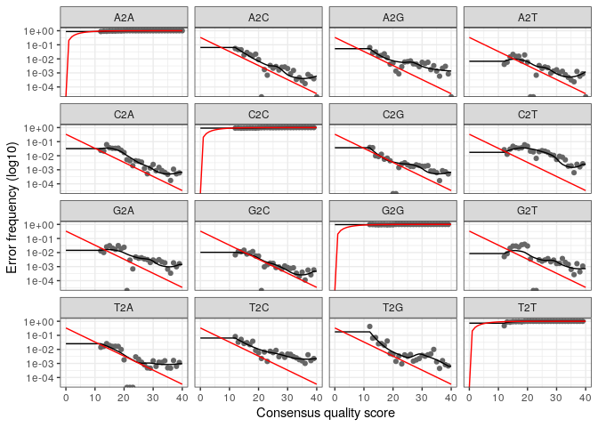
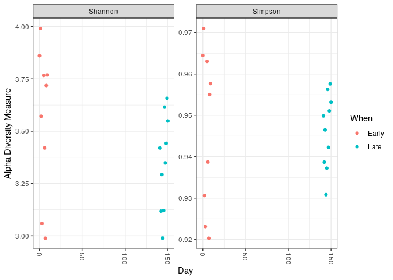
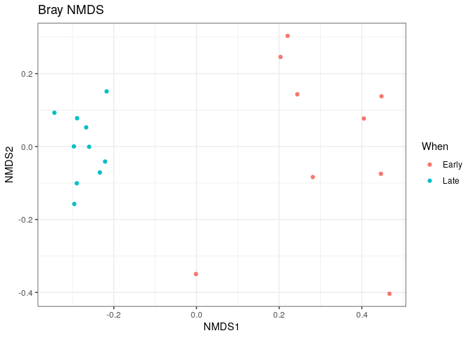
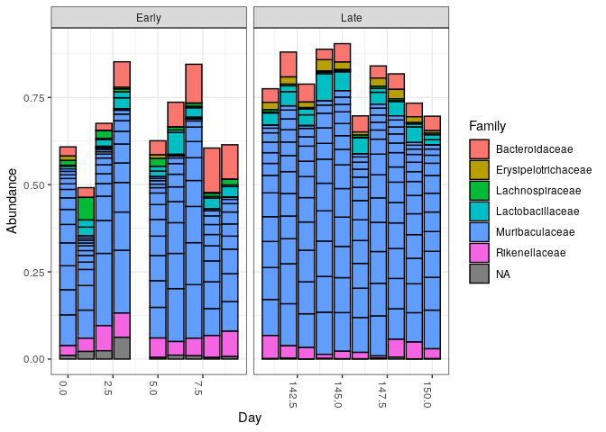

Dada2 tutorial
================

  - [On débute](#on-débute)
  - [On inspecte les profils de qualité de
    lecture](#on-inspecte-les-profils-de-qualité-de-lecture)
  - [On filtre et coupe](#on-filtre-et-coupe)
  - [On apprend les taux d’erreurs](#on-apprend-les-taux-derreurs)
  - [Inférence d’échantillon](#inférence-déchantillon)
  - [On lie les paires de reads](#on-lie-les-paires-de-reads)
  - [On construit la table
    d’observation](#on-construit-la-table-dobservation)
  - [On retirre les chimères](#on-retirre-les-chimères)
  - [Track reads through the
    pipeline](#track-reads-through-the-pipeline)
  - [On assigne la taxonomie](#on-assigne-la-taxonomie)
  - [Evaluate accuracy](#evaluate-accuracy)
  - [Bonus:handoff to phyloseq](#bonushandoff-to-phyloseq)
      - [Import dans phyloseq](#import-dans-phyloseq)
      - [Vizualisation de
        l’alpha-diversité](#vizualisation-de-lalpha-diversité)
      - [Ordination](#ordination)
      - [Histogramme](#histogramme)

# On débute

On charge dada2

``` r
library("dada2")
```

    ## Loading required package: Rcpp

On créé un chemin vers le répertoir MiSeq-SOP contenant les dossiers
fastq du séquençage.

``` r
path <- "~/MiSeq_SOP" 
list.files(path)
```

    ##  [1] "F3D0_S188_L001_R1_001.fastq"   "F3D0_S188_L001_R2_001.fastq"  
    ##  [3] "F3D1_S189_L001_R1_001.fastq"   "F3D1_S189_L001_R2_001.fastq"  
    ##  [5] "F3D141_S207_L001_R1_001.fastq" "F3D141_S207_L001_R2_001.fastq"
    ##  [7] "F3D142_S208_L001_R1_001.fastq" "F3D142_S208_L001_R2_001.fastq"
    ##  [9] "F3D143_S209_L001_R1_001.fastq" "F3D143_S209_L001_R2_001.fastq"
    ## [11] "F3D144_S210_L001_R1_001.fastq" "F3D144_S210_L001_R2_001.fastq"
    ## [13] "F3D145_S211_L001_R1_001.fastq" "F3D145_S211_L001_R2_001.fastq"
    ## [15] "F3D146_S212_L001_R1_001.fastq" "F3D146_S212_L001_R2_001.fastq"
    ## [17] "F3D147_S213_L001_R1_001.fastq" "F3D147_S213_L001_R2_001.fastq"
    ## [19] "F3D148_S214_L001_R1_001.fastq" "F3D148_S214_L001_R2_001.fastq"
    ## [21] "F3D149_S215_L001_R1_001.fastq" "F3D149_S215_L001_R2_001.fastq"
    ## [23] "F3D150_S216_L001_R1_001.fastq" "F3D150_S216_L001_R2_001.fastq"
    ## [25] "F3D2_S190_L001_R1_001.fastq"   "F3D2_S190_L001_R2_001.fastq"  
    ## [27] "F3D3_S191_L001_R1_001.fastq"   "F3D3_S191_L001_R2_001.fastq"  
    ## [29] "F3D5_S193_L001_R1_001.fastq"   "F3D5_S193_L001_R2_001.fastq"  
    ## [31] "F3D6_S194_L001_R1_001.fastq"   "F3D6_S194_L001_R2_001.fastq"  
    ## [33] "F3D7_S195_L001_R1_001.fastq"   "F3D7_S195_L001_R2_001.fastq"  
    ## [35] "F3D8_S196_L001_R1_001.fastq"   "F3D8_S196_L001_R2_001.fastq"  
    ## [37] "F3D9_S197_L001_R1_001.fastq"   "F3D9_S197_L001_R2_001.fastq"  
    ## [39] "filtered"                      "HMP_MOCK.v35.fasta"           
    ## [41] "Mock_S280_L001_R1_001.fastq"   "Mock_S280_L001_R2_001.fastq"  
    ## [43] "mouse.dpw.metadata"            "mouse.time.design"            
    ## [45] "stability.batch"               "stability.files"

On lit les fichiers fastq, dans ceux-ci les séquences Forward et
Reverses sont toutes ensembles, leurs noms ont un format spécifique: .
Donc on met les séquences Forward à la variable fnFs, et les Reverses à
la variable fnRs. Pour se faire, avec la fonction sort, on cherche tous
les Forwards, qui ont "\_R1\_001.fastq" à la fin de leurs noms, et on
les affecte à fnFs. Et les Reverse, qui ont "\_R2\_001.fastq" à la fin
de leurs noms, sont affectés à fnRs. Puis on utilise la fonction
“strsplit” pour découper le noms des séquences et ne garder que leur
identifiant. Et la fonction “sapply” permet d’appliquer cela à toute le
fichier. Ces noms sont affecté à la variable “sample.names”.

``` r
fnFs <- sort(list.files(path, pattern="_R1_001.fastq", full.names = TRUE))
fnRs <- sort(list.files(path, pattern="_R2_001.fastq", full.names = TRUE))

sample.names <- sapply(strsplit(basename(fnFs), "_"), `[`, 1)
```

# On inspecte les profils de qualité de lecture

On visualise les profils de qualité de lecture des reads Forward sous
forme de graphique avec la fonction “plotQualityProfile”. Le “1:4” prend
les quatre premiers reads.

``` r
plotQualityProfile(fnFs[1:4])
```

<!-- -->
On a donc les scores de qualité en ordonnée, en abscisse, la position
sur la séquence. En illumina on utilise 250 paires de base, c’est pour
ça que ça va jusqu’à 250. La fréquence est représentée en gris par une
Heatmap, plus haute est la fréquence, plus foncé est le gris. La ligne
verte montre la moyenne, la orange la médiane, et la orange pointillée
les premier et troisième quartiles.

On observe donc un bon score de qualité (\>30),à peu près constant,
excepté pour la dernière dizaine de nucléotides, où le score diminue
quelque peu. Il faudra peut-être couper ses derniers nucléotides pour
minimiser les erreurs.

# On filtre et coupe

Tout d’abord, on créé des variables pour les fichiers que l’on va
filtrer. Une variable pour les Forwards et une pour les Reverses. La
fonction “file.path” indiquant le chemin à suivre pour que les séquences
y soient assignées.

``` r
filtFs <- file.path(path,"filtered", paste0(sample.names, "_F_filt.fasta.gz"))
filtRs <- file.path(path,"filtered", paste0(sample.names, "_R_filt.fasta.gz"))
names(filtFs) <- sample.names
names(filtRs) <- sample.names
```

Ensuite, on utilise la fonction “filterAndTrim” pour couper et faire le
tri. Elle est appliquée aux variables fnFs, filtFs, fnRs, et filtRs. les
reads Forward sont coupé au 240ème nucléotides, et les Reverses au
160ème nucléotides, leurs scores de qualités diminuant après. On
applique les paramètres de filtration standards, avec “maxEE” le nombre
d’erreur attendues maximum à 2. Tous ces fichiers filtrés sont assignés
à out. On montre ensuite le début de out avec la fonction “head”.

``` r
out <- filterAndTrim(fnFs,filtFs, fnRs, filtRs, truncLen = c(240,160),maxN = 0, maxEE = c(2,2),truncQ = 2, rm.phix = TRUE, compress = TRUE, multithread = TRUE) 
head(out)
```

    ##                               reads.in reads.out
    ## F3D0_S188_L001_R1_001.fastq       7793      7113
    ## F3D1_S189_L001_R1_001.fastq       5869      5299
    ## F3D141_S207_L001_R1_001.fastq     5958      5463
    ## F3D142_S208_L001_R1_001.fastq     3183      2914
    ## F3D143_S209_L001_R1_001.fastq     3178      2941
    ## F3D144_S210_L001_R1_001.fastq     4827      4312

# On apprend les taux d’erreurs

On va calculer le modèle de taux d’erreurs pour notre set de données
avec la fonction “learnErrors”. Pour se faire, un taux maximal est
choisi initialement, et en fonction de l’échantillon il est modifié
jusqu’à atteindre un taux consistent.errF est la variable pour les
Forward.

``` r
errF <- learnErrors(filtFs, multithread = TRUE)
```

    ## 33514080 total bases in 139642 reads from 20 samples will be used for learning the error rates.

Et errR, la variable pour les Reverses.

``` r
errR <- learnErrors(filtRs, multithread = TRUE)
```

    ## 22342720 total bases in 139642 reads from 20 samples will be used for learning the error rates.

On vérifie visuellement :

``` r
plotErrors(errF, nominalQ = TRUE)
```

    ## Warning: Transformation introduced infinite values in continuous y-axis
    
    ## Warning: Transformation introduced infinite values in continuous y-axis

<!-- -->

``` r
#proba mutation fct Q score considéré
#proba d'erreur de seq (ex: un A changé en C) fct du Q score
```

Ici, la probabilité de mutation d’une base à une autre est observée en
fonction du score de qualité.La ligne noir représente le taux d’erreurs
calculé précédement, la ligne rouge le taux d’erreurs initial d’après le
score de qualité, et les points sont les erreurs observées.

On observe que les taux d’erreur calculés (lignes noires) correspondent
bien avec les erreurs observées (points). De plus le taux d’erreur
diminue quand le score de qualité augmente. Donc on peut continuer.

# Inférence d’échantillon

Avec la fonction “dada”, les séquences abondantes sont gardées pour les
reads, et les séquences en-dessous d’un seuil d’abondance, déterminé par
le taux d’erreur, ne sont pas gardées. Les séquences Forward gardées
sont affectées à la variable dadaFs.

``` r
dadaFs <- dada(filtFs, err=errF, multithread= TRUE)
```

    ## Sample 1 - 7113 reads in 1979 unique sequences.
    ## Sample 2 - 5299 reads in 1639 unique sequences.
    ## Sample 3 - 5463 reads in 1477 unique sequences.
    ## Sample 4 - 2914 reads in 904 unique sequences.
    ## Sample 5 - 2941 reads in 939 unique sequences.
    ## Sample 6 - 4312 reads in 1267 unique sequences.
    ## Sample 7 - 6741 reads in 1756 unique sequences.
    ## Sample 8 - 4560 reads in 1438 unique sequences.
    ## Sample 9 - 15637 reads in 3590 unique sequences.
    ## Sample 10 - 11413 reads in 2762 unique sequences.
    ## Sample 11 - 12017 reads in 3021 unique sequences.
    ## Sample 12 - 5032 reads in 1566 unique sequences.
    ## Sample 13 - 18075 reads in 3707 unique sequences.
    ## Sample 14 - 6250 reads in 1479 unique sequences.
    ## Sample 15 - 4052 reads in 1195 unique sequences.
    ## Sample 16 - 7369 reads in 1832 unique sequences.
    ## Sample 17 - 4765 reads in 1183 unique sequences.
    ## Sample 18 - 4871 reads in 1382 unique sequences.
    ## Sample 19 - 6504 reads in 1709 unique sequences.
    ## Sample 20 - 4314 reads in 897 unique sequences.

Les séquences Reverse gardées sont affectées à la variable dadaRs.

``` r
dadaRs <- dada(filtRs, err=errR, multithread = TRUE)
```

    ## Sample 1 - 7113 reads in 1660 unique sequences.
    ## Sample 2 - 5299 reads in 1349 unique sequences.
    ## Sample 3 - 5463 reads in 1335 unique sequences.
    ## Sample 4 - 2914 reads in 853 unique sequences.
    ## Sample 5 - 2941 reads in 880 unique sequences.
    ## Sample 6 - 4312 reads in 1286 unique sequences.
    ## Sample 7 - 6741 reads in 1803 unique sequences.
    ## Sample 8 - 4560 reads in 1265 unique sequences.
    ## Sample 9 - 15637 reads in 3414 unique sequences.
    ## Sample 10 - 11413 reads in 2522 unique sequences.
    ## Sample 11 - 12017 reads in 2771 unique sequences.
    ## Sample 12 - 5032 reads in 1415 unique sequences.
    ## Sample 13 - 18075 reads in 3290 unique sequences.
    ## Sample 14 - 6250 reads in 1390 unique sequences.
    ## Sample 15 - 4052 reads in 1134 unique sequences.
    ## Sample 16 - 7369 reads in 1635 unique sequences.
    ## Sample 17 - 4765 reads in 1084 unique sequences.
    ## Sample 18 - 4871 reads in 1161 unique sequences.
    ## Sample 19 - 6504 reads in 1502 unique sequences.
    ## Sample 20 - 4314 reads in 732 unique sequences.

On appelle le premier objet de dadaFs. C’est le “dada-class”, qui montre
le résultat du débruitage effectué précédement. Ici, 128 variants de
séquence depuis 1979 séquences uniques dans le premier échantillon.

``` r
dadaFs[[1]]
```

    ## dada-class: object describing DADA2 denoising results
    ## 128 sequence variants were inferred from 1979 input unique sequences.
    ## Key parameters: OMEGA_A = 1e-40, OMEGA_C = 1e-40, BAND_SIZE = 16

# On lie les paires de reads

Avec la fonction “mergePairs”, on aligne les reads Forward et Reverse,
qui ont été débruité, pour faire des contigs. Ces contigs sont assignés
à la variable mergers, dont on montre le début avec la fonction
“head()”.

``` r
mergers <- mergePairs(dadaFs, filtFs, dadaRs, filtRs, verbose = TRUE)
```

    ## 6551 paired-reads (in 106 unique pairings) successfully merged out of 6907 (in 199 pairings) input.

    ## 5025 paired-reads (in 100 unique pairings) successfully merged out of 5188 (in 156 pairings) input.

    ## 4973 paired-reads (in 80 unique pairings) successfully merged out of 5268 (in 166 pairings) input.

    ## 2595 paired-reads (in 52 unique pairings) successfully merged out of 2756 (in 109 pairings) input.

    ## 2553 paired-reads (in 60 unique pairings) successfully merged out of 2785 (in 119 pairings) input.

    ## 3622 paired-reads (in 53 unique pairings) successfully merged out of 4103 (in 157 pairings) input.

    ## 6079 paired-reads (in 81 unique pairings) successfully merged out of 6515 (in 198 pairings) input.

    ## 3961 paired-reads (in 90 unique pairings) successfully merged out of 4384 (in 188 pairings) input.

    ## 14231 paired-reads (in 143 unique pairings) successfully merged out of 15358 (in 351 pairings) input.

    ## 10526 paired-reads (in 120 unique pairings) successfully merged out of 11166 (in 279 pairings) input.

    ## 11156 paired-reads (in 137 unique pairings) successfully merged out of 11799 (in 298 pairings) input.

    ## 4329 paired-reads (in 84 unique pairings) successfully merged out of 4788 (in 180 pairings) input.

    ## 17431 paired-reads (in 153 unique pairings) successfully merged out of 17812 (in 272 pairings) input.

    ## 5850 paired-reads (in 81 unique pairings) successfully merged out of 6095 (in 159 pairings) input.

    ## 3716 paired-reads (in 86 unique pairings) successfully merged out of 3894 (in 147 pairings) input.

    ## 6865 paired-reads (in 99 unique pairings) successfully merged out of 7193 (in 187 pairings) input.

    ## 4430 paired-reads (in 67 unique pairings) successfully merged out of 4605 (in 127 pairings) input.

    ## 4574 paired-reads (in 100 unique pairings) successfully merged out of 4736 (in 172 pairings) input.

    ## 6094 paired-reads (in 109 unique pairings) successfully merged out of 6314 (in 172 pairings) input.

    ## 4269 paired-reads (in 20 unique pairings) successfully merged out of 4281 (in 28 pairings) input.

``` r
head(mergers[[1]])
```

    ##                                                                                                                                                                                                                                                       sequence
    ## 1 TACGGAGGATGCGAGCGTTATCCGGATTTATTGGGTTTAAAGGGTGCGCAGGCGGAAGATCAAGTCAGCGGTAAAATTGAGAGGCTCAACCTCTTCGAGCCGTTGAAACTGGTTTTCTTGAGTGAGCGAGAAGTATGCGGAATGCGTGGTGTAGCGGTGAAATGCATAGATATCACGCAGAACTCCGATTGCGAAGGCAGCATACCGGCGCTCAACTGACGCTCATGCACGAAAGTGTGGGTATCGAACAGG
    ## 2 TACGGAGGATGCGAGCGTTATCCGGATTTATTGGGTTTAAAGGGTGCGTAGGCGGCCTGCCAAGTCAGCGGTAAAATTGCGGGGCTCAACCCCGTACAGCCGTTGAAACTGCCGGGCTCGAGTGGGCGAGAAGTATGCGGAATGCGTGGTGTAGCGGTGAAATGCATAGATATCACGCAGAACCCCGATTGCGAAGGCAGCATACCGGCGCCCTACTGACGCTGAGGCACGAAAGTGCGGGGATCAAACAGG
    ## 3 TACGGAGGATGCGAGCGTTATCCGGATTTATTGGGTTTAAAGGGTGCGTAGGCGGGCTGTTAAGTCAGCGGTCAAATGTCGGGGCTCAACCCCGGCCTGCCGTTGAAACTGGCGGCCTCGAGTGGGCGAGAAGTATGCGGAATGCGTGGTGTAGCGGTGAAATGCATAGATATCACGCAGAACTCCGATTGCGAAGGCAGCATACCGGCGCCCGACTGACGCTGAGGCACGAAAGCGTGGGTATCGAACAGG
    ## 4 TACGGAGGATGCGAGCGTTATCCGGATTTATTGGGTTTAAAGGGTGCGTAGGCGGGCTTTTAAGTCAGCGGTAAAAATTCGGGGCTCAACCCCGTCCGGCCGTTGAAACTGGGGGCCTTGAGTGGGCGAGAAGAAGGCGGAATGCGTGGTGTAGCGGTGAAATGCATAGATATCACGCAGAACCCCGATTGCGAAGGCAGCCTTCCGGCGCCCTACTGACGCTGAGGCACGAAAGTGCGGGGATCGAACAGG
    ## 5 TACGGAGGATGCGAGCGTTATCCGGATTTATTGGGTTTAAAGGGTGCGCAGGCGGACTCTCAAGTCAGCGGTCAAATCGCGGGGCTCAACCCCGTTCCGCCGTTGAAACTGGGAGCCTTGAGTGCGCGAGAAGTAGGCGGAATGCGTGGTGTAGCGGTGAAATGCATAGATATCACGCAGAACTCCGATTGCGAAGGCAGCCTACCGGCGCGCAACTGACGCTCATGCACGAAAGCGTGGGTATCGAACAGG
    ## 6 TACGGAGGATGCGAGCGTTATCCGGATTTATTGGGTTTAAAGGGTGCGTAGGCGGGATGCCAAGTCAGCGGTAAAAAAGCGGTGCTCAACGCCGTCGAGCCGTTGAAACTGGCGTTCTTGAGTGGGCGAGAAGTATGCGGAATGCGTGGTGTAGCGGTGAAATGCATAGATATCACGCAGAACTCCGATTGCGAAGGCAGCATACCGGCGCCCTACTGACGCTGAGGCACGAAAGCGTGGGTATCGAACAGG
    ##   abundance forward reverse nmatch nmismatch nindel prefer accept
    ## 1       579       1       1    148         0      0      1   TRUE
    ## 2       470       2       2    148         0      0      2   TRUE
    ## 3       449       3       4    148         0      0      1   TRUE
    ## 4       430       4       3    148         0      0      2   TRUE
    ## 5       345       5       6    148         0      0      1   TRUE
    ## 6       282       6       5    148         0      0      2   TRUE

# On construit la table d’observation

On utilise la fonction “makeSequenceTable” pour construire un tableau de
séquence variant d’amplicon, à partir des contigs formé plutôt. Ce qui
est plus précis qu’un tableau d’OTU. Le tableau est dans la variable
seqtab. Et on utilise “dim” pour avoir la dimension du tableau.

``` r
seqtab <- makeSequenceTable(mergers)
dim(seqtab)
```

    ## [1]  20 293

On observe la distribution de la longueur des séquences avec la fonction
“nchar()”.

``` r
table(nchar(getSequences(seqtab)))
```

    ## 
    ## 251 252 253 254 255 
    ##   1  88 196   6   2

``` r
#inspect distribution os sequences lengths
```

La matrice contient 293 ASVs, et la longueur de séquences fusionnées est
entre 252 et 253, ce qui était attendu.

# On retirre les chimères

Malgré que les erreurs soient filtrées, des chimères peuvent rester. En
utilisant la fonction “remove BimeraDenovo()” avec la méthode
“consensus”, les chimères sont détectées quand il y a des bimeras.
C’est à dire quand en assemblant les séquences les plus abondantes, on
peut reconstuire à l’identique la séquence chimérique.

``` r
seqtab.nochim <- removeBimeraDenovo(seqtab, method = "consensus", multithread= TRUE, verbose=TRUE)
```

    ## Identified 61 bimeras out of 293 input sequences.

``` r
dim(seqtab.nochim)
```

    ## [1]  20 232

61 bimeras ont été identifiées, il reste 20 232 séquences.

On calcul la fréquence de séquence chimérique.

``` r
sum(seqtab.nochim)/sum(seqtab)
```

    ## [1] 0.964263

Celle-ci est de O.964.

# Track reads through the pipeline

On regarde le nombre de reads après chaque étape.

``` r
getN <- function(x) sum(getUniques(x))
track <- cbind(out, sapply(dadaFs, getN), sapply(dadaRs, getN), sapply(mergers, getN), rowSums(seqtab.nochim))
colnames(track) <- c("input", "filtered", "denoisedF", "denoisedR", "merged", "nonchim")
rownames(track) <- sample.names
head(track)
```

    ##        input filtered denoisedF denoisedR merged nonchim
    ## F3D0    7793     7113      6996      6978   6551    6539
    ## F3D1    5869     5299      5227      5239   5025    5014
    ## F3D141  5958     5463      5339      5351   4973    4850
    ## F3D142  3183     2914      2799      2833   2595    2521
    ## F3D143  3178     2941      2822      2868   2553    2519
    ## F3D144  4827     4312      4146      4224   3622    3483

Il n’y a pas eu trop de perte.C’est bon signe.

# On assigne la taxonomie

On charge les données silva.

``` bash
cd $HOME
wget https://zenodo.org/record/3986799/files/silva_species_assignment_v138.fa.gz
```

    ## --2020-12-04 11:41:23--  https://zenodo.org/record/3986799/files/silva_species_assignment_v138.fa.gz
    ## Resolving zenodo.org (zenodo.org)... 137.138.76.77
    ## Connecting to zenodo.org (zenodo.org)|137.138.76.77|:443... connected.
    ## HTTP request sent, awaiting response... 200 OK
    ## Length: 81840166 (78M) [application/octet-stream]
    ## Saving to: ‘silva_species_assignment_v138.fa.gz.9’
    ## 
    ##      0K .......... .......... .......... .......... ..........  0% 7.86M 10s
    ##     50K .......... .......... .......... .......... ..........  0% 11.8M 8s
    ##    100K .......... .......... .......... .......... ..........  0% 23.4M 7s
    ##    150K .......... .......... .......... .......... ..........  0% 14.6M 6s
    ##    200K .......... .......... .......... .......... ..........  0% 22.5M 6s
    ##    250K .......... .......... .......... .......... ..........  0% 34.5M 5s
    ##    300K .......... .......... .......... .......... ..........  0% 19.7M 5s
    ##    350K .......... .......... .......... .......... ..........  0% 70.8M 4s
    ##    400K .......... .......... .......... .......... ..........  0% 15.2M 5s
    ##    450K .......... .......... .......... .......... ..........  0% 81.1M 4s
    ##    500K .......... .......... .......... .......... ..........  0% 14.5M 4s
    ##    550K .......... .......... .......... .......... ..........  0% 10.3M 5s
    ##    600K .......... .......... .......... .......... ..........  0% 73.3M 4s
    ##    650K .......... .......... .......... .......... ..........  0% 14.7M 4s
    ##    700K .......... .......... .......... .......... ..........  0% 76.7M 4s
    ##    750K .......... .......... .......... .......... ..........  1% 82.3M 4s
    ##    800K .......... .......... .......... .......... ..........  1% 13.4M 4s
    ##    850K .......... .......... .......... .......... ..........  1% 73.8M 4s
    ##    900K .......... .......... .......... .......... ..........  1% 14.0M 4s
    ##    950K .......... .......... .......... .......... ..........  1% 14.6M 4s
    ##   1000K .......... .......... .......... .......... ..........  1%  101M 4s
    ##   1050K .......... .......... .......... .......... ..........  1% 7.03M 4s
    ##   1100K .......... .......... .......... .......... ..........  1% 77.0M 4s
    ##   1150K .......... .......... .......... .......... ..........  1% 13.0M 4s
    ##   1200K .......... .......... .......... .......... ..........  1% 72.7M 4s
    ##   1250K .......... .......... .......... .......... ..........  1% 14.6M 4s
    ##   1300K .......... .......... .......... .......... ..........  1% 96.7M 4s
    ##   1350K .......... .......... .......... .......... ..........  1% 14.3M 4s
    ##   1400K .......... .......... .......... .......... ..........  1% 62.6M 4s
    ##   1450K .......... .......... .......... .......... ..........  1% 14.1M 4s
    ##   1500K .......... .......... .......... .......... ..........  1% 52.7M 4s
    ##   1550K .......... .......... .......... .......... ..........  2% 80.4M 4s
    ##   1600K .......... .......... .......... .......... ..........  2% 16.9M 4s
    ##   1650K .......... .......... .......... .......... ..........  2% 60.7M 4s
    ##   1700K .......... .......... .......... .......... ..........  2% 32.5M 4s
    ##   1750K .......... .......... .......... .......... ..........  2% 21.1M 4s
    ##   1800K .......... .......... .......... .......... ..........  2% 74.2M 4s
    ##   1850K .......... .......... .......... .......... ..........  2% 16.1M 4s
    ##   1900K .......... .......... .......... .......... ..........  2% 71.7M 4s
    ##   1950K .......... .......... .......... .......... ..........  2% 83.2M 3s
    ##   2000K .......... .......... .......... .......... ..........  2% 15.3M 3s
    ##   2050K .......... .......... .......... .......... ..........  2% 73.9M 3s
    ##   2100K .......... .......... .......... .......... ..........  2% 14.3M 3s
    ##   2150K .......... .......... .......... .......... ..........  2% 69.4M 3s
    ##   2200K .......... .......... .......... .......... ..........  2% 89.0M 3s
    ##   2250K .......... .......... .......... .......... ..........  2% 14.3M 3s
    ##   2300K .......... .......... .......... .......... ..........  2% 69.1M 3s
    ##   2350K .......... .......... .......... .......... ..........  3% 17.7M 3s
    ##   2400K .......... .......... .......... .......... ..........  3% 66.3M 3s
    ##   2450K .......... .......... .......... .......... ..........  3% 79.6M 3s
    ##   2500K .......... .......... .......... .......... ..........  3% 15.0M 3s
    ##   2550K .......... .......... .......... .......... ..........  3% 77.9M 3s
    ##   2600K .......... .......... .......... .......... ..........  3% 15.2M 3s
    ##   2650K .......... .......... .......... .......... ..........  3% 69.5M 3s
    ##   2700K .......... .......... .......... .......... ..........  3% 90.9M 3s
    ##   2750K .......... .......... .......... .......... ..........  3% 13.0M 3s
    ##   2800K .......... .......... .......... .......... ..........  3% 88.5M 3s
    ##   2850K .......... .......... .......... .......... ..........  3% 18.2M 3s
    ##   2900K .......... .......... .......... .......... ..........  3% 53.4M 3s
    ##   2950K .......... .......... .......... .......... ..........  3% 86.7M 3s
    ##   3000K .......... .......... .......... .......... ..........  3% 16.3M 3s
    ##   3050K .......... .......... .......... .......... ..........  3% 69.4M 3s
    ##   3100K .......... .......... .......... .......... ..........  3% 97.5M 3s
    ##   3150K .......... .......... .......... .......... ..........  4% 30.1M 3s
    ##   3200K .......... .......... .......... .......... ..........  4% 27.5M 3s
    ##   3250K .......... .......... .......... .......... ..........  4% 84.1M 3s
    ##   3300K .......... .......... .......... .......... ..........  4% 15.9M 3s
    ##   3350K .......... .......... .......... .......... ..........  4% 68.6M 3s
    ##   3400K .......... .......... .......... .......... ..........  4% 95.5M 3s
    ##   3450K .......... .......... .......... .......... ..........  4% 13.7M 3s
    ##   3500K .......... .......... .......... .......... ..........  4% 68.8M 3s
    ##   3550K .......... .......... .......... .......... ..........  4% 86.8M 3s
    ##   3600K .......... .......... .......... .......... ..........  4% 19.2M 3s
    ##   3650K .......... .......... .......... .......... ..........  4% 66.3M 3s
    ##   3700K .......... .......... .......... .......... ..........  4% 93.4M 3s
    ##   3750K .......... .......... .......... .......... ..........  4% 16.7M 3s
    ##   3800K .......... .......... .......... .......... ..........  4% 69.4M 3s
    ##   3850K .......... .......... .......... .......... ..........  4% 70.5M 3s
    ##   3900K .......... .......... .......... .......... ..........  4% 17.2M 3s
    ##   3950K .......... .......... .......... .......... ..........  5% 79.3M 3s
    ##   4000K .......... .......... .......... .......... ..........  5% 14.2M 3s
    ##   4050K .......... .......... .......... .......... ..........  5% 78.3M 3s
    ##   4100K .......... .......... .......... .......... ..........  5% 83.1M 3s
    ##   4150K .......... .......... .......... .......... ..........  5% 16.6M 3s
    ##   4200K .......... .......... .......... .......... ..........  5%  106M 3s
    ##   4250K .......... .......... .......... .......... ..........  5% 75.8M 3s
    ##   4300K .......... .......... .......... .......... ..........  5% 29.1M 3s
    ##   4350K .......... .......... .......... .......... ..........  5% 51.9M 3s
    ##   4400K .......... .......... .......... .......... ..........  5% 72.1M 3s
    ##   4450K .......... .......... .......... .......... ..........  5% 15.9M 3s
    ##   4500K .......... .......... .......... .......... ..........  5% 70.8M 3s
    ##   4550K .......... .......... .......... .......... ..........  5% 84.8M 3s
    ##   4600K .......... .......... .......... .......... ..........  5% 95.4M 3s
    ##   4650K .......... .......... .......... .......... ..........  5% 22.6M 3s
    ##   4700K .......... .......... .......... .......... ..........  5% 63.6M 3s
    ##   4750K .......... .......... .......... .......... ..........  6% 27.5M 3s
    ##   4800K .......... .......... .......... .......... ..........  6% 61.0M 3s
    ##   4850K .......... .......... .......... .......... ..........  6% 33.0M 3s
    ##   4900K .......... .......... .......... .......... ..........  6% 22.3M 3s
    ##   4950K .......... .......... .......... .......... ..........  6% 23.7M 3s
    ##   5000K .......... .......... .......... .......... ..........  6% 36.8M 3s
    ##   5050K .......... .......... .......... .......... ..........  6% 73.7M 3s
    ##   5100K .......... .......... .......... .......... ..........  6% 22.0M 3s
    ##   5150K .......... .......... .......... .......... ..........  6% 27.9M 3s
    ##   5200K .......... .......... .......... .......... ..........  6% 41.2M 3s
    ##   5250K .......... .......... .......... .......... ..........  6% 68.5M 3s
    ##   5300K .......... .......... .......... .......... ..........  6% 26.7M 3s
    ##   5350K .......... .......... .......... .......... ..........  6% 31.2M 3s
    ##   5400K .......... .......... .......... .......... ..........  6% 34.8M 3s
    ##   5450K .......... .......... .......... .......... ..........  6% 31.6M 3s
    ##   5500K .......... .......... .......... .......... ..........  6% 74.1M 3s
    ##   5550K .......... .......... .......... .......... ..........  7% 28.3M 3s
    ##   5600K .......... .......... .......... .......... ..........  7% 34.6M 3s
    ##   5650K .......... .......... .......... .......... ..........  7% 36.3M 3s
    ##   5700K .......... .......... .......... .......... ..........  7% 80.4M 3s
    ##   5750K .......... .......... .......... .......... ..........  7% 39.5M 3s
    ##   5800K .......... .......... .......... .......... ..........  7% 32.2M 3s
    ##   5850K .......... .......... .......... .......... ..........  7% 28.8M 3s
    ##   5900K .......... .......... .......... .......... ..........  7% 35.0M 3s
    ##   5950K .......... .......... .......... .......... ..........  7% 80.1M 3s
    ##   6000K .......... .......... .......... .......... ..........  7% 40.4M 3s
    ##   6050K .......... .......... .......... .......... ..........  7% 29.0M 3s
    ##   6100K .......... .......... .......... .......... ..........  7% 37.8M 3s
    ##   6150K .......... .......... .......... .......... ..........  7% 29.0M 3s
    ##   6200K .......... .......... .......... .......... ..........  7% 30.0M 3s
    ##   6250K .......... .......... .......... .......... ..........  7% 66.3M 2s
    ##   6300K .......... .......... .......... .......... ..........  7% 48.3M 2s
    ##   6350K .......... .......... .......... .......... ..........  8% 16.1M 3s
    ##   6400K .......... .......... .......... .......... ..........  8% 78.1M 2s
    ##   6450K .......... .......... .......... .......... ..........  8% 86.5M 2s
    ##   6500K .......... .......... .......... .......... ..........  8% 26.3M 2s
    ##   6550K .......... .......... .......... .......... ..........  8% 26.4M 2s
    ##   6600K .......... .......... .......... .......... ..........  8% 34.2M 2s
    ##   6650K .......... .......... .......... .......... ..........  8% 87.7M 2s
    ##   6700K .......... .......... .......... .......... ..........  8% 21.8M 2s
    ##   6750K .......... .......... .......... .......... ..........  8% 43.4M 2s
    ##   6800K .......... .......... .......... .......... ..........  8% 19.0M 2s
    ##   6850K .......... .......... .......... .......... ..........  8% 50.4M 2s
    ##   6900K .......... .......... .......... .......... ..........  8% 85.8M 2s
    ##   6950K .......... .......... .......... .......... ..........  8% 18.2M 2s
    ##   7000K .......... .......... .......... .......... ..........  8% 75.6M 2s
    ##   7050K .......... .......... .......... .......... ..........  8% 15.9M 2s
    ##   7100K .......... .......... .......... .......... ..........  8% 73.4M 2s
    ##   7150K .......... .......... .......... .......... ..........  9% 88.9M 2s
    ##   7200K .......... .......... .......... .......... ..........  9% 20.1M 2s
    ##   7250K .......... .......... .......... .......... ..........  9% 71.6M 2s
    ##   7300K .......... .......... .......... .......... ..........  9% 18.2M 2s
    ##   7350K .......... .......... .......... .......... ..........  9% 59.7M 2s
    ##   7400K .......... .......... .......... .......... ..........  9% 85.8M 2s
    ##   7450K .......... .......... .......... .......... ..........  9% 16.3M 2s
    ##   7500K .......... .......... .......... .......... ..........  9% 80.9M 2s
    ##   7550K .......... .......... .......... .......... ..........  9% 12.4M 2s
    ##   7600K .......... .......... .......... .......... ..........  9% 75.7M 2s
    ##   7650K .......... .......... .......... .......... ..........  9% 84.1M 2s
    ##   7700K .......... .......... .......... .......... ..........  9% 12.3M 2s
    ##   7750K .......... .......... .......... .......... ..........  9% 76.4M 2s
    ##   7800K .......... .......... .......... .......... ..........  9% 17.3M 2s
    ##   7850K .......... .......... .......... .......... ..........  9% 49.8M 2s
    ##   7900K .......... .......... .......... .......... ..........  9% 76.4M 2s
    ##   7950K .......... .......... .......... .......... .......... 10% 79.1M 2s
    ##   8000K .......... .......... .......... .......... .......... 10% 18.4M 2s
    ##   8050K .......... .......... .......... .......... .......... 10% 79.1M 2s
    ##   8100K .......... .......... .......... .......... .......... 10% 83.9M 2s
    ##   8150K .......... .......... .......... .......... .......... 10% 12.3M 2s
    ##   8200K .......... .......... .......... .......... .......... 10% 85.3M 2s
    ##   8250K .......... .......... .......... .......... .......... 10% 82.3M 2s
    ##   8300K .......... .......... .......... .......... .......... 10% 21.4M 2s
    ##   8350K .......... .......... .......... .......... .......... 10% 60.3M 2s
    ##   8400K .......... .......... .......... .......... .......... 10% 72.0M 2s
    ##   8450K .......... .......... .......... .......... .......... 10% 88.0M 2s
    ##   8500K .......... .......... .......... .......... .......... 10% 27.8M 2s
    ##   8550K .......... .......... .......... .......... .......... 10% 63.2M 2s
    ##   8600K .......... .......... .......... .......... .......... 10% 33.1M 2s
    ##   8650K .......... .......... .......... .......... .......... 10% 83.4M 2s
    ##   8700K .......... .......... .......... .......... .......... 10% 17.5M 2s
    ##   8750K .......... .......... .......... .......... .......... 11% 64.7M 2s
    ##   8800K .......... .......... .......... .......... .......... 11% 83.2M 2s
    ##   8850K .......... .......... .......... .......... .......... 11% 86.2M 2s
    ##   8900K .......... .......... .......... .......... .......... 11% 26.4M 2s
    ##   8950K .......... .......... .......... .......... .......... 11% 38.0M 2s
    ##   9000K .......... .......... .......... .......... .......... 11% 71.2M 2s
    ##   9050K .......... .......... .......... .......... .......... 11% 97.9M 2s
    ##   9100K .......... .......... .......... .......... .......... 11% 15.7M 2s
    ##   9150K .......... .......... .......... .......... .......... 11% 67.0M 2s
    ##   9200K .......... .......... .......... .......... .......... 11% 99.9M 2s
    ##   9250K .......... .......... .......... .......... .......... 11% 78.9M 2s
    ##   9300K .......... .......... .......... .......... .......... 11% 17.4M 2s
    ##   9350K .......... .......... .......... .......... .......... 11% 76.7M 2s
    ##   9400K .......... .......... .......... .......... .......... 11% 89.3M 2s
    ##   9450K .......... .......... .......... .......... .......... 11% 25.2M 2s
    ##   9500K .......... .......... .......... .......... .......... 11% 77.3M 2s
    ##   9550K .......... .......... .......... .......... .......... 12% 63.0M 2s
    ##   9600K .......... .......... .......... .......... .......... 12%  102M 2s
    ##   9650K .......... .......... .......... .......... .......... 12% 21.2M 2s
    ##   9700K .......... .......... .......... .......... .......... 12% 39.9M 2s
    ##   9750K .......... .......... .......... .......... .......... 12% 62.5M 2s
    ##   9800K .......... .......... .......... .......... .......... 12% 99.6M 2s
    ##   9850K .......... .......... .......... .......... .......... 12% 31.2M 2s
    ##   9900K .......... .......... .......... .......... .......... 12% 27.3M 2s
    ##   9950K .......... .......... .......... .......... .......... 12% 71.2M 2s
    ##  10000K .......... .......... .......... .......... .......... 12% 90.1M 2s
    ##  10050K .......... .......... .......... .......... .......... 12% 37.9M 2s
    ##  10100K .......... .......... .......... .......... .......... 12% 23.0M 2s
    ##  10150K .......... .......... .......... .......... .......... 12% 82.9M 2s
    ##  10200K .......... .......... .......... .......... .......... 12% 70.7M 2s
    ##  10250K .......... .......... .......... .......... .......... 12% 82.7M 2s
    ##  10300K .......... .......... .......... .......... .......... 12% 20.5M 2s
    ##  10350K .......... .......... .......... .......... .......... 13% 70.9M 2s
    ##  10400K .......... .......... .......... .......... .......... 13% 81.0M 2s
    ##  10450K .......... .......... .......... .......... .......... 13% 78.4M 2s
    ##  10500K .......... .......... .......... .......... .......... 13% 27.9M 2s
    ##  10550K .......... .......... .......... .......... .......... 13% 65.8M 2s
    ##  10600K .......... .......... .......... .......... .......... 13% 88.8M 2s
    ##  10650K .......... .......... .......... .......... .......... 13% 23.5M 2s
    ##  10700K .......... .......... .......... .......... .......... 13% 74.6M 2s
    ##  10750K .......... .......... .......... .......... .......... 13% 74.5M 2s
    ##  10800K .......... .......... .......... .......... .......... 13% 72.6M 2s
    ##  10850K .......... .......... .......... .......... .......... 13% 47.9M 2s
    ##  10900K .......... .......... .......... .......... .......... 13% 33.9M 2s
    ##  10950K .......... .......... .......... .......... .......... 13% 17.8M 2s
    ##  11000K .......... .......... .......... .......... .......... 13% 68.7M 2s
    ##  11050K .......... .......... .......... .......... .......... 13% 79.5M 2s
    ##  11100K .......... .......... .......... .......... .......... 13% 82.0M 2s
    ##  11150K .......... .......... .......... .......... .......... 14% 16.9M 2s
    ##  11200K .......... .......... .......... .......... .......... 14% 67.8M 2s
    ##  11250K .......... .......... .......... .......... .......... 14% 86.3M 2s
    ##  11300K .......... .......... .......... .......... .......... 14% 19.7M 2s
    ##  11350K .......... .......... .......... .......... .......... 14% 65.9M 2s
    ##  11400K .......... .......... .......... .......... .......... 14% 73.8M 2s
    ##  11450K .......... .......... .......... .......... .......... 14% 71.7M 2s
    ##  11500K .......... .......... .......... .......... .......... 14% 27.6M 2s
    ##  11550K .......... .......... .......... .......... .......... 14% 35.7M 2s
    ##  11600K .......... .......... .......... .......... .......... 14% 78.5M 2s
    ##  11650K .......... .......... .......... .......... .......... 14% 83.9M 2s
    ##  11700K .......... .......... .......... .......... .......... 14% 47.2M 2s
    ##  11750K .......... .......... .......... .......... .......... 14% 28.4M 2s
    ##  11800K .......... .......... .......... .......... .......... 14% 80.8M 2s
    ##  11850K .......... .......... .......... .......... .......... 14% 83.1M 2s
    ##  11900K .......... .......... .......... .......... .......... 14% 22.7M 2s
    ##  11950K .......... .......... .......... .......... .......... 15% 57.5M 2s
    ##  12000K .......... .......... .......... .......... .......... 15% 66.3M 2s
    ##  12050K .......... .......... .......... .......... .......... 15% 32.2M 2s
    ##  12100K .......... .......... .......... .......... .......... 15% 72.8M 2s
    ##  12150K .......... .......... .......... .......... .......... 15% 24.8M 2s
    ##  12200K .......... .......... .......... .......... .......... 15% 92.4M 2s
    ##  12250K .......... .......... .......... .......... .......... 15% 61.4M 2s
    ##  12300K .......... .......... .......... .......... .......... 15% 24.4M 2s
    ##  12350K .......... .......... .......... .......... .......... 15% 62.0M 2s
    ##  12400K .......... .......... .......... .......... .......... 15% 94.9M 2s
    ##  12450K .......... .......... .......... .......... .......... 15% 68.4M 2s
    ##  12500K .......... .......... .......... .......... .......... 15%  115M 2s
    ##  12550K .......... .......... .......... .......... .......... 15% 28.2M 2s
    ##  12600K .......... .......... .......... .......... .......... 15% 83.9M 2s
    ##  12650K .......... .......... .......... .......... .......... 15% 32.6M 2s
    ##  12700K .......... .......... .......... .......... .......... 15% 27.4M 2s
    ##  12750K .......... .......... .......... .......... .......... 16% 81.9M 2s
    ##  12800K .......... .......... .......... .......... .......... 16% 97.1M 2s
    ##  12850K .......... .......... .......... .......... .......... 16% 56.8M 2s
    ##  12900K .......... .......... .......... .......... .......... 16% 19.2M 2s
    ##  12950K .......... .......... .......... .......... .......... 16% 77.9M 2s
    ##  13000K .......... .......... .......... .......... .......... 16% 88.2M 2s
    ##  13050K .......... .......... .......... .......... .......... 16% 98.2M 2s
    ##  13100K .......... .......... .......... .......... .......... 16% 16.1M 2s
    ##  13150K .......... .......... .......... .......... .......... 16% 72.6M 2s
    ##  13200K .......... .......... .......... .......... .......... 16% 92.7M 2s
    ##  13250K .......... .......... .......... .......... .......... 16% 83.0M 2s
    ##  13300K .......... .......... .......... .......... .......... 16% 22.6M 2s
    ##  13350K .......... .......... .......... .......... .......... 16% 92.3M 2s
    ##  13400K .......... .......... .......... .......... .......... 16% 86.7M 2s
    ##  13450K .......... .......... .......... .......... .......... 16% 26.9M 2s
    ##  13500K .......... .......... .......... .......... .......... 16% 24.6M 2s
    ##  13550K .......... .......... .......... .......... .......... 17% 17.3M 2s
    ##  13600K .......... .......... .......... .......... .......... 17% 85.2M 2s
    ##  13650K .......... .......... .......... .......... .......... 17% 71.6M 2s
    ##  13700K .......... .......... .......... .......... .......... 17%  102M 2s
    ##  13750K .......... .......... .......... .......... .......... 17% 90.0M 2s
    ##  13800K .......... .......... .......... .......... .......... 17% 26.0M 2s
    ##  13850K .......... .......... .......... .......... .......... 17% 79.2M 2s
    ##  13900K .......... .......... .......... .......... .......... 17% 84.2M 2s
    ##  13950K .......... .......... .......... .......... .......... 17% 32.1M 2s
    ##  14000K .......... .......... .......... .......... .......... 17% 81.9M 2s
    ##  14050K .......... .......... .......... .......... .......... 17% 24.6M 2s
    ##  14100K .......... .......... .......... .......... .......... 17% 87.4M 2s
    ##  14150K .......... .......... .......... .......... .......... 17% 41.2M 2s
    ##  14200K .......... .......... .......... .......... .......... 17% 93.8M 2s
    ##  14250K .......... .......... .......... .......... .......... 17% 26.8M 2s
    ##  14300K .......... .......... .......... .......... .......... 17% 93.3M 2s
    ##  14350K .......... .......... .......... .......... .......... 18% 44.4M 2s
    ##  14400K .......... .......... .......... .......... .......... 18% 43.0M 2s
    ##  14450K .......... .......... .......... .......... .......... 18% 60.9M 2s
    ##  14500K .......... .......... .......... .......... .......... 18% 74.8M 2s
    ##  14550K .......... .......... .......... .......... .......... 18% 38.2M 2s
    ##  14600K .......... .......... .......... .......... .......... 18% 35.2M 2s
    ##  14650K .......... .......... .......... .......... .......... 18% 51.8M 2s
    ##  14700K .......... .......... .......... .......... .......... 18% 93.0M 2s
    ##  14750K .......... .......... .......... .......... .......... 18% 45.6M 2s
    ##  14800K .......... .......... .......... .......... .......... 18% 24.7M 2s
    ##  14850K .......... .......... .......... .......... .......... 18% 68.2M 2s
    ##  14900K .......... .......... .......... .......... .......... 18% 78.1M 2s
    ##  14950K .......... .......... .......... .......... .......... 18% 78.8M 2s
    ##  15000K .......... .......... .......... .......... .......... 18% 33.1M 2s
    ##  15050K .......... .......... .......... .......... .......... 18% 43.7M 2s
    ##  15100K .......... .......... .......... .......... .......... 18% 54.0M 2s
    ##  15150K .......... .......... .......... .......... .......... 19% 90.3M 2s
    ##  15200K .......... .......... .......... .......... .......... 19% 37.3M 2s
    ##  15250K .......... .......... .......... .......... .......... 19% 25.3M 2s
    ##  15300K .......... .......... .......... .......... .......... 19% 65.6M 2s
    ##  15350K .......... .......... .......... .......... .......... 19% 91.5M 2s
    ##  15400K .......... .......... .......... .......... .......... 19% 87.8M 2s
    ##  15450K .......... .......... .......... .......... .......... 19% 20.4M 2s
    ##  15500K .......... .......... .......... .......... .......... 19% 72.5M 2s
    ##  15550K .......... .......... .......... .......... .......... 19% 87.4M 2s
    ##  15600K .......... .......... .......... .......... .......... 19% 23.7M 2s
    ##  15650K .......... .......... .......... .......... .......... 19% 79.0M 2s
    ##  15700K .......... .......... .......... .......... .......... 19% 83.4M 2s
    ##  15750K .......... .......... .......... .......... .......... 19% 63.4M 2s
    ##  15800K .......... .......... .......... .......... .......... 19% 15.9M 2s
    ##  15850K .......... .......... .......... .......... .......... 19% 67.9M 2s
    ##  15900K .......... .......... .......... .......... .......... 19% 72.7M 2s
    ##  15950K .......... .......... .......... .......... .......... 20% 97.2M 2s
    ##  16000K .......... .......... .......... .......... .......... 20% 24.5M 2s
    ##  16050K .......... .......... .......... .......... .......... 20% 72.5M 2s
    ##  16100K .......... .......... .......... .......... .......... 20% 74.8M 2s
    ##  16150K .......... .......... .......... .......... .......... 20% 65.9M 2s
    ##  16200K .......... .......... .......... .......... .......... 20% 26.1M 2s
    ##  16250K .......... .......... .......... .......... .......... 20% 71.9M 2s
    ##  16300K .......... .......... .......... .......... .......... 20% 83.7M 2s
    ##  16350K .......... .......... .......... .......... .......... 20% 81.1M 2s
    ##  16400K .......... .......... .......... .......... .......... 20% 30.3M 2s
    ##  16450K .......... .......... .......... .......... .......... 20% 29.7M 2s
    ##  16500K .......... .......... .......... .......... .......... 20% 79.6M 2s
    ##  16550K .......... .......... .......... .......... .......... 20% 89.5M 2s
    ##  16600K .......... .......... .......... .......... .......... 20% 28.8M 2s
    ##  16650K .......... .......... .......... .......... .......... 20% 24.0M 2s
    ##  16700K .......... .......... .......... .......... .......... 20% 88.3M 2s
    ##  16750K .......... .......... .......... .......... .......... 21% 47.9M 2s
    ##  16800K .......... .......... .......... .......... .......... 21% 62.2M 2s
    ##  16850K .......... .......... .......... .......... .......... 21% 30.7M 2s
    ##  16900K .......... .......... .......... .......... .......... 21% 78.9M 2s
    ##  16950K .......... .......... .......... .......... .......... 21% 70.2M 2s
    ##  17000K .......... .......... .......... .......... .......... 21% 29.0M 2s
    ##  17050K .......... .......... .......... .......... .......... 21% 47.7M 2s
    ##  17100K .......... .......... .......... .......... .......... 21% 82.2M 2s
    ##  17150K .......... .......... .......... .......... .......... 21% 45.3M 2s
    ##  17200K .......... .......... .......... .......... .......... 21% 42.7M 2s
    ##  17250K .......... .......... .......... .......... .......... 21% 55.0M 2s
    ##  17300K .......... .......... .......... .......... .......... 21% 87.1M 2s
    ##  17350K .......... .......... .......... .......... .......... 21% 39.3M 2s
    ##  17400K .......... .......... .......... .......... .......... 21% 58.8M 2s
    ##  17450K .......... .......... .......... .......... .......... 21% 44.1M 2s
    ##  17500K .......... .......... .......... .......... .......... 21% 50.0M 2s
    ##  17550K .......... .......... .......... .......... .......... 22% 69.4M 2s
    ##  17600K .......... .......... .......... .......... .......... 22% 78.0M 2s
    ##  17650K .......... .......... .......... .......... .......... 22% 26.2M 2s
    ##  17700K .......... .......... .......... .......... .......... 22% 76.1M 2s
    ##  17750K .......... .......... .......... .......... .......... 22% 62.8M 2s
    ##  17800K .......... .......... .......... .......... .......... 22% 65.3M 2s
    ##  17850K .......... .......... .......... .......... .......... 22% 28.1M 2s
    ##  17900K .......... .......... .......... .......... .......... 22% 24.7M 2s
    ##  17950K .......... .......... .......... .......... .......... 22% 72.6M 2s
    ##  18000K .......... .......... .......... .......... .......... 22% 89.9M 2s
    ##  18050K .......... .......... .......... .......... .......... 22% 88.6M 2s
    ##  18100K .......... .......... .......... .......... .......... 22% 17.1M 2s
    ##  18150K .......... .......... .......... .......... .......... 22% 62.5M 2s
    ##  18200K .......... .......... .......... .......... .......... 22% 89.8M 2s
    ##  18250K .......... .......... .......... .......... .......... 22% 78.3M 2s
    ##  18300K .......... .......... .......... .......... .......... 22% 31.6M 2s
    ##  18350K .......... .......... .......... .......... .......... 23% 67.1M 2s
    ##  18400K .......... .......... .......... .......... .......... 23% 78.0M 2s
    ##  18450K .......... .......... .......... .......... .......... 23% 80.8M 2s
    ##  18500K .......... .......... .......... .......... .......... 23% 29.9M 2s
    ##  18550K .......... .......... .......... .......... .......... 23% 59.7M 2s
    ##  18600K .......... .......... .......... .......... .......... 23% 78.1M 2s
    ##  18650K .......... .......... .......... .......... .......... 23% 26.4M 2s
    ##  18700K .......... .......... .......... .......... .......... 23% 31.6M 2s
    ##  18750K .......... .......... .......... .......... .......... 23% 57.6M 2s
    ##  18800K .......... .......... .......... .......... .......... 23% 98.1M 2s
    ##  18850K .......... .......... .......... .......... .......... 23% 68.1M 2s
    ##  18900K .......... .......... .......... .......... .......... 23% 53.2M 2s
    ##  18950K .......... .......... .......... .......... .......... 23% 62.5M 2s
    ##  19000K .......... .......... .......... .......... .......... 23% 40.5M 2s
    ##  19050K .......... .......... .......... .......... .......... 23% 69.8M 2s
    ##  19100K .......... .......... .......... .......... .......... 23% 29.6M 2s
    ##  19150K .......... .......... .......... .......... .......... 24% 64.8M 2s
    ##  19200K .......... .......... .......... .......... .......... 24% 70.4M 2s
    ##  19250K .......... .......... .......... .......... .......... 24% 64.5M 2s
    ##  19300K .......... .......... .......... .......... .......... 24% 26.2M 2s
    ##  19350K .......... .......... .......... .......... .......... 24% 28.4M 2s
    ##  19400K .......... .......... .......... .......... .......... 24% 85.0M 2s
    ##  19450K .......... .......... .......... .......... .......... 24% 85.8M 2s
    ##  19500K .......... .......... .......... .......... .......... 24% 37.3M 2s
    ##  19550K .......... .......... .......... .......... .......... 24% 28.9M 2s
    ##  19600K .......... .......... .......... .......... .......... 24% 75.3M 2s
    ##  19650K .......... .......... .......... .......... .......... 24% 84.5M 2s
    ##  19700K .......... .......... .......... .......... .......... 24% 83.3M 2s
    ##  19750K .......... .......... .......... .......... .......... 24% 24.0M 2s
    ##  19800K .......... .......... .......... .......... .......... 24% 69.1M 2s
    ##  19850K .......... .......... .......... .......... .......... 24% 80.3M 2s
    ##  19900K .......... .......... .......... .......... .......... 24% 96.7M 2s
    ##  19950K .......... .......... .......... .......... .......... 25% 18.0M 2s
    ##  20000K .......... .......... .......... .......... .......... 25%  102M 2s
    ##  20050K .......... .......... .......... .......... .......... 25% 86.5M 2s
    ##  20100K .......... .......... .......... .......... .......... 25% 69.5M 2s
    ##  20150K .......... .......... .......... .......... .......... 25% 26.1M 2s
    ##  20200K .......... .......... .......... .......... .......... 25% 31.5M 2s
    ##  20250K .......... .......... .......... .......... .......... 25% 74.7M 2s
    ##  20300K .......... .......... .......... .......... .......... 25% 64.2M 2s
    ##  20350K .......... .......... .......... .......... .......... 25% 67.6M 2s
    ##  20400K .......... .......... .......... .......... .......... 25% 25.4M 2s
    ##  20450K .......... .......... .......... .......... .......... 25% 64.6M 2s
    ##  20500K .......... .......... .......... .......... .......... 25% 73.6M 2s
    ##  20550K .......... .......... .......... .......... .......... 25% 76.4M 2s
    ##  20600K .......... .......... .......... .......... .......... 25% 66.8M 2s
    ##  20650K .......... .......... .......... .......... .......... 25% 32.8M 2s
    ##  20700K .......... .......... .......... .......... .......... 25% 63.5M 2s
    ##  20750K .......... .......... .......... .......... .......... 26% 41.3M 2s
    ##  20800K .......... .......... .......... .......... .......... 26% 86.6M 2s
    ##  20850K .......... .......... .......... .......... .......... 26% 28.5M 2s
    ##  20900K .......... .......... .......... .......... .......... 26% 87.3M 2s
    ##  20950K .......... .......... .......... .......... .......... 26% 48.1M 2s
    ##  21000K .......... .......... .......... .......... .......... 26% 29.3M 2s
    ##  21050K .......... .......... .......... .......... .......... 26% 70.3M 2s
    ##  21100K .......... .......... .......... .......... .......... 26% 95.4M 2s
    ##  21150K .......... .......... .......... .......... .......... 26% 78.2M 2s
    ##  21200K .......... .......... .......... .......... .......... 26% 26.8M 2s
    ##  21250K .......... .......... .......... .......... .......... 26% 91.1M 2s
    ##  21300K .......... .......... .......... .......... .......... 26% 39.3M 2s
    ##  21350K .......... .......... .......... .......... .......... 26% 90.2M 2s
    ##  21400K .......... .......... .......... .......... .......... 26% 35.6M 2s
    ##  21450K .......... .......... .......... .......... .......... 26% 28.2M 2s
    ##  21500K .......... .......... .......... .......... .......... 26% 69.9M 2s
    ##  21550K .......... .......... .......... .......... .......... 27% 84.0M 2s
    ##  21600K .......... .......... .......... .......... .......... 27% 68.7M 2s
    ##  21650K .......... .......... .......... .......... .......... 27% 28.4M 2s
    ##  21700K .......... .......... .......... .......... .......... 27% 58.6M 2s
    ##  21750K .......... .......... .......... .......... .......... 27% 88.8M 2s
    ##  21800K .......... .......... .......... .......... .......... 27% 45.6M 1s
    ##  21850K .......... .......... .......... .......... .......... 27% 29.3M 1s
    ##  21900K .......... .......... .......... .......... .......... 27% 83.0M 1s
    ##  21950K .......... .......... .......... .......... .......... 27% 38.5M 1s
    ##  22000K .......... .......... .......... .......... .......... 27% 16.2M 1s
    ##  22050K .......... .......... .......... .......... .......... 27% 57.1M 1s
    ##  22100K .......... .......... .......... .......... .......... 27% 71.3M 1s
    ##  22150K .......... .......... .......... .......... .......... 27% 84.0M 1s
    ##  22200K .......... .......... .......... .......... .......... 27% 31.7M 1s
    ##  22250K .......... .......... .......... .......... .......... 27% 55.2M 1s
    ##  22300K .......... .......... .......... .......... .......... 27% 62.8M 1s
    ##  22350K .......... .......... .......... .......... .......... 28% 76.1M 1s
    ##  22400K .......... .......... .......... .......... .......... 28% 33.9M 1s
    ##  22450K .......... .......... .......... .......... .......... 28% 75.5M 1s
    ##  22500K .......... .......... .......... .......... .......... 28% 65.1M 1s
    ##  22550K .......... .......... .......... .......... .......... 28% 52.5M 1s
    ##  22600K .......... .......... .......... .......... .......... 28% 91.4M 1s
    ##  22650K .......... .......... .......... .......... .......... 28% 31.3M 1s
    ##  22700K .......... .......... .......... .......... .......... 28% 68.1M 1s
    ##  22750K .......... .......... .......... .......... .......... 28% 61.9M 1s
    ##  22800K .......... .......... .......... .......... .......... 28% 59.1M 1s
    ##  22850K .......... .......... .......... .......... .......... 28% 34.5M 1s
    ##  22900K .......... .......... .......... .......... .......... 28% 81.7M 1s
    ##  22950K .......... .......... .......... .......... .......... 28% 21.6M 1s
    ##  23000K .......... .......... .......... .......... .......... 28% 82.5M 1s
    ##  23050K .......... .......... .......... .......... .......... 28% 98.3M 1s
    ##  23100K .......... .......... .......... .......... .......... 28% 22.1M 1s
    ##  23150K .......... .......... .......... .......... .......... 29% 56.5M 1s
    ##  23200K .......... .......... .......... .......... .......... 29% 68.3M 1s
    ##  23250K .......... .......... .......... .......... .......... 29% 84.2M 1s
    ##  23300K .......... .......... .......... .......... .......... 29% 57.2M 1s
    ##  23350K .......... .......... .......... .......... .......... 29% 33.9M 1s
    ##  23400K .......... .......... .......... .......... .......... 29% 85.8M 1s
    ##  23450K .......... .......... .......... .......... .......... 29% 72.4M 1s
    ##  23500K .......... .......... .......... .......... .......... 29% 41.8M 1s
    ##  23550K .......... .......... .......... .......... .......... 29% 32.8M 1s
    ##  23600K .......... .......... .......... .......... .......... 29% 77.1M 1s
    ##  23650K .......... .......... .......... .......... .......... 29% 27.4M 1s
    ##  23700K .......... .......... .......... .......... .......... 29% 97.0M 1s
    ##  23750K .......... .......... .......... .......... .......... 29% 66.1M 1s
    ##  23800K .......... .......... .......... .......... .......... 29% 58.2M 1s
    ##  23850K .......... .......... .......... .......... .......... 29% 51.0M 1s
    ##  23900K .......... .......... .......... .......... .......... 29% 76.6M 1s
    ##  23950K .......... .......... .......... .......... .......... 30% 62.2M 1s
    ##  24000K .......... .......... .......... .......... .......... 30% 32.6M 1s
    ##  24050K .......... .......... .......... .......... .......... 30% 56.6M 1s
    ##  24100K .......... .......... .......... .......... .......... 30% 56.3M 1s
    ##  24150K .......... .......... .......... .......... .......... 30% 80.4M 1s
    ##  24200K .......... .......... .......... .......... .......... 30% 26.2M 1s
    ##  24250K .......... .......... .......... .......... .......... 30% 22.0M 1s
    ##  24300K .......... .......... .......... .......... .......... 30% 88.7M 1s
    ##  24350K .......... .......... .......... .......... .......... 30% 81.0M 1s
    ##  24400K .......... .......... .......... .......... .......... 30% 78.2M 1s
    ##  24450K .......... .......... .......... .......... .......... 30% 20.2M 1s
    ##  24500K .......... .......... .......... .......... .......... 30% 84.0M 1s
    ##  24550K .......... .......... .......... .......... .......... 30% 76.1M 1s
    ##  24600K .......... .......... .......... .......... .......... 30% 20.4M 1s
    ##  24650K .......... .......... .......... .......... .......... 30% 51.0M 1s
    ##  24700K .......... .......... .......... .......... .......... 30% 48.8M 1s
    ##  24750K .......... .......... .......... .......... .......... 31% 72.8M 1s
    ##  24800K .......... .......... .......... .......... .......... 31% 95.1M 1s
    ##  24850K .......... .......... .......... .......... .......... 31% 78.3M 1s
    ##  24900K .......... .......... .......... .......... .......... 31% 21.9M 1s
    ##  24950K .......... .......... .......... .......... .......... 31% 74.2M 1s
    ##  25000K .......... .......... .......... .......... .......... 31% 99.0M 1s
    ##  25050K .......... .......... .......... .......... .......... 31% 89.7M 1s
    ##  25100K .......... .......... .......... .......... .......... 31% 23.1M 1s
    ##  25150K .......... .......... .......... .......... .......... 31% 61.4M 1s
    ##  25200K .......... .......... .......... .......... .......... 31% 82.7M 1s
    ##  25250K .......... .......... .......... .......... .......... 31% 24.8M 1s
    ##  25300K .......... .......... .......... .......... .......... 31% 52.2M 1s
    ##  25350K .......... .......... .......... .......... .......... 31% 75.2M 1s
    ##  25400K .......... .......... .......... .......... .......... 31% 78.4M 1s
    ##  25450K .......... .......... .......... .......... .......... 31% 94.4M 1s
    ##  25500K .......... .......... .......... .......... .......... 31%  111M 1s
    ##  25550K .......... .......... .......... .......... .......... 32% 24.4M 1s
    ##  25600K .......... .......... .......... .......... .......... 32% 48.9M 1s
    ##  25650K .......... .......... .......... .......... .......... 32% 82.9M 1s
    ##  25700K .......... .......... .......... .......... .......... 32% 33.3M 1s
    ##  25750K .......... .......... .......... .......... .......... 32% 66.5M 1s
    ##  25800K .......... .......... .......... .......... .......... 32% 78.6M 1s
    ##  25850K .......... .......... .......... .......... .......... 32% 77.8M 1s
    ##  25900K .......... .......... .......... .......... .......... 32% 22.2M 1s
    ##  25950K .......... .......... .......... .......... .......... 32% 63.0M 1s
    ##  26000K .......... .......... .......... .......... .......... 32% 69.5M 1s
    ##  26050K .......... .......... .......... .......... .......... 32% 73.0M 1s
    ##  26100K .......... .......... .......... .......... .......... 32% 90.3M 1s
    ##  26150K .......... .......... .......... .......... .......... 32% 36.2M 1s
    ##  26200K .......... .......... .......... .......... .......... 32% 54.4M 1s
    ##  26250K .......... .......... .......... .......... .......... 32% 73.8M 1s
    ##  26300K .......... .......... .......... .......... .......... 32% 82.6M 1s
    ##  26350K .......... .......... .......... .......... .......... 33% 31.7M 1s
    ##  26400K .......... .......... .......... .......... .......... 33% 36.9M 1s
    ##  26450K .......... .......... .......... .......... .......... 33% 43.7M 1s
    ##  26500K .......... .......... .......... .......... .......... 33% 47.7M 1s
    ##  26550K .......... .......... .......... .......... .......... 33% 60.4M 1s
    ##  26600K .......... .......... .......... .......... .......... 33% 43.0M 1s
    ##  26650K .......... .......... .......... .......... .......... 33% 45.6M 1s
    ##  26700K .......... .......... .......... .......... .......... 33% 50.8M 1s
    ##  26750K .......... .......... .......... .......... .......... 33% 53.8M 1s
    ##  26800K .......... .......... .......... .......... .......... 33% 67.1M 1s
    ##  26850K .......... .......... .......... .......... .......... 33% 30.4M 1s
    ##  26900K .......... .......... .......... .......... .......... 33% 33.5M 1s
    ##  26950K .......... .......... .......... .......... .......... 33% 70.9M 1s
    ##  27000K .......... .......... .......... .......... .......... 33% 51.8M 1s
    ##  27050K .......... .......... .......... .......... .......... 33% 33.8M 1s
    ##  27100K .......... .......... .......... .......... .......... 33% 62.1M 1s
    ##  27150K .......... .......... .......... .......... .......... 34% 81.9M 1s
    ##  27200K .......... .......... .......... .......... .......... 34% 54.2M 1s
    ##  27250K .......... .......... .......... .......... .......... 34% 66.1M 1s
    ##  27300K .......... .......... .......... .......... .......... 34% 21.4M 1s
    ##  27350K .......... .......... .......... .......... .......... 34% 60.9M 1s
    ##  27400K .......... .......... .......... .......... .......... 34% 89.2M 1s
    ##  27450K .......... .......... .......... .......... .......... 34% 62.5M 1s
    ##  27500K .......... .......... .......... .......... .......... 34% 69.3M 1s
    ##  27550K .......... .......... .......... .......... .......... 34% 22.2M 1s
    ##  27600K .......... .......... .......... .......... .......... 34% 47.4M 1s
    ##  27650K .......... .......... .......... .......... .......... 34% 86.6M 1s
    ##  27700K .......... .......... .......... .......... .......... 34% 73.8M 1s
    ##  27750K .......... .......... .......... .......... .......... 34% 88.6M 1s
    ##  27800K .......... .......... .......... .......... .......... 34% 40.6M 1s
    ##  27850K .......... .......... .......... .......... .......... 34% 39.1M 1s
    ##  27900K .......... .......... .......... .......... .......... 34% 47.1M 1s
    ##  27950K .......... .......... .......... .......... .......... 35% 72.4M 1s
    ##  28000K .......... .......... .......... .......... .......... 35% 61.7M 1s
    ##  28050K .......... .......... .......... .......... .......... 35% 89.7M 1s
    ##  28100K .......... .......... .......... .......... .......... 35% 56.3M 1s
    ##  28150K .......... .......... .......... .......... .......... 35% 30.8M 1s
    ##  28200K .......... .......... .......... .......... .......... 35% 28.5M 1s
    ##  28250K .......... .......... .......... .......... .......... 35% 83.6M 1s
    ##  28300K .......... .......... .......... .......... .......... 35% 61.0M 1s
    ##  28350K .......... .......... .......... .......... .......... 35% 74.0M 1s
    ##  28400K .......... .......... .......... .......... .......... 35% 52.9M 1s
    ##  28450K .......... .......... .......... .......... .......... 35% 32.9M 1s
    ##  28500K .......... .......... .......... .......... .......... 35% 46.8M 1s
    ##  28550K .......... .......... .......... .......... .......... 35% 88.8M 1s
    ##  28600K .......... .......... .......... .......... .......... 35% 91.9M 1s
    ##  28650K .......... .......... .......... .......... .......... 35% 44.6M 1s
    ##  28700K .......... .......... .......... .......... .......... 35% 45.1M 1s
    ##  28750K .......... .......... .......... .......... .......... 36% 48.0M 1s
    ##  28800K .......... .......... .......... .......... .......... 36% 71.1M 1s
    ##  28850K .......... .......... .......... .......... .......... 36% 75.1M 1s
    ##  28900K .......... .......... .......... .......... .......... 36% 38.2M 1s
    ##  28950K .......... .......... .......... .......... .......... 36% 54.3M 1s
    ##  29000K .......... .......... .......... .......... .......... 36% 56.4M 1s
    ##  29050K .......... .......... .......... .......... .......... 36% 63.5M 1s
    ##  29100K .......... .......... .......... .......... .......... 36% 73.3M 1s
    ##  29150K .......... .......... .......... .......... .......... 36% 73.0M 1s
    ##  29200K .......... .......... .......... .......... .......... 36% 30.3M 1s
    ##  29250K .......... .......... .......... .......... .......... 36% 71.2M 1s
    ##  29300K .......... .......... .......... .......... .......... 36% 79.9M 1s
    ##  29350K .......... .......... .......... .......... .......... 36% 81.7M 1s
    ##  29400K .......... .......... .......... .......... .......... 36% 59.4M 1s
    ##  29450K .......... .......... .......... .......... .......... 36% 79.0M 1s
    ##  29500K .......... .......... .......... .......... .......... 36% 35.3M 1s
    ##  29550K .......... .......... .......... .......... .......... 37% 40.2M 1s
    ##  29600K .......... .......... .......... .......... .......... 37% 89.8M 1s
    ##  29650K .......... .......... .......... .......... .......... 37% 63.7M 1s
    ##  29700K .......... .......... .......... .......... .......... 37% 75.0M 1s
    ##  29750K .......... .......... .......... .......... .......... 37% 50.9M 1s
    ##  29800K .......... .......... .......... .......... .......... 37% 86.8M 1s
    ##  29850K .......... .......... .......... .......... .......... 37% 54.1M 1s
    ##  29900K .......... .......... .......... .......... .......... 37% 75.6M 1s
    ##  29950K .......... .......... .......... .......... .......... 37% 91.1M 1s
    ##  30000K .......... .......... .......... .......... .......... 37% 65.5M 1s
    ##  30050K .......... .......... .......... .......... .......... 37% 82.2M 1s
    ##  30100K .......... .......... .......... .......... .......... 37% 35.7M 1s
    ##  30150K .......... .......... .......... .......... .......... 37% 70.7M 1s
    ##  30200K .......... .......... .......... .......... .......... 37% 75.2M 1s
    ##  30250K .......... .......... .......... .......... .......... 37% 99.5M 1s
    ##  30300K .......... .......... .......... .......... .......... 37% 63.9M 1s
    ##  30350K .......... .......... .......... .......... .......... 38% 60.7M 1s
    ##  30400K .......... .......... .......... .......... .......... 38% 35.9M 1s
    ##  30450K .......... .......... .......... .......... .......... 38% 83.8M 1s
    ##  30500K .......... .......... .......... .......... .......... 38% 65.2M 1s
    ##  30550K .......... .......... .......... .......... .......... 38% 58.1M 1s
    ##  30600K .......... .......... .......... .......... .......... 38%  103M 1s
    ##  30650K .......... .......... .......... .......... .......... 38% 48.5M 1s
    ##  30700K .......... .......... .......... .......... .......... 38% 66.0M 1s
    ##  30750K .......... .......... .......... .......... .......... 38% 48.7M 1s
    ##  30800K .......... .......... .......... .......... .......... 38% 59.8M 1s
    ##  30850K .......... .......... .......... .......... .......... 38% 81.7M 1s
    ##  30900K .......... .......... .......... .......... .......... 38% 73.5M 1s
    ##  30950K .......... .......... .......... .......... .......... 38% 82.5M 1s
    ##  31000K .......... .......... .......... .......... .......... 38% 26.4M 1s
    ##  31050K .......... .......... .......... .......... .......... 38% 68.8M 1s
    ##  31100K .......... .......... .......... .......... .......... 38% 70.4M 1s
    ##  31150K .......... .......... .......... .......... .......... 39% 83.7M 1s
    ##  31200K .......... .......... .......... .......... .......... 39%  107M 1s
    ##  31250K .......... .......... .......... .......... .......... 39% 27.8M 1s
    ##  31300K .......... .......... .......... .......... .......... 39%  104M 1s
    ##  31350K .......... .......... .......... .......... .......... 39% 49.9M 1s
    ##  31400K .......... .......... .......... .......... .......... 39% 72.5M 1s
    ##  31450K .......... .......... .......... .......... .......... 39% 88.2M 1s
    ##  31500K .......... .......... .......... .......... .......... 39% 71.4M 1s
    ##  31550K .......... .......... .......... .......... .......... 39% 30.6M 1s
    ##  31600K .......... .......... .......... .......... .......... 39%  111M 1s
    ##  31650K .......... .......... .......... .......... .......... 39% 36.4M 1s
    ##  31700K .......... .......... .......... .......... .......... 39% 63.6M 1s
    ##  31750K .......... .......... .......... .......... .......... 39% 46.6M 1s
    ##  31800K .......... .......... .......... .......... .......... 39%  106M 1s
    ##  31850K .......... .......... .......... .......... .......... 39% 54.2M 1s
    ##  31900K .......... .......... .......... .......... .......... 39% 72.0M 1s
    ##  31950K .......... .......... .......... .......... .......... 40% 85.3M 1s
    ##  32000K .......... .......... .......... .......... .......... 40% 25.6M 1s
    ##  32050K .......... .......... .......... .......... .......... 40% 49.2M 1s
    ##  32100K .......... .......... .......... .......... .......... 40% 68.3M 1s
    ##  32150K .......... .......... .......... .......... .......... 40% 85.7M 1s
    ##  32200K .......... .......... .......... .......... .......... 40%  106M 1s
    ##  32250K .......... .......... .......... .......... .......... 40% 58.4M 1s
    ##  32300K .......... .......... .......... .......... .......... 40% 47.9M 1s
    ##  32350K .......... .......... .......... .......... .......... 40% 32.9M 1s
    ##  32400K .......... .......... .......... .......... .......... 40%  117M 1s
    ##  32450K .......... .......... .......... .......... .......... 40% 46.3M 1s
    ##  32500K .......... .......... .......... .......... .......... 40%  105M 1s
    ##  32550K .......... .......... .......... .......... .......... 40% 83.8M 1s
    ##  32600K .......... .......... .......... .......... .......... 40% 87.7M 1s
    ##  32650K .......... .......... .......... .......... .......... 40%  114M 1s
    ##  32700K .......... .......... .......... .......... .......... 40% 93.4M 1s
    ##  32750K .......... .......... .......... .......... .......... 41% 56.5M 1s
    ##  32800K .......... .......... .......... .......... .......... 41% 99.7M 1s
    ##  32850K .......... .......... .......... .......... .......... 41% 39.1M 1s
    ##  32900K .......... .......... .......... .......... .......... 41% 31.3M 1s
    ##  32950K .......... .......... .......... .......... .......... 41% 54.9M 1s
    ##  33000K .......... .......... .......... .......... .......... 41% 83.0M 1s
    ##  33050K .......... .......... .......... .......... .......... 41% 82.4M 1s
    ##  33100K .......... .......... .......... .......... .......... 41%  124M 1s
    ##  33150K .......... .......... .......... .......... .......... 41% 29.3M 1s
    ##  33200K .......... .......... .......... .......... .......... 41% 70.1M 1s
    ##  33250K .......... .......... .......... .......... .......... 41% 55.2M 1s
    ##  33300K .......... .......... .......... .......... .......... 41%  119M 1s
    ##  33350K .......... .......... .......... .......... .......... 41%  114M 1s
    ##  33400K .......... .......... .......... .......... .......... 41% 9.75M 1s
    ##  33450K .......... .......... .......... .......... .......... 41% 81.0M 1s
    ##  33500K .......... .......... .......... .......... .......... 41% 52.8M 1s
    ##  33550K .......... .......... .......... .......... .......... 42%  120M 1s
    ##  33600K .......... .......... .......... .......... .......... 42%  137M 1s
    ##  33650K .......... .......... .......... .......... .......... 42% 47.0M 1s
    ##  33700K .......... .......... .......... .......... .......... 42% 60.9M 1s
    ##  33750K .......... .......... .......... .......... .......... 42% 71.1M 1s
    ##  33800K .......... .......... .......... .......... .......... 42% 35.5M 1s
    ##  33850K .......... .......... .......... .......... .......... 42% 78.0M 1s
    ##  33900K .......... .......... .......... .......... .......... 42%  116M 1s
    ##  33950K .......... .......... .......... .......... .......... 42% 41.5M 1s
    ##  34000K .......... .......... .......... .......... .......... 42% 19.6M 1s
    ##  34050K .......... .......... .......... .......... .......... 42% 80.3M 1s
    ##  34100K .......... .......... .......... .......... .......... 42% 92.0M 1s
    ##  34150K .......... .......... .......... .......... .......... 42% 87.5M 1s
    ##  34200K .......... .......... .......... .......... .......... 42% 21.0M 1s
    ##  34250K .......... .......... .......... .......... .......... 42% 75.9M 1s
    ##  34300K .......... .......... .......... .......... .......... 42% 32.7M 1s
    ##  34350K .......... .......... .......... .......... .......... 43% 68.4M 1s
    ##  34400K .......... .......... .......... .......... .......... 43% 77.6M 1s
    ##  34450K .......... .......... .......... .......... .......... 43% 74.0M 1s
    ##  34500K .......... .......... .......... .......... .......... 43% 63.3M 1s
    ##  34550K .......... .......... .......... .......... .......... 43% 72.2M 1s
    ##  34600K .......... .......... .......... .......... .......... 43% 37.9M 1s
    ##  34650K .......... .......... .......... .......... .......... 43% 51.7M 1s
    ##  34700K .......... .......... .......... .......... .......... 43% 62.7M 1s
    ##  34750K .......... .......... .......... .......... .......... 43% 80.9M 1s
    ##  34800K .......... .......... .......... .......... .......... 43% 57.1M 1s
    ##  34850K .......... .......... .......... .......... .......... 43% 56.2M 1s
    ##  34900K .......... .......... .......... .......... .......... 43% 42.8M 1s
    ##  34950K .......... .......... .......... .......... .......... 43% 62.9M 1s
    ##  35000K .......... .......... .......... .......... .......... 43% 78.2M 1s
    ##  35050K .......... .......... .......... .......... .......... 43% 79.8M 1s
    ##  35100K .......... .......... .......... .......... .......... 43% 67.2M 1s
    ##  35150K .......... .......... .......... .......... .......... 44%  104M 1s
    ##  35200K .......... .......... .......... .......... .......... 44% 59.3M 1s
    ##  35250K .......... .......... .......... .......... .......... 44% 46.9M 1s
    ##  35300K .......... .......... .......... .......... .......... 44% 97.6M 1s
    ##  35350K .......... .......... .......... .......... .......... 44% 64.7M 1s
    ##  35400K .......... .......... .......... .......... .......... 44%  116M 1s
    ##  35450K .......... .......... .......... .......... .......... 44% 76.4M 1s
    ##  35500K .......... .......... .......... .......... .......... 44% 98.2M 1s
    ##  35550K .......... .......... .......... .......... .......... 44% 58.7M 1s
    ##  35600K .......... .......... .......... .......... .......... 44% 18.3M 1s
    ##  35650K .......... .......... .......... .......... .......... 44% 90.1M 1s
    ##  35700K .......... .......... .......... .......... .......... 44% 93.5M 1s
    ##  35750K .......... .......... .......... .......... .......... 44% 81.1M 1s
    ##  35800K .......... .......... .......... .......... .......... 44%  115M 1s
    ##  35850K .......... .......... .......... .......... .......... 44% 18.2M 1s
    ##  35900K .......... .......... .......... .......... .......... 44% 55.9M 1s
    ##  35950K .......... .......... .......... .......... .......... 45% 91.7M 1s
    ##  36000K .......... .......... .......... .......... .......... 45%  107M 1s
    ##  36050K .......... .......... .......... .......... .......... 45% 96.8M 1s
    ##  36100K .......... .......... .......... .......... .......... 45% 34.9M 1s
    ##  36150K .......... .......... .......... .......... .......... 45% 72.0M 1s
    ##  36200K .......... .......... .......... .......... .......... 45% 25.8M 1s
    ##  36250K .......... .......... .......... .......... .......... 45% 70.6M 1s
    ##  36300K .......... .......... .......... .......... .......... 45% 58.0M 1s
    ##  36350K .......... .......... .......... .......... .......... 45% 70.6M 1s
    ##  36400K .......... .......... .......... .......... .......... 45% 51.4M 1s
    ##  36450K .......... .......... .......... .......... .......... 45% 59.6M 1s
    ##  36500K .......... .......... .......... .......... .......... 45% 43.8M 1s
    ##  36550K .......... .......... .......... .......... .......... 45% 39.7M 1s
    ##  36600K .......... .......... .......... .......... .......... 45% 57.0M 1s
    ##  36650K .......... .......... .......... .......... .......... 45% 49.7M 1s
    ##  36700K .......... .......... .......... .......... .......... 45% 96.1M 1s
    ##  36750K .......... .......... .......... .......... .......... 46% 75.0M 1s
    ##  36800K .......... .......... .......... .......... .......... 46% 64.1M 1s
    ##  36850K .......... .......... .......... .......... .......... 46% 24.4M 1s
    ##  36900K .......... .......... .......... .......... .......... 46% 56.1M 1s
    ##  36950K .......... .......... .......... .......... .......... 46% 67.2M 1s
    ##  37000K .......... .......... .......... .......... .......... 46% 74.5M 1s
    ##  37050K .......... .......... .......... .......... .......... 46% 20.1M 1s
    ##  37100K .......... .......... .......... .......... .......... 46% 77.4M 1s
    ##  37150K .......... .......... .......... .......... .......... 46% 11.0M 1s
    ##  37200K .......... .......... .......... .......... .......... 46% 84.2M 1s
    ##  37250K .......... .......... .......... .......... .......... 46% 69.6M 1s
    ##  37300K .......... .......... .......... .......... .......... 46% 87.0M 1s
    ##  37350K .......... .......... .......... .......... .......... 46% 68.4M 1s
    ##  37400K .......... .......... .......... .......... .......... 46% 71.9M 1s
    ##  37450K .......... .......... .......... .......... .......... 46% 44.8M 1s
    ##  37500K .......... .......... .......... .......... .......... 46% 37.1M 1s
    ##  37550K .......... .......... .......... .......... .......... 47% 54.7M 1s
    ##  37600K .......... .......... .......... .......... .......... 47% 61.8M 1s
    ##  37650K .......... .......... .......... .......... .......... 47% 69.5M 1s
    ##  37700K .......... .......... .......... .......... .......... 47% 51.9M 1s
    ##  37750K .......... .......... .......... .......... .......... 47% 51.8M 1s
    ##  37800K .......... .......... .......... .......... .......... 47% 43.0M 1s
    ##  37850K .......... .......... .......... .......... .......... 47% 72.7M 1s
    ##  37900K .......... .......... .......... .......... .......... 47% 95.5M 1s
    ##  37950K .......... .......... .......... .......... .......... 47% 81.0M 1s
    ##  38000K .......... .......... .......... .......... .......... 47% 73.2M 1s
    ##  38050K .......... .......... .......... .......... .......... 47% 42.1M 1s
    ##  38100K .......... .......... .......... .......... .......... 47% 61.0M 1s
    ##  38150K .......... .......... .......... .......... .......... 47% 77.3M 1s
    ##  38200K .......... .......... .......... .......... .......... 47%  100M 1s
    ##  38250K .......... .......... .......... .......... .......... 47% 79.2M 1s
    ##  38300K .......... .......... .......... .......... .......... 47% 44.3M 1s
    ##  38350K .......... .......... .......... .......... .......... 48% 45.8M 1s
    ##  38400K .......... .......... .......... .......... .......... 48% 60.8M 1s
    ##  38450K .......... .......... .......... .......... .......... 48% 82.0M 1s
    ##  38500K .......... .......... .......... .......... .......... 48% 70.4M 1s
    ##  38550K .......... .......... .......... .......... .......... 48% 69.8M 1s
    ##  38600K .......... .......... .......... .......... .......... 48% 52.9M 1s
    ##  38650K .......... .......... .......... .......... .......... 48% 49.1M 1s
    ##  38700K .......... .......... .......... .......... .......... 48% 64.5M 1s
    ##  38750K .......... .......... .......... .......... .......... 48% 76.9M 1s
    ##  38800K .......... .......... .......... .......... .......... 48% 94.4M 1s
    ##  38850K .......... .......... .......... .......... .......... 48% 51.2M 1s
    ##  38900K .......... .......... .......... .......... .......... 48% 51.6M 1s
    ##  38950K .......... .......... .......... .......... .......... 48% 41.5M 1s
    ##  39000K .......... .......... .......... .......... .......... 48% 73.9M 1s
    ##  39050K .......... .......... .......... .......... .......... 48% 81.7M 1s
    ##  39100K .......... .......... .......... .......... .......... 48% 93.4M 1s
    ##  39150K .......... .......... .......... .......... .......... 49% 56.1M 1s
    ##  39200K .......... .......... .......... .......... .......... 49% 59.0M 1s
    ##  39250K .......... .......... .......... .......... .......... 49% 86.8M 1s
    ##  39300K .......... .......... .......... .......... .......... 49% 3.75M 1s
    ##  39350K .......... .......... .......... .......... .......... 49% 74.2M 1s
    ##  39400K .......... .......... .......... .......... .......... 49% 75.4M 1s
    ##  39450K .......... .......... .......... .......... .......... 49% 71.9M 1s
    ##  39500K .......... .......... .......... .......... .......... 49% 72.1M 1s
    ##  39550K .......... .......... .......... .......... .......... 49% 62.0M 1s
    ##  39600K .......... .......... .......... .......... .......... 49% 57.5M 1s
    ##  39650K .......... .......... .......... .......... .......... 49% 74.7M 1s
    ##  39700K .......... .......... .......... .......... .......... 49% 36.3M 1s
    ##  39750K .......... .......... .......... .......... .......... 49% 24.9M 1s
    ##  39800K .......... .......... .......... .......... .......... 49% 75.4M 1s
    ##  39850K .......... .......... .......... .......... .......... 49% 59.9M 1s
    ##  39900K .......... .......... .......... .......... .......... 49% 53.4M 1s
    ##  39950K .......... .......... .......... .......... .......... 50% 42.6M 1s
    ##  40000K .......... .......... .......... .......... .......... 50% 34.3M 1s
    ##  40050K .......... .......... .......... .......... .......... 50% 71.5M 1s
    ##  40100K .......... .......... .......... .......... .......... 50% 46.3M 1s
    ##  40150K .......... .......... .......... .......... .......... 50% 69.1M 1s
    ##  40200K .......... .......... .......... .......... .......... 50% 88.4M 1s
    ##  40250K .......... .......... .......... .......... .......... 50% 90.5M 1s
    ##  40300K .......... .......... .......... .......... .......... 50% 63.0M 1s
    ##  40350K .......... .......... .......... .......... .......... 50% 55.9M 1s
    ##  40400K .......... .......... .......... .......... .......... 50% 78.9M 1s
    ##  40450K .......... .......... .......... .......... .......... 50% 80.1M 1s
    ##  40500K .......... .......... .......... .......... .......... 50% 97.6M 1s
    ##  40550K .......... .......... .......... .......... .......... 50% 88.1M 1s
    ##  40600K .......... .......... .......... .......... .......... 50% 85.4M 1s
    ##  40650K .......... .......... .......... .......... .......... 50% 39.5M 1s
    ##  40700K .......... .......... .......... .......... .......... 50% 69.3M 1s
    ##  40750K .......... .......... .......... .......... .......... 51% 43.5M 1s
    ##  40800K .......... .......... .......... .......... .......... 51% 66.3M 1s
    ##  40850K .......... .......... .......... .......... .......... 51% 68.7M 1s
    ##  40900K .......... .......... .......... .......... .......... 51% 66.2M 1s
    ##  40950K .......... .......... .......... .......... .......... 51% 81.5M 1s
    ##  41000K .......... .......... .......... .......... .......... 51% 75.2M 1s
    ##  41050K .......... .......... .......... .......... .......... 51% 45.5M 1s
    ##  41100K .......... .......... .......... .......... .......... 51% 61.2M 1s
    ##  41150K .......... .......... .......... .......... .......... 51% 54.4M 1s
    ##  41200K .......... .......... .......... .......... .......... 51% 54.1M 1s
    ##  41250K .......... .......... .......... .......... .......... 51% 36.1M 1s
    ##  41300K .......... .......... .......... .......... .......... 51% 32.0M 1s
    ##  41350K .......... .......... .......... .......... .......... 51% 36.9M 1s
    ##  41400K .......... .......... .......... .......... .......... 51% 30.6M 1s
    ##  41450K .......... .......... .......... .......... .......... 51% 76.7M 1s
    ##  41500K .......... .......... .......... .......... .......... 51% 95.8M 1s
    ##  41550K .......... .......... .......... .......... .......... 52% 91.7M 1s
    ##  41600K .......... .......... .......... .......... .......... 52% 99.2M 1s
    ##  41650K .......... .......... .......... .......... .......... 52% 74.3M 1s
    ##  41700K .......... .......... .......... .......... .......... 52% 78.1M 1s
    ##  41750K .......... .......... .......... .......... .......... 52% 31.7M 1s
    ##  41800K .......... .......... .......... .......... .......... 52% 37.5M 1s
    ##  41850K .......... .......... .......... .......... .......... 52% 43.7M 1s
    ##  41900K .......... .......... .......... .......... .......... 52% 98.3M 1s
    ##  41950K .......... .......... .......... .......... .......... 52% 96.2M 1s
    ##  42000K .......... .......... .......... .......... .......... 52% 83.3M 1s
    ##  42050K .......... .......... .......... .......... .......... 52% 55.6M 1s
    ##  42100K .......... .......... .......... .......... .......... 52% 40.9M 1s
    ##  42150K .......... .......... .......... .......... .......... 52% 95.7M 1s
    ##  42200K .......... .......... .......... .......... .......... 52% 79.2M 1s
    ##  42250K .......... .......... .......... .......... .......... 52% 69.9M 1s
    ##  42300K .......... .......... .......... .......... .......... 52% 64.1M 1s
    ##  42350K .......... .......... .......... .......... .......... 53% 89.2M 1s
    ##  42400K .......... .......... .......... .......... .......... 53% 50.3M 1s
    ##  42450K .......... .......... .......... .......... .......... 53% 99.2M 1s
    ##  42500K .......... .......... .......... .......... .......... 53% 50.7M 1s
    ##  42550K .......... .......... .......... .......... .......... 53% 77.4M 1s
    ##  42600K .......... .......... .......... .......... .......... 53% 89.7M 1s
    ##  42650K .......... .......... .......... .......... .......... 53% 68.7M 1s
    ##  42700K .......... .......... .......... .......... .......... 53% 63.5M 1s
    ##  42750K .......... .......... .......... .......... .......... 53% 84.4M 1s
    ##  42800K .......... .......... .......... .......... .......... 53% 91.8M 1s
    ##  42850K .......... .......... .......... .......... .......... 53% 77.3M 1s
    ##  42900K .......... .......... .......... .......... .......... 53% 95.5M 1s
    ##  42950K .......... .......... .......... .......... .......... 53% 76.9M 1s
    ##  43000K .......... .......... .......... .......... .......... 53% 74.2M 1s
    ##  43050K .......... .......... .......... .......... .......... 53% 61.7M 1s
    ##  43100K .......... .......... .......... .......... .......... 53% 68.1M 1s
    ##  43150K .......... .......... .......... .......... .......... 54%  107M 1s
    ##  43200K .......... .......... .......... .......... .......... 54% 87.9M 1s
    ##  43250K .......... .......... .......... .......... .......... 54% 72.6M 1s
    ##  43300K .......... .......... .......... .......... .......... 54%  110M 1s
    ##  43350K .......... .......... .......... .......... .......... 54% 70.0M 1s
    ##  43400K .......... .......... .......... .......... .......... 54% 42.7M 1s
    ##  43450K .......... .......... .......... .......... .......... 54% 51.6M 1s
    ##  43500K .......... .......... .......... .......... .......... 54% 79.5M 1s
    ##  43550K .......... .......... .......... .......... .......... 54% 50.3M 1s
    ##  43600K .......... .......... .......... .......... .......... 54% 92.5M 1s
    ##  43650K .......... .......... .......... .......... .......... 54% 56.7M 1s
    ##  43700K .......... .......... .......... .......... .......... 54% 70.3M 1s
    ##  43750K .......... .......... .......... .......... .......... 54% 35.9M 1s
    ##  43800K .......... .......... .......... .......... .......... 54% 77.1M 1s
    ##  43850K .......... .......... .......... .......... .......... 54% 58.1M 1s
    ##  43900K .......... .......... .......... .......... .......... 54% 72.0M 1s
    ##  43950K .......... .......... .......... .......... .......... 55% 47.2M 1s
    ##  44000K .......... .......... .......... .......... .......... 55% 59.8M 1s
    ##  44050K .......... .......... .......... .......... .......... 55% 53.6M 1s
    ##  44100K .......... .......... .......... .......... .......... 55% 82.4M 1s
    ##  44150K .......... .......... .......... .......... .......... 55% 53.5M 1s
    ##  44200K .......... .......... .......... .......... .......... 55% 51.0M 1s
    ##  44250K .......... .......... .......... .......... .......... 55% 82.0M 1s
    ##  44300K .......... .......... .......... .......... .......... 55% 92.5M 1s
    ##  44350K .......... .......... .......... .......... .......... 55% 47.5M 1s
    ##  44400K .......... .......... .......... .......... .......... 55% 36.5M 1s
    ##  44450K .......... .......... .......... .......... .......... 55% 82.5M 1s
    ##  44500K .......... .......... .......... .......... .......... 55% 94.8M 1s
    ##  44550K .......... .......... .......... .......... .......... 55% 57.5M 1s
    ##  44600K .......... .......... .......... .......... .......... 55% 89.1M 1s
    ##  44650K .......... .......... .......... .......... .......... 55% 21.2M 1s
    ##  44700K .......... .......... .......... .......... .......... 55% 75.0M 1s
    ##  44750K .......... .......... .......... .......... .......... 56% 89.6M 1s
    ##  44800K .......... .......... .......... .......... .......... 56% 97.4M 1s
    ##  44850K .......... .......... .......... .......... .......... 56% 43.2M 1s
    ##  44900K .......... .......... .......... .......... .......... 56% 34.4M 1s
    ##  44950K .......... .......... .......... .......... .......... 56% 58.3M 1s
    ##  45000K .......... .......... .......... .......... .......... 56% 49.1M 1s
    ##  45050K .......... .......... .......... .......... .......... 56% 85.0M 1s
    ##  45100K .......... .......... .......... .......... .......... 56% 99.3M 1s
    ##  45150K .......... .......... .......... .......... .......... 56% 53.4M 1s
    ##  45200K .......... .......... .......... .......... .......... 56% 85.5M 1s
    ##  45250K .......... .......... .......... .......... .......... 56% 66.2M 1s
    ##  45300K .......... .......... .......... .......... .......... 56% 39.7M 1s
    ##  45350K .......... .......... .......... .......... .......... 56% 72.8M 1s
    ##  45400K .......... .......... .......... .......... .......... 56% 84.3M 1s
    ##  45450K .......... .......... .......... .......... .......... 56% 90.1M 1s
    ##  45500K .......... .......... .......... .......... .......... 56% 60.7M 1s
    ##  45550K .......... .......... .......... .......... .......... 57% 47.2M 1s
    ##  45600K .......... .......... .......... .......... .......... 57% 72.4M 1s
    ##  45650K .......... .......... .......... .......... .......... 57% 88.3M 1s
    ##  45700K .......... .......... .......... .......... .......... 57% 81.1M 1s
    ##  45750K .......... .......... .......... .......... .......... 57% 28.5M 1s
    ##  45800K .......... .......... .......... .......... .......... 57% 73.4M 1s
    ##  45850K .......... .......... .......... .......... .......... 57% 93.6M 1s
    ##  45900K .......... .......... .......... .......... .......... 57%  105M 1s
    ##  45950K .......... .......... .......... .......... .......... 57% 59.4M 1s
    ##  46000K .......... .......... .......... .......... .......... 57% 62.8M 1s
    ##  46050K .......... .......... .......... .......... .......... 57% 72.7M 1s
    ##  46100K .......... .......... .......... .......... .......... 57% 41.4M 1s
    ##  46150K .......... .......... .......... .......... .......... 57% 91.4M 1s
    ##  46200K .......... .......... .......... .......... .......... 57% 75.0M 1s
    ##  46250K .......... .......... .......... .......... .......... 57% 55.0M 1s
    ##  46300K .......... .......... .......... .......... .......... 57% 87.7M 1s
    ##  46350K .......... .......... .......... .......... .......... 58% 92.4M 1s
    ##  46400K .......... .......... .......... .......... .......... 58% 50.3M 1s
    ##  46450K .......... .......... .......... .......... .......... 58% 65.8M 1s
    ##  46500K .......... .......... .......... .......... .......... 58% 96.3M 1s
    ##  46550K .......... .......... .......... .......... .......... 58% 65.7M 1s
    ##  46600K .......... .......... .......... .......... .......... 58% 95.3M 1s
    ##  46650K .......... .......... .......... .......... .......... 58% 38.1M 1s
    ##  46700K .......... .......... .......... .......... .......... 58% 28.3M 1s
    ##  46750K .......... .......... .......... .......... .......... 58% 40.2M 1s
    ##  46800K .......... .......... .......... .......... .......... 58% 47.8M 1s
    ##  46850K .......... .......... .......... .......... .......... 58% 56.2M 1s
    ##  46900K .......... .......... .......... .......... .......... 58% 69.4M 1s
    ##  46950K .......... .......... .......... .......... .......... 58% 45.8M 1s
    ##  47000K .......... .......... .......... .......... .......... 58% 58.4M 1s
    ##  47050K .......... .......... .......... .......... .......... 58% 41.3M 1s
    ##  47100K .......... .......... .......... .......... .......... 58% 84.0M 1s
    ##  47150K .......... .......... .......... .......... .......... 59% 45.4M 1s
    ##  47200K .......... .......... .......... .......... .......... 59% 58.5M 1s
    ##  47250K .......... .......... .......... .......... .......... 59% 33.4M 1s
    ##  47300K .......... .......... .......... .......... .......... 59% 77.0M 1s
    ##  47350K .......... .......... .......... .......... .......... 59% 54.1M 1s
    ##  47400K .......... .......... .......... .......... .......... 59% 80.0M 1s
    ##  47450K .......... .......... .......... .......... .......... 59% 73.3M 1s
    ##  47500K .......... .......... .......... .......... .......... 59% 82.0M 1s
    ##  47550K .......... .......... .......... .......... .......... 59% 51.6M 1s
    ##  47600K .......... .......... .......... .......... .......... 59% 69.9M 1s
    ##  47650K .......... .......... .......... .......... .......... 59% 75.5M 1s
    ##  47700K .......... .......... .......... .......... .......... 59% 73.9M 1s
    ##  47750K .......... .......... .......... .......... .......... 59% 81.1M 1s
    ##  47800K .......... .......... .......... .......... .......... 59% 24.5M 1s
    ##  47850K .......... .......... .......... .......... .......... 59% 75.1M 1s
    ##  47900K .......... .......... .......... .......... .......... 59% 69.0M 1s
    ##  47950K .......... .......... .......... .......... .......... 60% 83.0M 1s
    ##  48000K .......... .......... .......... .......... .......... 60% 48.7M 1s
    ##  48050K .......... .......... .......... .......... .......... 60% 47.8M 1s
    ##  48100K .......... .......... .......... .......... .......... 60% 68.4M 1s
    ##  48150K .......... .......... .......... .......... .......... 60% 52.4M 1s
    ##  48200K .......... .......... .......... .......... .......... 60% 79.2M 1s
    ##  48250K .......... .......... .......... .......... .......... 60% 84.7M 1s
    ##  48300K .......... .......... .......... .......... .......... 60% 88.0M 1s
    ##  48350K .......... .......... .......... .......... .......... 60% 38.1M 1s
    ##  48400K .......... .......... .......... .......... .......... 60% 45.9M 1s
    ##  48450K .......... .......... .......... .......... .......... 60% 87.9M 1s
    ##  48500K .......... .......... .......... .......... .......... 60% 72.4M 1s
    ##  48550K .......... .......... .......... .......... .......... 60% 87.7M 1s
    ##  48600K .......... .......... .......... .......... .......... 60% 91.4M 1s
    ##  48650K .......... .......... .......... .......... .......... 60% 85.7M 1s
    ##  48700K .......... .......... .......... .......... .......... 60% 86.1M 1s
    ##  48750K .......... .......... .......... .......... .......... 61% 39.5M 1s
    ##  48800K .......... .......... .......... .......... .......... 61% 92.2M 1s
    ##  48850K .......... .......... .......... .......... .......... 61% 91.0M 1s
    ##  48900K .......... .......... .......... .......... .......... 61% 88.1M 1s
    ##  48950K .......... .......... .......... .......... .......... 61% 52.5M 1s
    ##  49000K .......... .......... .......... .......... .......... 61% 54.3M 1s
    ##  49050K .......... .......... .......... .......... .......... 61% 63.7M 1s
    ##  49100K .......... .......... .......... .......... .......... 61% 51.3M 1s
    ##  49150K .......... .......... .......... .......... .......... 61% 32.5M 1s
    ##  49200K .......... .......... .......... .......... .......... 61% 85.1M 1s
    ##  49250K .......... .......... .......... .......... .......... 61% 61.4M 1s
    ##  49300K .......... .......... .......... .......... .......... 61% 59.1M 1s
    ##  49350K .......... .......... .......... .......... .......... 61% 85.4M 1s
    ##  49400K .......... .......... .......... .......... .......... 61% 92.0M 1s
    ##  49450K .......... .......... .......... .......... .......... 61% 94.3M 1s
    ##  49500K .......... .......... .......... .......... .......... 61% 60.3M 1s
    ##  49550K .......... .......... .......... .......... .......... 62% 19.2M 1s
    ##  49600K .......... .......... .......... .......... .......... 62% 78.1M 1s
    ##  49650K .......... .......... .......... .......... .......... 62% 56.0M 1s
    ##  49700K .......... .......... .......... .......... .......... 62% 79.7M 1s
    ##  49750K .......... .......... .......... .......... .......... 62% 32.0M 1s
    ##  49800K .......... .......... .......... .......... .......... 62% 36.2M 1s
    ##  49850K .......... .......... .......... .......... .......... 62% 71.5M 1s
    ##  49900K .......... .......... .......... .......... .......... 62% 61.2M 1s
    ##  49950K .......... .......... .......... .......... .......... 62% 45.4M 1s
    ##  50000K .......... .......... .......... .......... .......... 62% 48.5M 1s
    ##  50050K .......... .......... .......... .......... .......... 62% 70.9M 1s
    ##  50100K .......... .......... .......... .......... .......... 62% 66.9M 1s
    ##  50150K .......... .......... .......... .......... .......... 62% 50.0M 1s
    ##  50200K .......... .......... .......... .......... .......... 62% 48.8M 1s
    ##  50250K .......... .......... .......... .......... .......... 62% 37.7M 1s
    ##  50300K .......... .......... .......... .......... .......... 62% 83.0M 1s
    ##  50350K .......... .......... .......... .......... .......... 63% 52.0M 1s
    ##  50400K .......... .......... .......... .......... .......... 63% 52.1M 1s
    ##  50450K .......... .......... .......... .......... .......... 63% 61.5M 1s
    ##  50500K .......... .......... .......... .......... .......... 63% 34.4M 1s
    ##  50550K .......... .......... .......... .......... .......... 63% 43.7M 1s
    ##  50600K .......... .......... .......... .......... .......... 63% 74.0M 1s
    ##  50650K .......... .......... .......... .......... .......... 63% 45.9M 1s
    ##  50700K .......... .......... .......... .......... .......... 63% 39.8M 1s
    ##  50750K .......... .......... .......... .......... .......... 63% 52.7M 1s
    ##  50800K .......... .......... .......... .......... .......... 63% 31.9M 1s
    ##  50850K .......... .......... .......... .......... .......... 63% 49.6M 1s
    ##  50900K .......... .......... .......... .......... .......... 63% 66.5M 1s
    ##  50950K .......... .......... .......... .......... .......... 63% 79.1M 1s
    ##  51000K .......... .......... .......... .......... .......... 63% 50.6M 1s
    ##  51050K .......... .......... .......... .......... .......... 63% 46.0M 1s
    ##  51100K .......... .......... .......... .......... .......... 63% 78.2M 1s
    ##  51150K .......... .......... .......... .......... .......... 64% 86.0M 1s
    ##  51200K .......... .......... .......... .......... .......... 64% 47.6M 1s
    ##  51250K .......... .......... .......... .......... .......... 64% 32.5M 1s
    ##  51300K .......... .......... .......... .......... .......... 64% 63.1M 1s
    ##  51350K .......... .......... .......... .......... .......... 64% 46.4M 1s
    ##  51400K .......... .......... .......... .......... .......... 64% 28.5M 1s
    ##  51450K .......... .......... .......... .......... .......... 64% 52.1M 1s
    ##  51500K .......... .......... .......... .......... .......... 64% 25.4M 1s
    ##  51550K .......... .......... .......... .......... .......... 64% 15.3M 1s
    ##  51600K .......... .......... .......... .......... .......... 64% 25.6M 1s
    ##  51650K .......... .......... .......... .......... .......... 64% 33.6M 1s
    ##  51700K .......... .......... .......... .......... .......... 64% 32.5M 1s
    ##  51750K .......... .......... .......... .......... .......... 64% 30.0M 1s
    ##  51800K .......... .......... .......... .......... .......... 64% 89.9M 1s
    ##  51850K .......... .......... .......... .......... .......... 64% 52.2M 1s
    ##  51900K .......... .......... .......... .......... .......... 65%  101M 1s
    ##  51950K .......... .......... .......... .......... .......... 65% 95.9M 1s
    ##  52000K .......... .......... .......... .......... .......... 65% 60.4M 1s
    ##  52050K .......... .......... .......... .......... .......... 65% 41.1M 1s
    ##  52100K .......... .......... .......... .......... .......... 65% 56.5M 1s
    ##  52150K .......... .......... .......... .......... .......... 65% 60.7M 1s
    ##  52200K .......... .......... .......... .......... .......... 65%  107M 1s
    ##  52250K .......... .......... .......... .......... .......... 65% 63.0M 1s
    ##  52300K .......... .......... .......... .......... .......... 65%  105M 1s
    ##  52350K .......... .......... .......... .......... .......... 65%  110M 1s
    ##  52400K .......... .......... .......... .......... .......... 65% 39.5M 1s
    ##  52450K .......... .......... .......... .......... .......... 65% 63.7M 1s
    ##  52500K .......... .......... .......... .......... .......... 65% 58.3M 1s
    ##  52550K .......... .......... .......... .......... .......... 65% 68.2M 1s
    ##  52600K .......... .......... .......... .......... .......... 65% 35.8M 1s
    ##  52650K .......... .......... .......... .......... .......... 65% 76.1M 1s
    ##  52700K .......... .......... .......... .......... .......... 66% 56.7M 1s
    ##  52750K .......... .......... .......... .......... .......... 66% 38.4M 1s
    ##  52800K .......... .......... .......... .......... .......... 66% 61.8M 1s
    ##  52850K .......... .......... .......... .......... .......... 66% 69.7M 1s
    ##  52900K .......... .......... .......... .......... .......... 66% 42.7M 1s
    ##  52950K .......... .......... .......... .......... .......... 66% 86.7M 1s
    ##  53000K .......... .......... .......... .......... .......... 66% 97.0M 1s
    ##  53050K .......... .......... .......... .......... .......... 66% 30.4M 1s
    ##  53100K .......... .......... .......... .......... .......... 66% 60.2M 1s
    ##  53150K .......... .......... .......... .......... .......... 66%  103M 1s
    ##  53200K .......... .......... .......... .......... .......... 66% 35.6M 1s
    ##  53250K .......... .......... .......... .......... .......... 66% 77.4M 1s
    ##  53300K .......... .......... .......... .......... .......... 66% 93.2M 1s
    ##  53350K .......... .......... .......... .......... .......... 66% 45.0M 1s
    ##  53400K .......... .......... .......... .......... .......... 66% 56.6M 1s
    ##  53450K .......... .......... .......... .......... .......... 66% 80.0M 1s
    ##  53500K .......... .......... .......... .......... .......... 67% 46.8M 1s
    ##  53550K .......... .......... .......... .......... .......... 67% 82.3M 1s
    ##  53600K .......... .......... .......... .......... .......... 67% 53.5M 1s
    ##  53650K .......... .......... .......... .......... .......... 67% 49.8M 1s
    ##  53700K .......... .......... .......... .......... .......... 67% 47.5M 1s
    ##  53750K .......... .......... .......... .......... .......... 67% 53.6M 1s
    ##  53800K .......... .......... .......... .......... .......... 67% 54.3M 1s
    ##  53850K .......... .......... .......... .......... .......... 67% 56.5M 1s
    ##  53900K .......... .......... .......... .......... .......... 67% 56.4M 1s
    ##  53950K .......... .......... .......... .......... .......... 67% 45.0M 1s
    ##  54000K .......... .......... .......... .......... .......... 67% 60.5M 1s
    ##  54050K .......... .......... .......... .......... .......... 67% 83.0M 1s
    ##  54100K .......... .......... .......... .......... .......... 67% 76.8M 1s
    ##  54150K .......... .......... .......... .......... .......... 67% 57.5M 1s
    ##  54200K .......... .......... .......... .......... .......... 67% 60.3M 1s
    ##  54250K .......... .......... .......... .......... .......... 67% 59.1M 1s
    ##  54300K .......... .......... .......... .......... .......... 68% 84.6M 1s
    ##  54350K .......... .......... .......... .......... .......... 68% 79.2M 1s
    ##  54400K .......... .......... .......... .......... .......... 68% 61.8M 1s
    ##  54450K .......... .......... .......... .......... .......... 68% 61.5M 1s
    ##  54500K .......... .......... .......... .......... .......... 68% 62.5M 1s
    ##  54550K .......... .......... .......... .......... .......... 68% 57.1M 1s
    ##  54600K .......... .......... .......... .......... .......... 68%  132M 1s
    ##  54650K .......... .......... .......... .......... .......... 68% 63.1M 1s
    ##  54700K .......... .......... .......... .......... .......... 68%  125M 1s
    ##  54750K .......... .......... .......... .......... .......... 68% 93.3M 1s
    ##  54800K .......... .......... .......... .......... .......... 68% 92.7M 1s
    ##  54850K .......... .......... .......... .......... .......... 68%  117M 1s
    ##  54900K .......... .......... .......... .......... .......... 68%  102M 1s
    ##  54950K .......... .......... .......... .......... .......... 68%  128M 1s
    ##  55000K .......... .......... .......... .......... .......... 68%  129M 1s
    ##  55050K .......... .......... .......... .......... .......... 68%  123M 1s
    ##  55100K .......... .......... .......... .......... .......... 69%  142M 1s
    ##  55150K .......... .......... .......... .......... .......... 69%  118M 1s
    ##  55200K .......... .......... .......... .......... .......... 69% 68.5M 1s
    ##  55250K .......... .......... .......... .......... .......... 69% 77.3M 1s
    ##  55300K .......... .......... .......... .......... .......... 69%  114M 1s
    ##  55350K .......... .......... .......... .......... .......... 69%  105M 1s
    ##  55400K .......... .......... .......... .......... .......... 69% 60.3M 1s
    ##  55450K .......... .......... .......... .......... .......... 69%  128M 1s
    ##  55500K .......... .......... .......... .......... .......... 69%  119M 1s
    ##  55550K .......... .......... .......... .......... .......... 69%  139M 1s
    ##  55600K .......... .......... .......... .......... .......... 69%  138M 1s
    ##  55650K .......... .......... .......... .......... .......... 69% 71.5M 1s
    ##  55700K .......... .......... .......... .......... .......... 69%  135M 1s
    ##  55750K .......... .......... .......... .......... .......... 69% 55.5M 1s
    ##  55800K .......... .......... .......... .......... .......... 69%  136M 1s
    ##  55850K .......... .......... .......... .......... .......... 69%  141M 1s
    ##  55900K .......... .......... .......... .......... .......... 70% 60.7M 1s
    ##  55950K .......... .......... .......... .......... .......... 70%  133M 1s
    ##  56000K .......... .......... .......... .......... .......... 70%  121M 1s
    ##  56050K .......... .......... .......... .......... .......... 70%  127M 1s
    ##  56100K .......... .......... .......... .......... .......... 70%  149M 0s
    ##  56150K .......... .......... .......... .......... .......... 70%  150M 0s
    ##  56200K .......... .......... .......... .......... .......... 70%  175M 0s
    ##  56250K .......... .......... .......... .......... .......... 70%  130M 0s
    ##  56300K .......... .......... .......... .......... .......... 70%  151M 0s
    ##  56350K .......... .......... .......... .......... .......... 70% 26.7M 0s
    ##  56400K .......... .......... .......... .......... .......... 70%  102M 0s
    ##  56450K .......... .......... .......... .......... .......... 70%  106M 0s
    ##  56500K .......... .......... .......... .......... .......... 70%  176M 0s
    ##  56550K .......... .......... .......... .......... .......... 70%  145M 0s
    ##  56600K .......... .......... .......... .......... .......... 70%  155M 0s
    ##  56650K .......... .......... .......... .......... .......... 70%  156M 0s
    ##  56700K .......... .......... .......... .......... .......... 71% 19.1M 0s
    ##  56750K .......... .......... .......... .......... .......... 71% 47.9M 0s
    ##  56800K .......... .......... .......... .......... .......... 71% 80.2M 0s
    ##  56850K .......... .......... .......... .......... .......... 71% 32.1M 0s
    ##  56900K .......... .......... .......... .......... .......... 71% 94.9M 0s
    ##  56950K .......... .......... .......... .......... .......... 71%  127M 0s
    ##  57000K .......... .......... .......... .......... .......... 71%  161M 0s
    ##  57050K .......... .......... .......... .......... .......... 71% 14.9M 0s
    ##  57100K .......... .......... .......... .......... .......... 71% 58.7M 0s
    ##  57150K .......... .......... .......... .......... .......... 71%  132M 0s
    ##  57200K .......... .......... .......... .......... .......... 71%  130M 0s
    ##  57250K .......... .......... .......... .......... .......... 71%  133M 0s
    ##  57300K .......... .......... .......... .......... .......... 71%  163M 0s
    ##  57350K .......... .......... .......... .......... .......... 71% 64.8M 0s
    ##  57400K .......... .......... .......... .......... .......... 71% 45.9M 0s
    ##  57450K .......... .......... .......... .......... .......... 71% 22.1M 0s
    ##  57500K .......... .......... .......... .......... .......... 72% 23.9M 0s
    ##  57550K .......... .......... .......... .......... .......... 72% 75.3M 0s
    ##  57600K .......... .......... .......... .......... .......... 72% 64.6M 0s
    ##  57650K .......... .......... .......... .......... .......... 72% 40.3M 0s
    ##  57700K .......... .......... .......... .......... .......... 72% 43.5M 0s
    ##  57750K .......... .......... .......... .......... .......... 72% 28.7M 0s
    ##  57800K .......... .......... .......... .......... .......... 72% 88.4M 0s
    ##  57850K .......... .......... .......... .......... .......... 72% 76.4M 0s
    ##  57900K .......... .......... .......... .......... .......... 72% 71.7M 0s
    ##  57950K .......... .......... .......... .......... .......... 72% 91.4M 0s
    ##  58000K .......... .......... .......... .......... .......... 72% 78.8M 0s
    ##  58050K .......... .......... .......... .......... .......... 72% 17.0M 0s
    ##  58100K .......... .......... .......... .......... .......... 72% 39.7M 0s
    ##  58150K .......... .......... .......... .......... .......... 72% 54.8M 0s
    ##  58200K .......... .......... .......... .......... .......... 72% 38.0M 0s
    ##  58250K .......... .......... .......... .......... .......... 72% 74.0M 0s
    ##  58300K .......... .......... .......... .......... .......... 73% 57.9M 0s
    ##  58350K .......... .......... .......... .......... .......... 73% 72.4M 0s
    ##  58400K .......... .......... .......... .......... .......... 73% 80.4M 0s
    ##  58450K .......... .......... .......... .......... .......... 73% 84.0M 0s
    ##  58500K .......... .......... .......... .......... .......... 73% 70.6M 0s
    ##  58550K .......... .......... .......... .......... .......... 73% 34.2M 0s
    ##  58600K .......... .......... .......... .......... .......... 73% 85.0M 0s
    ##  58650K .......... .......... .......... .......... .......... 73% 80.0M 0s
    ##  58700K .......... .......... .......... .......... .......... 73% 47.3M 0s
    ##  58750K .......... .......... .......... .......... .......... 73% 57.1M 0s
    ##  58800K .......... .......... .......... .......... .......... 73% 65.8M 0s
    ##  58850K .......... .......... .......... .......... .......... 73% 41.6M 0s
    ##  58900K .......... .......... .......... .......... .......... 73% 71.6M 0s
    ##  58950K .......... .......... .......... .......... .......... 73% 95.3M 0s
    ##  59000K .......... .......... .......... .......... .......... 73% 86.8M 0s
    ##  59050K .......... .......... .......... .......... .......... 73%  107M 0s
    ##  59100K .......... .......... .......... .......... .......... 74% 67.9M 0s
    ##  59150K .......... .......... .......... .......... .......... 74%  112M 0s
    ##  59200K .......... .......... .......... .......... .......... 74% 99.9M 0s
    ##  59250K .......... .......... .......... .......... .......... 74% 46.7M 0s
    ##  59300K .......... .......... .......... .......... .......... 74% 98.0M 0s
    ##  59350K .......... .......... .......... .......... .......... 74% 80.5M 0s
    ##  59400K .......... .......... .......... .......... .......... 74%  117M 0s
    ##  59450K .......... .......... .......... .......... .......... 74%  109M 0s
    ##  59500K .......... .......... .......... .......... .......... 74% 59.8M 0s
    ##  59550K .......... .......... .......... .......... .......... 74% 51.3M 0s
    ##  59600K .......... .......... .......... .......... .......... 74% 79.7M 0s
    ##  59650K .......... .......... .......... .......... .......... 74% 51.0M 0s
    ##  59700K .......... .......... .......... .......... .......... 74% 37.3M 0s
    ##  59750K .......... .......... .......... .......... .......... 74% 51.7M 0s
    ##  59800K .......... .......... .......... .......... .......... 74% 34.7M 0s
    ##  59850K .......... .......... .......... .......... .......... 74% 69.5M 0s
    ##  59900K .......... .......... .......... .......... .......... 75% 70.5M 0s
    ##  59950K .......... .......... .......... .......... .......... 75% 27.0M 0s
    ##  60000K .......... .......... .......... .......... .......... 75% 77.2M 0s
    ##  60050K .......... .......... .......... .......... .......... 75% 39.6M 0s
    ##  60100K .......... .......... .......... .......... .......... 75% 83.5M 0s
    ##  60150K .......... .......... .......... .......... .......... 75% 72.8M 0s
    ##  60200K .......... .......... .......... .......... .......... 75% 79.0M 0s
    ##  60250K .......... .......... .......... .......... .......... 75% 59.8M 0s
    ##  60300K .......... .......... .......... .......... .......... 75% 72.6M 0s
    ##  60350K .......... .......... .......... .......... .......... 75% 50.8M 0s
    ##  60400K .......... .......... .......... .......... .......... 75% 65.3M 0s
    ##  60450K .......... .......... .......... .......... .......... 75% 76.7M 0s
    ##  60500K .......... .......... .......... .......... .......... 75% 96.1M 0s
    ##  60550K .......... .......... .......... .......... .......... 75% 78.3M 0s
    ##  60600K .......... .......... .......... .......... .......... 75% 98.1M 0s
    ##  60650K .......... .......... .......... .......... .......... 75% 77.9M 0s
    ##  60700K .......... .......... .......... .......... .......... 76% 14.1M 0s
    ##  60750K .......... .......... .......... .......... .......... 76% 17.1M 0s
    ##  60800K .......... .......... .......... .......... .......... 76% 73.6M 0s
    ##  60850K .......... .......... .......... .......... .......... 76% 70.8M 0s
    ##  60900K .......... .......... .......... .......... .......... 76% 86.8M 0s
    ##  60950K .......... .......... .......... .......... .......... 76% 62.8M 0s
    ##  61000K .......... .......... .......... .......... .......... 76% 95.8M 0s
    ##  61050K .......... .......... .......... .......... .......... 76% 34.5M 0s
    ##  61100K .......... .......... .......... .......... .......... 76% 54.7M 0s
    ##  61150K .......... .......... .......... .......... .......... 76% 24.9M 0s
    ##  61200K .......... .......... .......... .......... .......... 76% 48.2M 0s
    ##  61250K .......... .......... .......... .......... .......... 76% 79.1M 0s
    ##  61300K .......... .......... .......... .......... .......... 76%  101M 0s
    ##  61350K .......... .......... .......... .......... .......... 76% 91.2M 0s
    ##  61400K .......... .......... .......... .......... .......... 76% 63.9M 0s
    ##  61450K .......... .......... .......... .......... .......... 76% 32.0M 0s
    ##  61500K .......... .......... .......... .......... .......... 77% 7.56M 0s
    ##  61550K .......... .......... .......... .......... .......... 77% 33.0M 0s
    ##  61600K .......... .......... .......... .......... .......... 77% 94.7M 0s
    ##  61650K .......... .......... .......... .......... .......... 77%  106M 0s
    ##  61700K .......... .......... .......... .......... .......... 77% 58.8M 0s
    ##  61750K .......... .......... .......... .......... .......... 77% 81.4M 0s
    ##  61800K .......... .......... .......... .......... .......... 77%  115M 0s
    ##  61850K .......... .......... .......... .......... .......... 77% 73.4M 0s
    ##  61900K .......... .......... .......... .......... .......... 77%  111M 0s
    ##  61950K .......... .......... .......... .......... .......... 77% 67.1M 0s
    ##  62000K .......... .......... .......... .......... .......... 77% 48.3M 0s
    ##  62050K .......... .......... .......... .......... .......... 77% 76.2M 0s
    ##  62100K .......... .......... .......... .......... .......... 77% 70.5M 0s
    ##  62150K .......... .......... .......... .......... .......... 77% 53.6M 0s
    ##  62200K .......... .......... .......... .......... .......... 77% 76.8M 0s
    ##  62250K .......... .......... .......... .......... .......... 77% 57.1M 0s
    ##  62300K .......... .......... .......... .......... .......... 78%  111M 0s
    ##  62350K .......... .......... .......... .......... .......... 78%  101M 0s
    ##  62400K .......... .......... .......... .......... .......... 78% 77.9M 0s
    ##  62450K .......... .......... .......... .......... .......... 78% 89.5M 0s
    ##  62500K .......... .......... .......... .......... .......... 78% 88.8M 0s
    ##  62550K .......... .......... .......... .......... .......... 78% 77.6M 0s
    ##  62600K .......... .......... .......... .......... .......... 78% 66.0M 0s
    ##  62650K .......... .......... .......... .......... .......... 78% 86.9M 0s
    ##  62700K .......... .......... .......... .......... .......... 78% 77.7M 0s
    ##  62750K .......... .......... .......... .......... .......... 78% 98.2M 0s
    ##  62800K .......... .......... .......... .......... .......... 78% 26.5M 0s
    ##  62850K .......... .......... .......... .......... .......... 78% 58.3M 0s
    ##  62900K .......... .......... .......... .......... .......... 78% 61.7M 0s
    ##  62950K .......... .......... .......... .......... .......... 78%  102M 0s
    ##  63000K .......... .......... .......... .......... .......... 78% 42.1M 0s
    ##  63050K .......... .......... .......... .......... .......... 78% 70.9M 0s
    ##  63100K .......... .......... .......... .......... .......... 79% 66.4M 0s
    ##  63150K .......... .......... .......... .......... .......... 79% 70.0M 0s
    ##  63200K .......... .......... .......... .......... .......... 79% 19.2M 0s
    ##  63250K .......... .......... .......... .......... .......... 79%  100M 0s
    ##  63300K .......... .......... .......... .......... .......... 79% 85.1M 0s
    ##  63350K .......... .......... .......... .......... .......... 79% 90.5M 0s
    ##  63400K .......... .......... .......... .......... .......... 79% 79.2M 0s
    ##  63450K .......... .......... .......... .......... .......... 79% 22.3M 0s
    ##  63500K .......... .......... .......... .......... .......... 79% 41.6M 0s
    ##  63550K .......... .......... .......... .......... .......... 79% 68.4M 0s
    ##  63600K .......... .......... .......... .......... .......... 79% 91.5M 0s
    ##  63650K .......... .......... .......... .......... .......... 79% 61.9M 0s
    ##  63700K .......... .......... .......... .......... .......... 79% 33.6M 0s
    ##  63750K .......... .......... .......... .......... .......... 79% 68.6M 0s
    ##  63800K .......... .......... .......... .......... .......... 79%  141M 0s
    ##  63850K .......... .......... .......... .......... .......... 79% 34.6M 0s
    ##  63900K .......... .......... .......... .......... .......... 80% 28.9M 0s
    ##  63950K .......... .......... .......... .......... .......... 80% 75.1M 0s
    ##  64000K .......... .......... .......... .......... .......... 80%  139M 0s
    ##  64050K .......... .......... .......... .......... .......... 80% 60.8M 0s
    ##  64100K .......... .......... .......... .......... .......... 80% 39.1M 0s
    ##  64150K .......... .......... .......... .......... .......... 80% 73.3M 0s
    ##  64200K .......... .......... .......... .......... .......... 80% 40.2M 0s
    ##  64250K .......... .......... .......... .......... .......... 80%  106M 0s
    ##  64300K .......... .......... .......... .......... .......... 80% 37.5M 0s
    ##  64350K .......... .......... .......... .......... .......... 80% 70.2M 0s
    ##  64400K .......... .......... .......... .......... .......... 80% 39.3M 0s
    ##  64450K .......... .......... .......... .......... .......... 80%  114M 0s
    ##  64500K .......... .......... .......... .......... .......... 80% 27.7M 0s
    ##  64550K .......... .......... .......... .......... .......... 80%  107M 0s
    ##  64600K .......... .......... .......... .......... .......... 80% 34.0M 0s
    ##  64650K .......... .......... .......... .......... .......... 80% 28.4M 0s
    ##  64700K .......... .......... .......... .......... .......... 81% 92.1M 0s
    ##  64750K .......... .......... .......... .......... .......... 81%  118M 0s
    ##  64800K .......... .......... .......... .......... .......... 81% 58.3M 0s
    ##  64850K .......... .......... .......... .......... .......... 81% 20.0M 0s
    ##  64900K .......... .......... .......... .......... .......... 81% 57.9M 0s
    ##  64950K .......... .......... .......... .......... .......... 81% 99.4M 0s
    ##  65000K .......... .......... .......... .......... .......... 81% 80.4M 0s
    ##  65050K .......... .......... .......... .......... .......... 81% 27.8M 0s
    ##  65100K .......... .......... .......... .......... .......... 81% 74.4M 0s
    ##  65150K .......... .......... .......... .......... .......... 81% 71.2M 0s
    ##  65200K .......... .......... .......... .......... .......... 81%  114M 0s
    ##  65250K .......... .......... .......... .......... .......... 81% 50.4M 0s
    ##  65300K .......... .......... .......... .......... .......... 81% 22.8M 0s
    ##  65350K .......... .......... .......... .......... .......... 81% 56.1M 0s
    ##  65400K .......... .......... .......... .......... .......... 81% 87.6M 0s
    ##  65450K .......... .......... .......... .......... .......... 81% 97.9M 0s
    ##  65500K .......... .......... .......... .......... .......... 82% 50.2M 0s
    ##  65550K .......... .......... .......... .......... .......... 82% 30.2M 0s
    ##  65600K .......... .......... .......... .......... .......... 82%  169M 0s
    ##  65650K .......... .......... .......... .......... .......... 82% 53.3M 0s
    ##  65700K .......... .......... .......... .......... .......... 82% 49.2M 0s
    ##  65750K .......... .......... .......... .......... .......... 82% 7.00M 0s
    ##  65800K .......... .......... .......... .......... .......... 82% 61.6M 0s
    ##  65850K .......... .......... .......... .......... .......... 82% 85.1M 0s
    ##  65900K .......... .......... .......... .......... .......... 82%  175M 0s
    ##  65950K .......... .......... .......... .......... .......... 82%  131M 0s
    ##  66000K .......... .......... .......... .......... .......... 82% 24.9M 0s
    ##  66050K .......... .......... .......... .......... .......... 82% 28.6M 0s
    ##  66100K .......... .......... .......... .......... .......... 82%  126M 0s
    ##  66150K .......... .......... .......... .......... .......... 82%  104M 0s
    ##  66200K .......... .......... .......... .......... .......... 82% 40.6M 0s
    ##  66250K .......... .......... .......... .......... .......... 82% 29.1M 0s
    ##  66300K .......... .......... .......... .......... .......... 83% 68.1M 0s
    ##  66350K .......... .......... .......... .......... .......... 83% 96.9M 0s
    ##  66400K .......... .......... .......... .......... .......... 83% 44.0M 0s
    ##  66450K .......... .......... .......... .......... .......... 83% 35.3M 0s
    ##  66500K .......... .......... .......... .......... .......... 83% 73.0M 0s
    ##  66550K .......... .......... .......... .......... .......... 83% 58.4M 0s
    ##  66600K .......... .......... .......... .......... .......... 83% 60.1M 0s
    ##  66650K .......... .......... .......... .......... .......... 83% 45.5M 0s
    ##  66700K .......... .......... .......... .......... .......... 83% 7.98M 0s
    ##  66750K .......... .......... .......... .......... .......... 83% 59.8M 0s
    ##  66800K .......... .......... .......... .......... .......... 83% 70.3M 0s
    ##  66850K .......... .......... .......... .......... .......... 83%  107M 0s
    ##  66900K .......... .......... .......... .......... .......... 83% 28.7M 0s
    ##  66950K .......... .......... .......... .......... .......... 83% 24.2M 0s
    ##  67000K .......... .......... .......... .......... .......... 83%  127M 0s
    ##  67050K .......... .......... .......... .......... .......... 83%  102M 0s
    ##  67100K .......... .......... .......... .......... .......... 84% 62.1M 0s
    ##  67150K .......... .......... .......... .......... .......... 84% 22.6M 0s
    ##  67200K .......... .......... .......... .......... .......... 84% 68.4M 0s
    ##  67250K .......... .......... .......... .......... .......... 84% 71.2M 0s
    ##  67300K .......... .......... .......... .......... .......... 84%  124M 0s
    ##  67350K .......... .......... .......... .......... .......... 84% 26.2M 0s
    ##  67400K .......... .......... .......... .......... .......... 84%  121M 0s
    ##  67450K .......... .......... .......... .......... .......... 84% 50.3M 0s
    ##  67500K .......... .......... .......... .......... .......... 84% 21.0M 0s
    ##  67550K .......... .......... .......... .......... .......... 84% 72.4M 0s
    ##  67600K .......... .......... .......... .......... .......... 84% 71.0M 0s
    ##  67650K .......... .......... .......... .......... .......... 84%  108M 0s
    ##  67700K .......... .......... .......... .......... .......... 84% 20.0M 0s
    ##  67750K .......... .......... .......... .......... .......... 84% 61.2M 0s
    ##  67800K .......... .......... .......... .......... .......... 84% 55.6M 0s
    ##  67850K .......... .......... .......... .......... .......... 84%  113M 0s
    ##  67900K .......... .......... .......... .......... .......... 85% 24.3M 0s
    ##  67950K .......... .......... .......... .......... .......... 85% 70.5M 0s
    ##  68000K .......... .......... .......... .......... .......... 85% 82.7M 0s
    ##  68050K .......... .......... .......... .......... .......... 85%  113M 0s
    ##  68100K .......... .......... .......... .......... .......... 85% 22.3M 0s
    ##  68150K .......... .......... .......... .......... .......... 85% 64.4M 0s
    ##  68200K .......... .......... .......... .......... .......... 85%  131M 0s
    ##  68250K .......... .......... .......... .......... .......... 85% 93.3M 0s
    ##  68300K .......... .......... .......... .......... .......... 85% 78.5M 0s
    ##  68350K .......... .......... .......... .......... .......... 85% 31.8M 0s
    ##  68400K .......... .......... .......... .......... .......... 85% 64.0M 0s
    ##  68450K .......... .......... .......... .......... .......... 85% 68.9M 0s
    ##  68500K .......... .......... .......... .......... .......... 85%  141M 0s
    ##  68550K .......... .......... .......... .......... .......... 85% 25.5M 0s
    ##  68600K .......... .......... .......... .......... .......... 85% 82.1M 0s
    ##  68650K .......... .......... .......... .......... .......... 85% 67.6M 0s
    ##  68700K .......... .......... .......... .......... .......... 86%  110M 0s
    ##  68750K .......... .......... .......... .......... .......... 86% 25.1M 0s
    ##  68800K .......... .......... .......... .......... .......... 86% 93.7M 0s
    ##  68850K .......... .......... .......... .......... .......... 86% 58.6M 0s
    ##  68900K .......... .......... .......... .......... .......... 86% 75.9M 0s
    ##  68950K .......... .......... .......... .......... .......... 86% 93.9M 0s
    ##  69000K .......... .......... .......... .......... .......... 86% 45.8M 0s
    ##  69050K .......... .......... .......... .......... .......... 86% 22.5M 0s
    ##  69100K .......... .......... .......... .......... .......... 86% 56.7M 0s
    ##  69150K .......... .......... .......... .......... .......... 86% 32.9M 0s
    ##  69200K .......... .......... .......... .......... .......... 86%  124M 0s
    ##  69250K .......... .......... .......... .......... .......... 86%  116M 0s
    ##  69300K .......... .......... .......... .......... .......... 86% 48.0M 0s
    ##  69350K .......... .......... .......... .......... .......... 86% 25.5M 0s
    ##  69400K .......... .......... .......... .......... .......... 86% 51.7M 0s
    ##  69450K .......... .......... .......... .......... .......... 86% 84.3M 0s
    ##  69500K .......... .......... .......... .......... .......... 87% 64.1M 0s
    ##  69550K .......... .......... .......... .......... .......... 87% 82.2M 0s
    ##  69600K .......... .......... .......... .......... .......... 87% 92.5M 0s
    ##  69650K .......... .......... .......... .......... .......... 87% 36.8M 0s
    ##  69700K .......... .......... .......... .......... .......... 87% 34.1M 0s
    ##  69750K .......... .......... .......... .......... .......... 87% 80.7M 0s
    ##  69800K .......... .......... .......... .......... .......... 87% 78.8M 0s
    ##  69850K .......... .......... .......... .......... .......... 87% 58.9M 0s
    ##  69900K .......... .......... .......... .......... .......... 87% 91.6M 0s
    ##  69950K .......... .......... .......... .......... .......... 87% 32.6M 0s
    ##  70000K .......... .......... .......... .......... .......... 87% 79.0M 0s
    ##  70050K .......... .......... .......... .......... .......... 87% 25.8M 0s
    ##  70100K .......... .......... .......... .......... .......... 87% 54.7M 0s
    ##  70150K .......... .......... .......... .......... .......... 87% 32.3M 0s
    ##  70200K .......... .......... .......... .......... .......... 87% 70.5M 0s
    ##  70250K .......... .......... .......... .......... .......... 87% 86.5M 0s
    ##  70300K .......... .......... .......... .......... .......... 88% 67.3M 0s
    ##  70350K .......... .......... .......... .......... .......... 88% 71.6M 0s
    ##  70400K .......... .......... .......... .......... .......... 88% 70.6M 0s
    ##  70450K .......... .......... .......... .......... .......... 88% 42.8M 0s
    ##  70500K .......... .......... .......... .......... .......... 88% 88.4M 0s
    ##  70550K .......... .......... .......... .......... .......... 88% 64.7M 0s
    ##  70600K .......... .......... .......... .......... .......... 88% 96.7M 0s
    ##  70650K .......... .......... .......... .......... .......... 88% 47.2M 0s
    ##  70700K .......... .......... .......... .......... .......... 88% 28.7M 0s
    ##  70750K .......... .......... .......... .......... .......... 88% 55.8M 0s
    ##  70800K .......... .......... .......... .......... .......... 88% 98.8M 0s
    ##  70850K .......... .......... .......... .......... .......... 88% 68.8M 0s
    ##  70900K .......... .......... .......... .......... .......... 88% 85.2M 0s
    ##  70950K .......... .......... .......... .......... .......... 88% 53.9M 0s
    ##  71000K .......... .......... .......... .......... .......... 88% 26.8M 0s
    ##  71050K .......... .......... .......... .......... .......... 88% 10.4M 0s
    ##  71100K .......... .......... .......... .......... .......... 89% 70.3M 0s
    ##  71150K .......... .......... .......... .......... .......... 89% 12.2M 0s
    ##  71200K .......... .......... .......... .......... .......... 89% 38.5M 0s
    ##  71250K .......... .......... .......... .......... .......... 89% 34.1M 0s
    ##  71300K .......... .......... .......... .......... .......... 89% 43.7M 0s
    ##  71350K .......... .......... .......... .......... .......... 89% 28.7M 0s
    ##  71400K .......... .......... .......... .......... .......... 89% 60.1M 0s
    ##  71450K .......... .......... .......... .......... .......... 89% 71.2M 0s
    ##  71500K .......... .......... .......... .......... .......... 89% 61.7M 0s
    ##  71550K .......... .......... .......... .......... .......... 89% 40.4M 0s
    ##  71600K .......... .......... .......... .......... .......... 89% 38.6M 0s
    ##  71650K .......... .......... .......... .......... .......... 89% 56.7M 0s
    ##  71700K .......... .......... .......... .......... .......... 89% 50.0M 0s
    ##  71750K .......... .......... .......... .......... .......... 89% 79.7M 0s
    ##  71800K .......... .......... .......... .......... .......... 89% 46.4M 0s
    ##  71850K .......... .......... .......... .......... .......... 89% 55.0M 0s
    ##  71900K .......... .......... .......... .......... .......... 90% 55.6M 0s
    ##  71950K .......... .......... .......... .......... .......... 90% 73.6M 0s
    ##  72000K .......... .......... .......... .......... .......... 90% 44.0M 0s
    ##  72050K .......... .......... .......... .......... .......... 90% 44.3M 0s
    ##  72100K .......... .......... .......... .......... .......... 90% 55.6M 0s
    ##  72150K .......... .......... .......... .......... .......... 90% 52.6M 0s
    ##  72200K .......... .......... .......... .......... .......... 90% 69.4M 0s
    ##  72250K .......... .......... .......... .......... .......... 90% 57.4M 0s
    ##  72300K .......... .......... .......... .......... .......... 90% 76.8M 0s
    ##  72350K .......... .......... .......... .......... .......... 90% 55.0M 0s
    ##  72400K .......... .......... .......... .......... .......... 90% 63.4M 0s
    ##  72450K .......... .......... .......... .......... .......... 90% 79.8M 0s
    ##  72500K .......... .......... .......... .......... .......... 90% 93.9M 0s
    ##  72550K .......... .......... .......... .......... .......... 90% 84.9M 0s
    ##  72600K .......... .......... .......... .......... .......... 90% 82.5M 0s
    ##  72650K .......... .......... .......... .......... .......... 90% 44.2M 0s
    ##  72700K .......... .......... .......... .......... .......... 91% 82.8M 0s
    ##  72750K .......... .......... .......... .......... .......... 91% 41.2M 0s
    ##  72800K .......... .......... .......... .......... .......... 91% 77.2M 0s
    ##  72850K .......... .......... .......... .......... .......... 91% 91.3M 0s
    ##  72900K .......... .......... .......... .......... .......... 91% 59.8M 0s
    ##  72950K .......... .......... .......... .......... .......... 91% 49.6M 0s
    ##  73000K .......... .......... .......... .......... .......... 91% 74.7M 0s
    ##  73050K .......... .......... .......... .......... .......... 91% 58.6M 0s
    ##  73100K .......... .......... .......... .......... .......... 91% 95.7M 0s
    ##  73150K .......... .......... .......... .......... .......... 91% 63.9M 0s
    ##  73200K .......... .......... .......... .......... .......... 91% 89.5M 0s
    ##  73250K .......... .......... .......... .......... .......... 91% 96.0M 0s
    ##  73300K .......... .......... .......... .......... .......... 91% 98.6M 0s
    ##  73350K .......... .......... .......... .......... .......... 91% 88.5M 0s
    ##  73400K .......... .......... .......... .......... .......... 91%  106M 0s
    ##  73450K .......... .......... .......... .......... .......... 91% 71.5M 0s
    ##  73500K .......... .......... .......... .......... .......... 92% 73.7M 0s
    ##  73550K .......... .......... .......... .......... .......... 92% 47.5M 0s
    ##  73600K .......... .......... .......... .......... .......... 92% 87.6M 0s
    ##  73650K .......... .......... .......... .......... .......... 92% 90.3M 0s
    ##  73700K .......... .......... .......... .......... .......... 92% 75.3M 0s
    ##  73750K .......... .......... .......... .......... .......... 92%  103M 0s
    ##  73800K .......... .......... .......... .......... .......... 92%  118M 0s
    ##  73850K .......... .......... .......... .......... .......... 92%  104M 0s
    ##  73900K .......... .......... .......... .......... .......... 92% 63.7M 0s
    ##  73950K .......... .......... .......... .......... .......... 92% 83.7M 0s
    ##  74000K .......... .......... .......... .......... .......... 92% 59.6M 0s
    ##  74050K .......... .......... .......... .......... .......... 92%  109M 0s
    ##  74100K .......... .......... .......... .......... .......... 92%  125M 0s
    ##  74150K .......... .......... .......... .......... .......... 92% 20.8M 0s
    ##  74200K .......... .......... .......... .......... .......... 92% 61.4M 0s
    ##  74250K .......... .......... .......... .......... .......... 92% 40.0M 0s
    ##  74300K .......... .......... .......... .......... .......... 93%  132M 0s
    ##  74350K .......... .......... .......... .......... .......... 93% 53.4M 0s
    ##  74400K .......... .......... .......... .......... .......... 93% 94.0M 0s
    ##  74450K .......... .......... .......... .......... .......... 93% 69.4M 0s
    ##  74500K .......... .......... .......... .......... .......... 93% 33.2M 0s
    ##  74550K .......... .......... .......... .......... .......... 93% 61.9M 0s
    ##  74600K .......... .......... .......... .......... .......... 93% 69.6M 0s
    ##  74650K .......... .......... .......... .......... .......... 93% 68.1M 0s
    ##  74700K .......... .......... .......... .......... .......... 93%  115M 0s
    ##  74750K .......... .......... .......... .......... .......... 93% 39.0M 0s
    ##  74800K .......... .......... .......... .......... .......... 93% 18.5M 0s
    ##  74850K .......... .......... .......... .......... .......... 93% 96.0M 0s
    ##  74900K .......... .......... .......... .......... .......... 93%  134M 0s
    ##  74950K .......... .......... .......... .......... .......... 93%  110M 0s
    ##  75000K .......... .......... .......... .......... .......... 93% 22.8M 0s
    ##  75050K .......... .......... .......... .......... .......... 93% 35.7M 0s
    ##  75100K .......... .......... .......... .......... .......... 94% 52.1M 0s
    ##  75150K .......... .......... .......... .......... .......... 94% 85.1M 0s
    ##  75200K .......... .......... .......... .......... .......... 94%  143M 0s
    ##  75250K .......... .......... .......... .......... .......... 94% 78.7M 0s
    ##  75300K .......... .......... .......... .......... .......... 94%  110M 0s
    ##  75350K .......... .......... .......... .......... .......... 94% 35.9M 0s
    ##  75400K .......... .......... .......... .......... .......... 94% 34.1M 0s
    ##  75450K .......... .......... .......... .......... .......... 94%  110M 0s
    ##  75500K .......... .......... .......... .......... .......... 94%  152M 0s
    ##  75550K .......... .......... .......... .......... .......... 94% 88.2M 0s
    ##  75600K .......... .......... .......... .......... .......... 94% 71.5M 0s
    ##  75650K .......... .......... .......... .......... .......... 94% 30.7M 0s
    ##  75700K .......... .......... .......... .......... .......... 94% 60.7M 0s
    ##  75750K .......... .......... .......... .......... .......... 94% 93.2M 0s
    ##  75800K .......... .......... .......... .......... .......... 94% 84.0M 0s
    ##  75850K .......... .......... .......... .......... .......... 94%  111M 0s
    ##  75900K .......... .......... .......... .......... .......... 95% 61.9M 0s
    ##  75950K .......... .......... .......... .......... .......... 95% 35.3M 0s
    ##  76000K .......... .......... .......... .......... .......... 95% 66.0M 0s
    ##  76050K .......... .......... .......... .......... .......... 95%  120M 0s
    ##  76100K .......... .......... .......... .......... .......... 95%  138M 0s
    ##  76150K .......... .......... .......... .......... .......... 95% 67.8M 0s
    ##  76200K .......... .......... .......... .......... .......... 95% 23.7M 0s
    ##  76250K .......... .......... .......... .......... .......... 95% 58.1M 0s
    ##  76300K .......... .......... .......... .......... .......... 95% 93.8M 0s
    ##  76350K .......... .......... .......... .......... .......... 95%  119M 0s
    ##  76400K .......... .......... .......... .......... .......... 95%  130M 0s
    ##  76450K .......... .......... .......... .......... .......... 95%  145M 0s
    ##  76500K .......... .......... .......... .......... .......... 95% 17.8M 0s
    ##  76550K .......... .......... .......... .......... .......... 95% 42.2M 0s
    ##  76600K .......... .......... .......... .......... .......... 95% 62.4M 0s
    ##  76650K .......... .......... .......... .......... .......... 95% 39.9M 0s
    ##  76700K .......... .......... .......... .......... .......... 96% 39.5M 0s
    ##  76750K .......... .......... .......... .......... .......... 96% 25.1M 0s
    ##  76800K .......... .......... .......... .......... .......... 96% 64.3M 0s
    ##  76850K .......... .......... .......... .......... .......... 96% 37.6M 0s
    ##  76900K .......... .......... .......... .......... .......... 96% 42.9M 0s
    ##  76950K .......... .......... .......... .......... .......... 96% 60.7M 0s
    ##  77000K .......... .......... .......... .......... .......... 96% 50.2M 0s
    ##  77050K .......... .......... .......... .......... .......... 96% 33.3M 0s
    ##  77100K .......... .......... .......... .......... .......... 96% 37.8M 0s
    ##  77150K .......... .......... .......... .......... .......... 96% 38.9M 0s
    ##  77200K .......... .......... .......... .......... .......... 96% 69.6M 0s
    ##  77250K .......... .......... .......... .......... .......... 96% 47.2M 0s
    ##  77300K .......... .......... .......... .......... .......... 96% 45.0M 0s
    ##  77350K .......... .......... .......... .......... .......... 96% 32.1M 0s
    ##  77400K .......... .......... .......... .......... .......... 96% 52.4M 0s
    ##  77450K .......... .......... .......... .......... .......... 96% 59.2M 0s
    ##  77500K .......... .......... .......... .......... .......... 97% 65.3M 0s
    ##  77550K .......... .......... .......... .......... .......... 97% 64.1M 0s
    ##  77600K .......... .......... .......... .......... .......... 97% 46.4M 0s
    ##  77650K .......... .......... .......... .......... .......... 97% 34.1M 0s
    ##  77700K .......... .......... .......... .......... .......... 97% 75.9M 0s
    ##  77750K .......... .......... .......... .......... .......... 97% 50.2M 0s
    ##  77800K .......... .......... .......... .......... .......... 97% 43.6M 0s
    ##  77850K .......... .......... .......... .......... .......... 97% 37.2M 0s
    ##  77900K .......... .......... .......... .......... .......... 97% 73.8M 0s
    ##  77950K .......... .......... .......... .......... .......... 97% 47.8M 0s
    ##  78000K .......... .......... .......... .......... .......... 97% 57.0M 0s
    ##  78050K .......... .......... .......... .......... .......... 97% 40.7M 0s
    ##  78100K .......... .......... .......... .......... .......... 97% 60.7M 0s
    ##  78150K .......... .......... .......... .......... .......... 97% 45.1M 0s
    ##  78200K .......... .......... .......... .......... .......... 97% 74.9M 0s
    ##  78250K .......... .......... .......... .......... .......... 97% 61.7M 0s
    ##  78300K .......... .......... .......... .......... .......... 98% 90.3M 0s
    ##  78350K .......... .......... .......... .......... .......... 98% 71.4M 0s
    ##  78400K .......... .......... .......... .......... .......... 98% 41.3M 0s
    ##  78450K .......... .......... .......... .......... .......... 98% 67.2M 0s
    ##  78500K .......... .......... .......... .......... .......... 98% 84.7M 0s
    ##  78550K .......... .......... .......... .......... .......... 98% 68.9M 0s
    ##  78600K .......... .......... .......... .......... .......... 98% 85.0M 0s
    ##  78650K .......... .......... .......... .......... .......... 98% 60.2M 0s
    ##  78700K .......... .......... .......... .......... .......... 98% 45.0M 0s
    ##  78750K .......... .......... .......... .......... .......... 98% 38.0M 0s
    ##  78800K .......... .......... .......... .......... .......... 98% 79.3M 0s
    ##  78850K .......... .......... .......... .......... .......... 98% 53.5M 0s
    ##  78900K .......... .......... .......... .......... .......... 98% 60.3M 0s
    ##  78950K .......... .......... .......... .......... .......... 98% 68.2M 0s
    ##  79000K .......... .......... .......... .......... .......... 98% 42.5M 0s
    ##  79050K .......... .......... .......... .......... .......... 98% 42.2M 0s
    ##  79100K .......... .......... .......... .......... .......... 99% 41.7M 0s
    ##  79150K .......... .......... .......... .......... .......... 99% 56.2M 0s
    ##  79200K .......... .......... .......... .......... .......... 99% 81.9M 0s
    ##  79250K .......... .......... .......... .......... .......... 99% 58.1M 0s
    ##  79300K .......... .......... .......... .......... .......... 99% 49.7M 0s
    ##  79350K .......... .......... .......... .......... .......... 99% 41.2M 0s
    ##  79400K .......... .......... .......... .......... .......... 99% 55.3M 0s
    ##  79450K .......... .......... .......... .......... .......... 99% 62.6M 0s
    ##  79500K .......... .......... .......... .......... .......... 99% 80.8M 0s
    ##  79550K .......... .......... .......... .......... .......... 99% 87.7M 0s
    ##  79600K .......... .......... .......... .......... .......... 99% 83.6M 0s
    ##  79650K .......... .......... .......... .......... .......... 99% 80.0M 0s
    ##  79700K .......... .......... .......... .......... .......... 99% 98.4M 0s
    ##  79750K .......... .......... .......... .......... .......... 99% 79.3M 0s
    ##  79800K .......... .......... .......... .......... .......... 99% 86.6M 0s
    ##  79850K .......... .......... .......... .......... .......... 99% 86.8M 0s
    ##  79900K .......... .......... ..                              100% 65.3M=1.6s
    ## 
    ## 2020-12-04 11:41:25 (48.0 MB/s) - ‘silva_species_assignment_v138.fa.gz.9’ saved [81840166/81840166]

Puis on utilise la fonction “assignTaxonomy()” pour assigner la
taxonomie du fichier téléchargé à la table de séquences sans chimère.

``` r
taxa <- assignTaxonomy(seqtab.nochim, "~/silva_nr99_v138_train_set.fa.gz", multithread = TRUE)
```

``` r
taxa <- addSpecies(taxa, "~/silva_species_assignment_v138.fa.gz")
```

On regarde le résultat de l’assignation.

``` r
taxa.print <- taxa
rownames(taxa.print) <- NULL
head(taxa.print)
```

    ##      Kingdom    Phylum         Class         Order           Family          
    ## [1,] "Bacteria" "Bacteroidota" "Bacteroidia" "Bacteroidales" "Muribaculaceae"
    ## [2,] "Bacteria" "Bacteroidota" "Bacteroidia" "Bacteroidales" "Muribaculaceae"
    ## [3,] "Bacteria" "Bacteroidota" "Bacteroidia" "Bacteroidales" "Muribaculaceae"
    ## [4,] "Bacteria" "Bacteroidota" "Bacteroidia" "Bacteroidales" "Muribaculaceae"
    ## [5,] "Bacteria" "Bacteroidota" "Bacteroidia" "Bacteroidales" "Bacteroidaceae"
    ## [6,] "Bacteria" "Bacteroidota" "Bacteroidia" "Bacteroidales" "Muribaculaceae"
    ##      Genus         Species
    ## [1,] NA            NA     
    ## [2,] NA            NA     
    ## [3,] NA            NA     
    ## [4,] NA            NA     
    ## [5,] "Bacteroides" NA     
    ## [6,] NA            NA

Les Bacteroides sont dans le taxon le plus abondant. Beaucoup d’espèces
n’ont pas été assignées car il est difficile avec du 16s de ne pas avoir
des assignations ambigues, de plus le microbiote des intestin de souris
n’est pas assez bien référencé dans les bases de données.

# Evaluate accuracy

On va utiliser la communauté fictive pour vérifier les variants obtenus
avec DADA2. D’abord on enlève de la communauté fictive les séquences qui
ne sont pas présente dans les données brutes avec la fonction “sort()”.
Puis on concatène avec la fonction “cat()”.

``` r
unqs.mock <- seqtab.nochim["Mock",]
unqs.mock <- sort(unqs.mock[unqs.mock>0], decreasing=TRUE) 
cat("DADA2 inferred", length(unqs.mock), "sample sequences present in the Mock community.\n")
```

    ## DADA2 inferred 20 sample sequences present in the Mock community.

Maintenant, on compare les deux set de séquences.

``` r
mock.ref <- getSequences(file.path(path, "HMP_MOCK.v35.fasta"))
match.ref <- sum(sapply(names(unqs.mock), function(x) any(grepl(x, mock.ref))))
cat("Of those,", sum(match.ref), "were exact matches to the expected reference sequences.\n")
```

    ## Of those, 20 were exact matches to the expected reference sequences.

DADA2 a donc identifié 20 séquences qui correspondent à celles du génome
de référence, et le taux d’erreur pour cet échantillon est 0%. Bien sûr
celà n’est pas représentatif d’un cas réel, le taux d’erreur sera plus
élevé et toutes les séquences ne corresponderont pas au génome
référence.

# Bonus:handoff to phyloseq

On installe tous les packages nécéssaires.

``` r
BiocManager::install("phyloseq")
```

    ## Bioconductor version 3.11 (BiocManager 1.30.10), R 4.0.3 (2020-10-10)

    ## Installing package(s) 'phyloseq'

    ## Installation path not writeable, unable to update packages: codetools,
    ##   KernSmooth, nlme

``` r
library(phyloseq); packageVersion("phyloseq")
```

    ## [1] '1.32.0'

``` r
library(Biostrings); packageVersion("Biostrings")
```

    ## Loading required package: BiocGenerics

    ## Loading required package: parallel

    ## 
    ## Attaching package: 'BiocGenerics'

    ## The following objects are masked from 'package:parallel':
    ## 
    ##     clusterApply, clusterApplyLB, clusterCall, clusterEvalQ,
    ##     clusterExport, clusterMap, parApply, parCapply, parLapply,
    ##     parLapplyLB, parRapply, parSapply, parSapplyLB

    ## The following objects are masked from 'package:stats':
    ## 
    ##     IQR, mad, sd, var, xtabs

    ## The following objects are masked from 'package:base':
    ## 
    ##     anyDuplicated, append, as.data.frame, basename, cbind, colnames,
    ##     dirname, do.call, duplicated, eval, evalq, Filter, Find, get, grep,
    ##     grepl, intersect, is.unsorted, lapply, Map, mapply, match, mget,
    ##     order, paste, pmax, pmax.int, pmin, pmin.int, Position, rank,
    ##     rbind, Reduce, rownames, sapply, setdiff, sort, table, tapply,
    ##     union, unique, unsplit, which, which.max, which.min

    ## Loading required package: S4Vectors

    ## Loading required package: stats4

    ## 
    ## Attaching package: 'S4Vectors'

    ## The following object is masked from 'package:base':
    ## 
    ##     expand.grid

    ## Loading required package: IRanges

    ## 
    ## Attaching package: 'IRanges'

    ## The following object is masked from 'package:phyloseq':
    ## 
    ##     distance

    ## Loading required package: XVector

    ## 
    ## Attaching package: 'Biostrings'

    ## The following object is masked from 'package:base':
    ## 
    ##     strsplit

    ## [1] '2.56.0'

``` r
library(ggplot2); packageVersion("ggplot2")
```

    ## [1] '3.3.2'

## Import dans phyloseq

Après avoir chargé les packages nécéssaires, on applique le thème “bw”.

``` r
theme_set(theme_bw())
```

Puis on construit un échantillon avec la fonction “data.frame()”.
Normalement on utilise les données d’un fichier, ici on les a inventés.

``` r
samples.out <- rownames(seqtab.nochim)
subject <- sapply(strsplit(samples.out, "D"), `[`, 1)
gender <- substr(subject,1,1)
subject <- substr(subject,2,999)
day <- as.integer(sapply(strsplit(samples.out, "D"), `[`, 2))
samdf <- data.frame(Subject=subject, Gender=gender, Day=day)
samdf$When <- "Early"
samdf$When[samdf$Day>100] <- "Late"
rownames(samdf) <- samples.out
```

Avec la fonction “phyloseq()” on construit l’objet “ps” qui va contenir
la table d’OTU, les données des échantillons, et le tableau taxonomique.
Puis on enlève les échantillons “Mocks” pour simuler un filtrage avec la
fonction “prune\_samples()”.

``` r
ps <- phyloseq(otu_table(seqtab.nochim, taxa_are_rows=FALSE), 
               sample_data(samdf), 
               tax_table(taxa))
ps <- prune_samples(sample_names(ps) != "Mock", ps) # Remove mock sample
```

On créé des diminutifs aux noms des séquences en liant les noms de
taxons aux séquences avec la fonction “merge\_phyloseq()”, puis en
raccouricissant ces noms.

``` r
dna <- Biostrings::DNAStringSet(taxa_names(ps))
names(dna) <- taxa_names(ps)
ps <- merge_phyloseq(ps, dna)
taxa_names(ps) <- paste0("ASV", seq(ntaxa(ps)))
ps
```

    ## phyloseq-class experiment-level object
    ## otu_table()   OTU Table:         [ 232 taxa and 19 samples ]
    ## sample_data() Sample Data:       [ 19 samples by 4 sample variables ]
    ## tax_table()   Taxonomy Table:    [ 232 taxa by 7 taxonomic ranks ]
    ## refseq()      DNAStringSet:      [ 232 reference sequences ]

## Vizualisation de l’alpha-diversité

On trace les graphiques d’alpha-diversité, indices de Shannon et
Simpson, avec la fonction “plot\_richness()”.

``` r
plot_richness(ps, x="Day", measures=c("Shannon", "Simpson"), color="When")
```

    ## Warning in estimate_richness(physeq, split = TRUE, measures = measures): The data you have provided does not have
    ## any singletons. This is highly suspicious. Results of richness
    ## estimates (for example) are probably unreliable, or wrong, if you have already
    ## trimmed low-abundance taxa from the data.
    ## 
    ## We recommended that you find the un-trimmed data and retry.

<!-- -->
Les deux indices ne montrent pas de différence notable entre les
échantillons à 0 jour et à 150 jours.

## Ordination

On transforme les données à des proportions adaptées aux distances de
Bray-Curtis avec la fonction “transform\_sample\_counts()”. Ensuite on
fait une ordination NMDS avec la fonction “ordinate()”.

``` r
# Transform data to proportions as appropriate for Bray-Curtis distances
ps.prop <- transform_sample_counts(ps, function(otu) otu/sum(otu))
ord.nmds.bray <- ordinate(ps.prop, method="NMDS", distance="bray")
```

    ## Run 0 stress 0.08574537 
    ## Run 1 stress 0.08942862 
    ## Run 2 stress 0.08574537 
    ## ... Procrustes: rmse 3.389906e-06  max resid 1.139718e-05 
    ## ... Similar to previous best
    ## Run 3 stress 0.08574537 
    ## ... New best solution
    ## ... Procrustes: rmse 1.603699e-06  max resid 3.393183e-06 
    ## ... Similar to previous best
    ## Run 4 stress 0.08942871 
    ## Run 5 stress 0.08942869 
    ## Run 6 stress 0.08002299 
    ## ... New best solution
    ## ... Procrustes: rmse 0.04283603  max resid 0.1433494 
    ## Run 7 stress 0.08574537 
    ## Run 8 stress 0.08574537 
    ## Run 9 stress 0.08574537 
    ## Run 10 stress 0.08002299 
    ## ... Procrustes: rmse 4.217516e-06  max resid 1.424399e-05 
    ## ... Similar to previous best
    ## Run 11 stress 0.08574537 
    ## Run 12 stress 0.08574537 
    ## Run 13 stress 0.1216669 
    ## Run 14 stress 0.08002299 
    ## ... New best solution
    ## ... Procrustes: rmse 1.676385e-06  max resid 5.345851e-06 
    ## ... Similar to previous best
    ## Run 15 stress 0.08574537 
    ## Run 16 stress 0.08002299 
    ## ... Procrustes: rmse 4.977021e-06  max resid 1.711132e-05 
    ## ... Similar to previous best
    ## Run 17 stress 0.08574537 
    ## Run 18 stress 0.0894286 
    ## Run 19 stress 0.08942862 
    ## Run 20 stress 0.08942867 
    ## *** Solution reached

Puis on trace le graphique avec la fonction “plot\_ordination()”.

``` r
plot_ordination(ps.prop, ord.nmds.bray, color="When", title="Bray NMDS")
```

<!-- -->
On observe un nette séparation entre les échantillons tôts et tards.

## Histogramme

On trace l’histogramme avec la fonction “plot\_bar()” des familles en
fonction de l’abondance et des jours.

``` r
top20 <- names(sort(taxa_sums(ps), decreasing=TRUE))[1:20]
ps.top20 <- transform_sample_counts(ps, function(OTU) OTU/sum(OTU))
ps.top20 <- prune_taxa(top20, ps.top20)
plot_bar(ps.top20, x="Day", fill="Family") + facet_wrap(~When, scales="free_x")
```

<!-- -->
On ne peut rien observer dans la distribution taxonomique des 20
premières séquences qui pourrait expliquer le résultat de l’ordination.
