03\_phyloseq
================

  - [On utilise phyloseq](#on-utilise-phyloseq)
      - [Chargement des données](#chargement-des-données)
      - [Filtrer la taxonomy](#filtrer-la-taxonomy)
      - [Prévalence filtering](#prévalence-filtering)
      - [Agglomerate taxa](#agglomerate-taxa)
      - [Transformation de la valeur
        d’abondance](#transformation-de-la-valeur-dabondance)
      - [Sous-ensembles par taxonomie](#sous-ensembles-par-taxonomie)
      - [Preprocessing](#preprocessing)
  - [Differentes projections
    d’ordination](#differentes-projections-dordination)
      - [PCA sur les rangs](#pca-sur-les-rangs)
      - [Canonical correspondence](#canonical-correspondence)
  - [Supervised learning](#supervised-learning)
  - [Graphbased analysis](#graphbased-analysis)
      - [Creating and ploting graphs](#creating-and-ploting-graphs)
  - [Graph-based two-sample test](#graph-based-two-sample-test)
      - [Minimum spanning tree](#minimum-spanning-tree)
      - [Nearest neighbors](#nearest-neighbors)
  - [Linear modeling](#linear-modeling)
  - [Hierarchical multiple testing](#hierarchical-multiple-testing)
  - [Multitable techniques](#multitable-techniques)
  - [Conclusion](#conclusion)

# On utilise phyloseq

## Chargement des données

On charge les données disponibles à l’url indiqué dans la ligne de code,
et on les assigne à la variable “ps\_connect”. Puis on utilise la
fonction “readRDS()” pour lire les données et les assignées à “ps”.

``` r
ps_connect <-url("https://raw.githubusercontent.com/spholmes/F1000_workflow/master/data/ps.rds")
ps = readRDS(ps_connect)
ps
```

    ## Loading required package: phyloseq

    ## phyloseq-class experiment-level object
    ## otu_table()   OTU Table:         [ 389 taxa and 360 samples ]
    ## sample_data() Sample Data:       [ 360 samples by 14 sample variables ]
    ## tax_table()   Taxonomy Table:    [ 389 taxa by 6 taxonomic ranks ]
    ## phy_tree()    Phylogenetic Tree: [ 389 tips and 387 internal nodes ]

## Filtrer la taxonomy

Pour commencer on utilise la fonction “rank\_names()” pour donner les
différents rangs taxonomiques.

``` r
rank_names(ps)
```

    ## [1] "Kingdom" "Phylum"  "Class"   "Order"   "Family"  "Genus"

Ici on observe que ça va du “Kingdom” jusqu’au “Genus”.

Ensuite on utilise la fonction “table()” et “tax\_table()” pour créer un
tableau des différents phylums, avec leurs noms et le nombre d’objet
dedans. Tous les objets non-attribués (NULL) sont exclus.

``` r
table(tax_table(ps)[, "Phylum"], exclude = NULL)
```

    ## 
    ##              Actinobacteria               Bacteroidetes 
    ##                          13                          23 
    ## Candidatus_Saccharibacteria   Cyanobacteria/Chloroplast 
    ##                           1                           4 
    ##         Deinococcus-Thermus                  Firmicutes 
    ##                           1                         327 
    ##                Fusobacteria              Proteobacteria 
    ##                           1                          11 
    ##                 Tenericutes             Verrucomicrobia 
    ##                           1                           1 
    ##                        <NA> 
    ##                           6

On remarque que plusieurs phylum auraient besoins d’être filtrés, et des
objets ne sont pas attribués, ce qu’il faut enlever.

Ce que l’on fait ici avec la fonction “subset\_taxa()”, où “\!” indique
ce que l’on ne veut pas.

``` r
ps <- subset_taxa(ps, !is.na(Phylum) & !Phylum %in% c("", "uncharacterized"))
```

On regarde la prévalence du jeu de donnée pour chaque échantillon avec
au moins 1 taxon. Pour cela on utilise la fonction “apply()” et
“taxa\_are\_rows()” pour que ce soit sur tous les taxons du tableau,
et “sum(x\>0)” pour prendre tous ceux qui sont présents au minimum 1
fois. On met ces résultats dans “prevdf”.

``` r
prevdf = apply(X = otu_table(ps),
               MARGIN = ifelse(taxa_are_rows(ps), yes = 1, no = 2),
               FUN = function(x){sum(x > 0)})

prevdf = data.frame(Prevalence = prevdf,
                    TotalAbundance = taxa_sums(ps),
                    tax_table(ps))
```

Avec la fonction “ddply()” du package plyr, les fonctions “mean()” et
“sum()” de la prévalence sont appliquées sur tous les sous-ensembles
de la base de données. Ainsi on connait la moyenne et le total de la
prévalence pour chaque phylum.

``` r
plyr::ddply(prevdf, "Phylum", function(df1){cbind(mean(df1$Prevalence),sum(df1$Prevalence))})
```

    ##                         Phylum         1     2
    ## 1               Actinobacteria 120.15385  1562
    ## 2                Bacteroidetes 265.52174  6107
    ## 3  Candidatus_Saccharibacteria 280.00000   280
    ## 4    Cyanobacteria/Chloroplast  64.25000   257
    ## 5          Deinococcus-Thermus  52.00000    52
    ## 6                   Firmicutes 179.24771 58614
    ## 7                 Fusobacteria   2.00000     2
    ## 8               Proteobacteria  59.09091   650
    ## 9                  Tenericutes 234.00000   234
    ## 10             Verrucomicrobia 104.00000   104

On a donc remarqué avec la prévalence que Deinococcus-Thermus et
Fusobacteria ont besoin d’être filtrés du jeu de donnée. Pour cela on
les assigne à “filterPhyla”, et on utilise de nouveau la fonction
“subset\_taxa()” avec “\!” devant “filterPhyla” pour indiquer que
c’est cela qu’on veut filtrer.

``` r
filterPhyla = c("Fusobacteria", "Deinococcus-Thermus")

ps1 = subset_taxa(ps, !Phylum %in% filterPhyla)
ps1
```

    ## phyloseq-class experiment-level object
    ## otu_table()   OTU Table:         [ 381 taxa and 360 samples ]
    ## sample_data() Sample Data:       [ 360 samples by 14 sample variables ]
    ## tax_table()   Taxonomy Table:    [ 381 taxa by 6 taxonomic ranks ]
    ## phy_tree()    Phylogenetic Tree: [ 381 tips and 379 internal nodes ]

## Prévalence filtering

``` r
library(ggplot2); packageVersion("ggplot2")
```

    ## [1] '3.3.2'

On observe le lien entre la prévalence et le nombre de read pour être
sûr qu’il n’y ai pas de valeurs aberrantes. On plot donc la prévalence
des taxons en fonction du total avec la fonction “ggplot()”.

``` r
prevdf1 = subset(prevdf, Phylum %in% get_taxa_unique(ps1, "Phylum"))
ggplot(prevdf1, aes(TotalAbundance, Prevalence / nsamples(ps),color=Phylum)) +
  geom_hline(yintercept = 0.05, alpha = 0.5, linetype = 2) +  geom_point(size = 2, alpha = 0.7) +
  scale_x_log10() +  xlab("Total Abundance") + ylab("Prevalence [Frac. Samples]") +
  facet_wrap(~Phylum) + theme(legend.position="none")
```

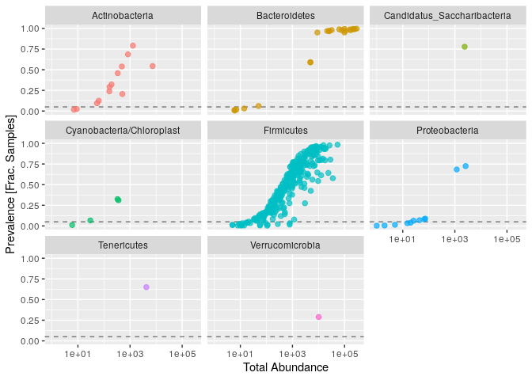<!-- -->

Dans les graphiques affichés, chaque point est un taxon. La ligne noir
en pointillée est à 5% de prévalence. On va exclure les points
inférieurs à ce seuil dans les étapes suivantes.

On définit la prévalence à 5% du total des échantillons.

``` r
prevalenceThreshold = 0.05 * nsamples(ps)
prevalenceThreshold
```

    ## [1] 18

On utilise la fonction “prune\_taxa()” pour filtrer avec une prévalence
de 5%.

``` r
keepTaxa = rownames(prevdf1)[(prevdf1$Prevalence >= prevalenceThreshold)]
ps2 = prune_taxa(keepTaxa, ps)
```

## Agglomerate taxa

Tout d’abord, on regarde le nombre de genre qu’il reste après avoir
filtré, en utilisant la fonction “length()” sur la fonction
“get\_taxa\_unique()” au rang “Genus”.

``` r
length(get_taxa_unique(ps2, taxonomic.rank = "Genus"))
```

    ## [1] 49

La fonction “tax\_glom()” sert à agglomérer les taxons du même type. Ici
on l’applique sans utiliser de distance phylogénétique, mais par genre.

``` r
ps3 = tax_glom(ps2, "Genus", NArm = TRUE)
```

La fonction “tip\_glom()” va agglomérer les taxons selon la distance
phylogénétique. Ici la distance doit être en-dessous de h1=0.4.

``` r
h1 = 0.4
ps4 = tip_glom(ps2, h = h1)
```

Maintenant, on plot 3 graphs pour comparer les données non-agglomérées
(ps2), en agglomération taxonomique (ps3), et en agglomération
phylogénétique (ps4). Tout d’abord on les plot séparément et on les
assigne chacun à une variable.

``` r
multiPlotTitleTextSize = 15
p2tree = plot_tree(ps2, method = "treeonly",
                   ladderize = "left",
                   title = "Before Agglomeration") +
  theme(plot.title = element_text(size = multiPlotTitleTextSize))
p3tree = plot_tree(ps3, method = "treeonly",
                   ladderize = "left", title = "By Genus") +
  theme(plot.title = element_text(size = multiPlotTitleTextSize))
p4tree = plot_tree(ps4, method = "treeonly",
                   ladderize = "left", title = "By Height") +
  theme(plot.title = element_text(size = multiPlotTitleTextSize))
```

Puis on utilise la fonction “grid.arrange()” pour les plotter ensemble.

``` r
library(gridExtra); packageVersion("gridExtra")
```

    ## [1] '2.3'

``` r
grid.arrange(nrow = 1, p2tree, p3tree, p4tree)
```

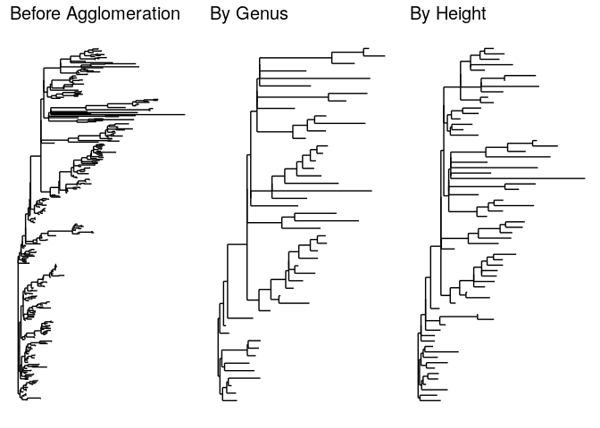<!-- -->

Avant agglomération il y a trop de branches pour pouvoir lire l’arbre
comme il faut, les deux arbres agglomérés sont plus clairs. On peut
tirer différentes interprétations, mais ici on n’a pas codé pour avoir
les noms des taxons.

## Transformation de la valeur d’abondance

On commence par définir notre fonction “plot\_abundance” pour comparer
les différences d’échelle et de distribution dans nos valeurs.On base
les sous-ensembles en fonction des Phylums.

``` r
plot_abundance = function(physeq,title = "",
                          Facet = "Order", Color = "Phylum"){
  p1f = subset_taxa(physeq, Phylum %in% c("Firmicutes"))
  mphyseq = psmelt(p1f)
  mphyseq <- subset(mphyseq, Abundance > 0)
  ggplot(data = mphyseq, mapping = aes_string(x = "sex",y = "Abundance",
                              color = Color, fill = Color)) +
    geom_violin(fill = NA) +
    geom_point(size = 1, alpha = 0.3,
               position = position_jitter(width = 0.3)) +
    facet_wrap(facets = Facet) + scale_y_log10()+
    theme(legend.position="none")
}
```

Ici on va transformer le nombre d’objet des échantillon en abondance
relative avec la fonction “transform\_sample\_counts()”.

``` r
ps3ra = transform_sample_counts(ps3, function(x){x / sum(x)})
```

On assigne chaque plot à une variable, et on utilise la fonction
“grid.arrange()” pour les plotter ensemble.

``` r
library("gridExtra")

plotBefore = plot_abundance(ps3,"")
plotAfter = plot_abundance(ps3ra,"")
grid.arrange(nrow = 2,  plotBefore, plotAfter)
```

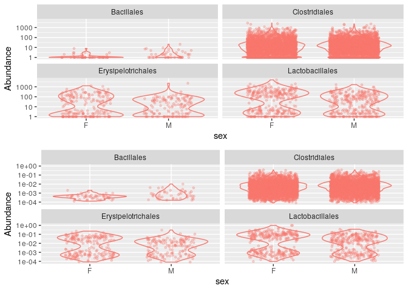<!-- -->

On observe mieux l’abondance des graphs modifiés, en effet, les données
sont mieux réparties. Contrairement à avant modification, où les données
sont un peu “écrasées” en bas des graphs. Ainsi on voit bien que les
microbiotes diffèrent en fonction du sexe de la souris. On peut aussi
remarquer 2 modules d’abondance relative pour certaines espèces, comme
Lactobacillus.

## Sous-ensembles par taxonomie

Pour mieux comprendre l’observation précédente d’abondance bi-modulaire,
on va plotter l’abondance de Lactobacillus en fonction du genre, avec la
fonction “plot\_abundance()”.

``` r
psOrd = subset_taxa(ps3ra, Order == "Lactobacillales")
plot_abundance(psOrd, Facet = "Genus", Color = NULL)
```

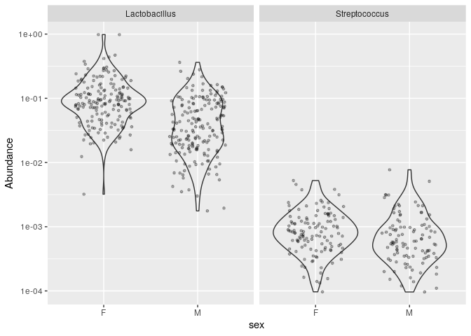<!-- -->

On voit bien que l’abondance bi-modulaire observée précédemment est due
à deux genre: Lactobacillu et Streptococcus. Lactobacillus étant plus
abondant chez les deux types d’hôte.

Maintenant que l’on a filtré et transformé nos données, on va pouvoir
commencer à faire des analyses statistiques. Mais avant cela, nous
devons traiter les données une dernière fois.

## Preprocessing

On utilise la fonction “qplot”, qui permet de faire des histogrammes,
pour plotter les ages des souris.

``` r
qplot(sample_data(ps)$age, geom = "histogram",binwidth=20) + xlab("age")
```

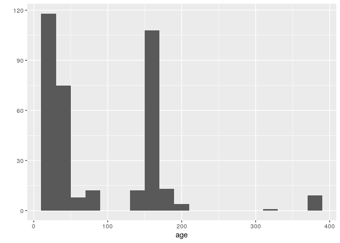<!-- -->

On observe trois groupes d’age distincts.

On fait un histogramme du log des données d’abondance.

``` r
qplot(log10(rowSums(otu_table(ps))),binwidth=0.2) +
  xlab("Logged counts-per-sample")
```

<!-- -->

Normaliser les données d’abondance par un log(1+x) serait donc suffisant
pour les futures analyses.

On procède donc à former ces 3 groupes d’age, Young100 (de 0 à 100
jours), Mid100to200 (de 100 à 200 jours), et Old200 (de 200 à 400 jous).
Avec la fonction “cut()” et “break()” on coupe les tranches d’age, puis
la fonction “list()” pour former les groupes. Ensuite on normalise au
log(1+x) avec la fonction “transform\_sample\_counts()”. Puis on assigne
à la variable “out.wuf.log” ces données normalisés, que l’on ordonne
avec la fonction “ordinate()”, en appliquant la méthode MDS
(multidimentional scaling) et la distance wunifrac (weighted UniFrac).
Et finalement on performe la PCoA en fonction des groupes d’age avec la
fonction “plot\_ordination()”.

``` r
sample_data(ps)$age_binned <- cut(sample_data(ps)$age,
                          breaks = c(0, 100, 200, 400))
levels(sample_data(ps)$age_binned) <- list(Young100="(0,100]", Mid100to200="(100,200]", Old200="(200,400]")
sample_data(ps)$family_relationship=gsub(" ","",sample_data(ps)$family_relationship)
pslog <- transform_sample_counts(ps, function(x) log(1 + x))
out.wuf.log <- ordinate(pslog, method = "MDS", distance = "wunifrac")
```

    ## Warning in UniFrac(physeq, weighted = TRUE, ...): Randomly assigning root as --
    ## GCAAGCGTTATCCGGATTTACTGGGTGTAAAGGGCGTGTAGGCGGGAGTGCAAGTCAGATGTGAAAACTATGGGCTCAACCCATAGCCTGCATTTGAAACTGTACTTCTTGAGTGCTGGAGAGGCAATCGGAATTCCGTGTGTAGCGGTGAAATGCGTAGATATACGGAGGAACACCAGTGGCGAAGGCGGATTGCTGGACAGTAACTGACGCTGAGGCGCGAAAGCGTGGGGAG
    ## -- in the phylogenetic tree in the data you provided.

``` r
evals <- out.wuf.log$values$Eigenvalues
plot_ordination(pslog, out.wuf.log, color = "age_binned") +
  labs(col = "Binned Age") +
  coord_fixed(sqrt(evals[2] / evals[1]))
```

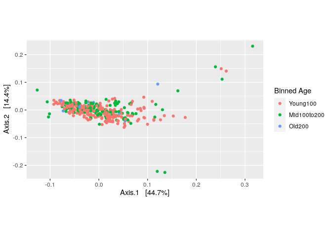<!-- -->

On remarque quelques valeurs abérrantes.

On vérifie donc l’abondance relative de ces données abérrantes.

``` r
rel_abund <- t(apply(otu_table(ps), 1, function(x) x / sum(x)))
qplot(rel_abund[, 12], geom = "histogram",binwidth=0.05) +
  xlab("Relative abundance")
```

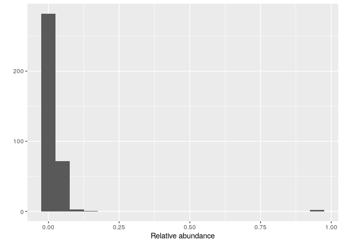<!-- -->

On observe des abondances relatives bien plus hautes que pour le reste
des échantillons.

# Differentes projections d’ordination

On assigne donc les échantillons abérrants à une variable “outliers”,
que l’on utilise avec la fonction “prune\_samples()” pour les enlever du
jeu de données.

``` r
outliers <- c("F5D165", "F6D165", "M3D175", "M4D175", "M5D175", "M6D175")
ps <- prune_samples(!(sample_names(ps) %in% outliers), ps)
```

On va aussi enlever les échantillons avec moins de 1000 reads. On les
trouve avec la fonction “which()” en écartant tous les échantillons
ayant plus de 1000 reads avec “\!”, pour qu’il ne reste que ceux qui ont
moins.

``` r
which(!rowSums(otu_table(ps)) > 1000)
```

    ## F5D145 M1D149   M1D9 M2D125  M2D19 M3D148 M3D149   M3D3   M3D5   M3D8 
    ##     69    185    200    204    218    243    244    252    256    260

Avec la fonction “prun\_sample()”, on assigne tous les échantillons que
l’on garde à la variable “ps”. Et l’on normalise au log(1+x) de nouveau
ces données avec la fonction “transform\_sample\_counts()”.

``` r
ps <- prune_samples(rowSums(otu_table(ps)) > 1000, ps)
pslog <- transform_sample_counts(ps, function(x) log(1 + x))
```

Ensuite on performe une PCoA avec un indice de dissimilarité Bry-Curtis:
distance=“bray” dans la fonction “ordinate()”. Le graphique est plotter
avec la fonction “plot\_ordination()”, en fonction des groupes d’age et
de la portée (Litter).

``` r
out.pcoa.log <- ordinate(pslog,  method = "MDS", distance = "bray")
evals <- out.pcoa.log$values[,1]
plot_ordination(pslog, out.pcoa.log, color = "age_binned",
                  shape = "family_relationship") +
  labs(col = "Binned Age", shape = "Litter")+
  coord_fixed(sqrt(evals[2] / evals[1]))
```

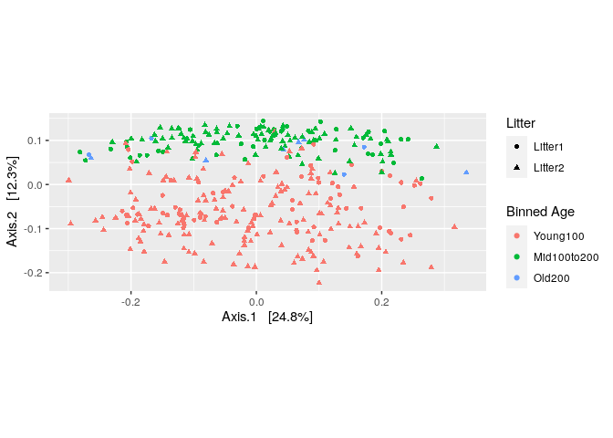<!-- -->

On remarque que l’age a un effet important, peu importe le sexe ou la
portée.

Maintenant on va faire une analyse DPCoA, qui est une méthode
d’ordination phylogénétique incluant une représentation à la fois des
échantillons et des catégories taxonomiques. On fait donc l’ordination
avec la fonction “ordinate()”, la méthode étant cette fois-ci “DPCoA”.

``` r
out.dpcoa.log <- ordinate(pslog, method = "DPCoA")
evals <- out.dpcoa.log$eig
plot_ordination(pslog, out.dpcoa.log, color = "age_binned", label= "SampleID",
                  shape = "family_relationship") +
  labs(col = "Binned Age", shape = "Litter")+
  coord_fixed(sqrt(evals[2] / evals[1]))
```

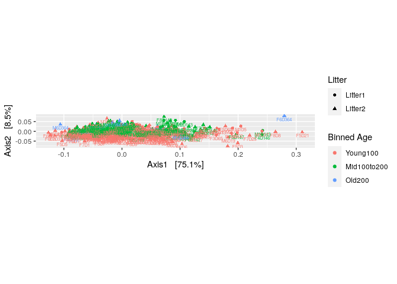<!-- -->

On remarque une forme alongée horizontale, ce qui traduit d’une grande
diversité venant de l’axe 1.

On plot donc en fonction des espèces et phylum pour comprendre les
taxons responsables du pourcentage des axes 1 et 2.

``` r
plot_ordination(pslog, out.dpcoa.log, type = "species", color = "Phylum") +
  coord_fixed(sqrt(evals[2] / evals[1]))
```

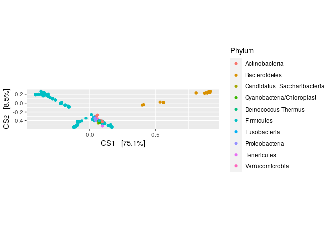<!-- -->

On remarque que les Firmicutes et les Bactéroides sont les taxons
responsable du pourcentage de l’axe 1. Le reste des taxons étant plutôt
groupés.

On regarde ensuite le résultat d’une PCoA avec “wunifrac” (weighted
UniFrac). On utilise donc toujours la fonction “ordinate()” puis
“plot\_ordination()”.

``` r
out.wuf.log <- ordinate(pslog, method = "PCoA", distance ="wunifrac")
```

    ## Warning in UniFrac(physeq, weighted = TRUE, ...): Randomly assigning root as --
    ## GCAAGCGTTATCCGGATTTACTGGGTGTAAAGGGCGTGTAGGCGGGCATGCAAGCCAGAAGTGAAATCTGGGGGCTTAACCCCCAAACTGCTTTTGGAACTGCGTGTCTTGAGTGATGGAGAGGCAGGCGGAATTCCCAGTGTAGCGGTGAAATGCGTAGATATTGGGAGGAACACCAGTGGCGAAGGCGGCCTGCTGGACATTAACTGACGCTGAGGCGCGAAAGCGTGGGGAG
    ## -- in the phylogenetic tree in the data you provided.

``` r
evals <- out.wuf.log$values$Eigenvalues
plot_ordination(pslog, out.wuf.log, color = "age_binned",
                  shape = "family_relationship") +
  coord_fixed(sqrt(evals[2] / evals[1])) +
  labs(col = "Binned Age", shape = "Litter")
```

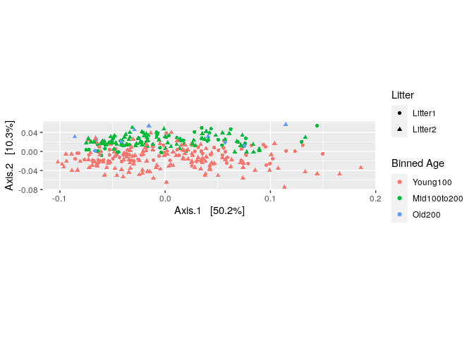<!-- -->

On voit bien qu’il y a toujours une influence de l’age lié à l’axe 2.

## PCA sur les rangs

On commence par créer une matrice d’abondance, puis de l’abondance en
fonction des rangs.

``` r
abund <- otu_table(pslog)
abund_ranks <- t(apply(abund, 1, rank))
```

Pour diminuer les trop grands écarts d’abondance entre les rangs, on
place un seuil en-dessous duquel les rangs sont fixé à 1.

``` r
abund_ranks <- abund_ranks - 329
abund_ranks[abund_ranks < 1] <- 1
```

On fait un graphique de l’abondance en fonction du rang et des
échantillons.

``` r
library(dplyr)
```

    ## 
    ## Attaching package: 'dplyr'

    ## The following object is masked from 'package:gridExtra':
    ## 
    ##     combine

    ## The following objects are masked from 'package:stats':
    ## 
    ##     filter, lag

    ## The following objects are masked from 'package:base':
    ## 
    ##     intersect, setdiff, setequal, union

``` r
library(reshape2)
abund_df <- melt(abund, value.name = "abund") %>%
  left_join(melt(abund_ranks, value.name = "rank"))
```

    ## Joining, by = c("Var1", "Var2")

``` r
colnames(abund_df) <- c("sample", "seq", "abund", "rank")

abund_df <- melt(abund, value.name = "abund") %>%
  left_join(melt(abund_ranks, value.name = "rank"))
```

    ## Joining, by = c("Var1", "Var2")

``` r
colnames(abund_df) <- c("sample", "seq", "abund", "rank")

sample_ix <- sample(1:nrow(abund_df), 8)
ggplot(abund_df %>%
         filter(sample %in% abund_df$sample[sample_ix])) +
  geom_point(aes(x = abund, y = rank, col = sample),
             position = position_jitter(width = 0.2), size = 1.5) +
  labs(x = "Abundance", y = "Thresholded rank") +
  scale_color_brewer(palette = "Set2")
```

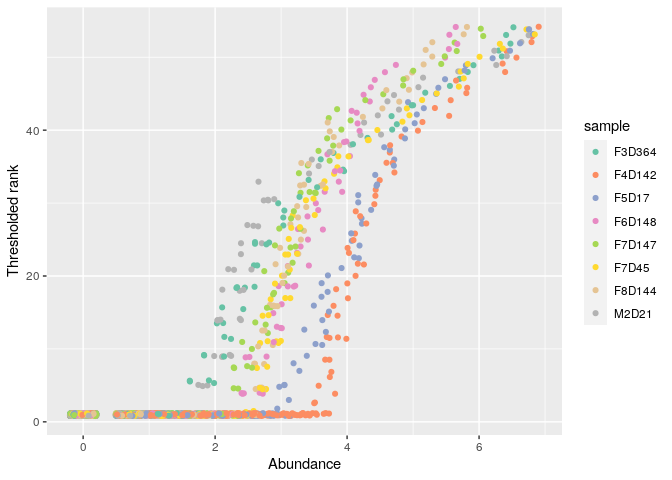<!-- -->

On observe une tendance similaire pour les différents échantillons, avec
une abondance qui augmente progressivement.

On va maintenant faire une PCA. Pour cela on utilise la fonction
“dudi.pca()” qui fait une pca sur une dataframe, ici “abund\_ranks”,
le résultat est assigné à la variable “ranks\_pca”. On créé aussi une
table taxonomique où l’on assigne à l’objet “Order” les principaux
ordres. Puis avec la fonction “geom\_point” on créé des graphique en
nuage de points.

``` r
library(ade4)
ranks_pca <- dudi.pca(abund_ranks, scannf = F, nf = 3)
row_scores <- data.frame(li = ranks_pca$li,
                         SampleID = rownames(abund_ranks))
col_scores <- data.frame(co = ranks_pca$co,
                         seq = colnames(abund_ranks))
tax <- tax_table(ps) %>%
  data.frame(stringsAsFactors = FALSE)
tax$seq <- rownames(tax)
main_orders <- c("Clostridiales", "Bacteroidales", "Lactobacillales",
                 "Coriobacteriales")
tax$Order[!(tax$Order %in% main_orders)] <- "Other"
tax$Order <- factor(tax$Order, levels = c(main_orders, "Other"))
tax$otu_id <- seq_len(ncol(otu_table(ps)))
row_scores <- row_scores %>%
  left_join(sample_data(pslog))
```

    ## Joining, by = "SampleID"

    ## Warning in class(x) <- c(setdiff(subclass, tibble_class), tibble_class): Setting
    ## class(x) to multiple strings ("tbl_df", "tbl", ...); result will no longer be an
    ## S4 object

``` r
col_scores <- col_scores %>%
  left_join(tax)
```

    ## Joining, by = "seq"

``` r
evals_prop <- 100 * (ranks_pca$eig / sum(ranks_pca$eig))
ggplot() +
  geom_point(data = row_scores, aes(x = li.Axis1, y = li.Axis2), shape = 2) +
  geom_point(data = col_scores, aes(x = 25 * co.Comp1, y = 25 * co.Comp2, col = Order),
             size = .3, alpha = 0.6) +
  scale_color_brewer(palette = "Set2") +
  facet_grid(~ age_binned) +
  guides(col = guide_legend(override.aes = list(size = 3))) +
  labs(x = sprintf("Axis1 [%s%% variance]", round(evals_prop[1], 2)),
       y = sprintf("Axis2 [%s%% variance]", round(evals_prop[2], 2))) +
  coord_fixed(sqrt(ranks_pca$eig[2] / ranks_pca$eig[1])) +
  theme(panel.border = element_rect(color = "#787878", fill = alpha("white", 0)))
```

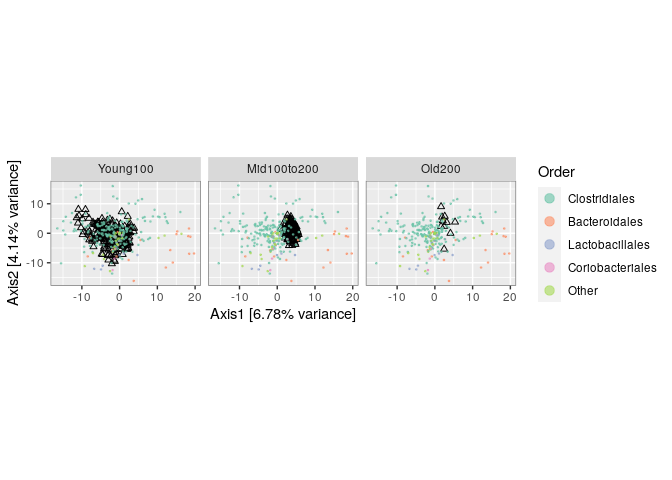<!-- -->

On obtient 3 graphiques en nuage de point, un par groupe d’age. Les deux
axes représente un certain pourcentage de variance, à peu près égal
(axis1=6.78% et axis2=4.14%). Les points colorés représentes les
principaux ordres taxonomiques (et le reste des ordres dans other). Et
les triangles correspondent aux données normalisées “pslog” à log(1+x).
Les résultats,ici avec les rangs principaux distingués des autres rangs
moins abondants, sont similaires à ceux des analyses PCoA avec tout les
rangs. Ce qui soutient l’analyse des données originales.

## Canonical correspondence

Une analyse CCpnA permet de faire une ordination avec plus de paramètres
informatifs sur les échantillons. Ici les groupes d’age et les lien
familiaux.

``` r
ps_ccpna <- ordinate(pslog, "CCA", formula = pslog ~ age_binned + family_relationship)
```

Pour faire les graphiques, on commence d’abord par extraire les scores
des sites et des espèces. Puis avec la fonction “geom\_point()” on trace
les graphiques en nuage de points d’analyse CCpnA.

``` r
library(ggrepel)
ps_scores <- vegan::scores(ps_ccpna)
sites <- data.frame(ps_scores$sites)
sites$SampleID <- rownames(sites)
sites <- sites %>%
  left_join(sample_data(ps))
```

    ## Joining, by = "SampleID"

    ## Warning in class(x) <- c(setdiff(subclass, tibble_class), tibble_class): Setting
    ## class(x) to multiple strings ("tbl_df", "tbl", ...); result will no longer be an
    ## S4 object

``` r
species <- data.frame(ps_scores$species)
species$otu_id <- seq_along(colnames(otu_table(ps)))
species <- species %>%
  left_join(tax)
```

    ## Joining, by = "otu_id"

``` r
evals_prop <- 100 * ps_ccpna$CCA$eig[1:2] / sum(ps_ccpna$CA$eig)
ggplot() +
  geom_point(data = sites, aes(x = CCA1, y = CCA2), shape = 2, alpha = 0.5) +
  geom_point(data = species, aes(x = CCA1, y = CCA2, col = Order), size = 0.5) +
  geom_text_repel(data = species %>% filter(CCA2 < -2),
                    aes(x = CCA1, y = CCA2, label = otu_id),
            size = 1.5, segment.size = 0.1) +
  facet_grid(. ~ family_relationship) +
  guides(col = guide_legend(override.aes = list(size = 3))) +
  labs(x = sprintf("Axis1 [%s%% variance]", round(evals_prop[1], 2)),
        y = sprintf("Axis2 [%s%% variance]", round(evals_prop[2], 2))) +
  scale_color_brewer(palette = "Set2") +
  coord_fixed(sqrt(ps_ccpna$CCA$eig[2] / ps_ccpna$CCA$eig[1])*0.45   ) +
  theme(panel.border = element_rect(color = "#787878", fill = alpha("white", 0)))
```

<!-- -->

On obtient deux graphiques en nuage de points générés par CCpnA, un par
portée. Chaque axe présente un certain pourcentage de variance
(axe1=7.52% et axe2=4.42%). Les ronds colorés correspondent aux ordres
principaux. Et les triangles correspondent aux sites. On observe donc un
groupe distinct dans chaque graphique, avec quelques espèces et sites
isolés.

# Supervised learning

On a vu que les microbiomes changent avec l’age. On va donc maintenant
essayé de pédire l’age en fonction de la composition des microbiomes. On
commence par séparer les données et former une data-frame. Puis on va
prendre 8 souris au hasard pour être le training set, et les 4 autres
pour être le test set. On forme des matrices, et on utilise la fonction
“train()” avec la méthode “pls”.

``` r
library(caret)
```

    ## Loading required package: lattice

``` r
sample_data(pslog)$age2 <- cut(sample_data(pslog)$age, c(0, 100, 400))
dataMatrix <- data.frame(age = sample_data(pslog)$age2, otu_table(pslog))
# take 8 mice at random to be the training set, and the remaining 4 the test set
trainingMice <- sample(unique(sample_data(pslog)$host_subject_id), size = 8)
inTrain <- which(sample_data(pslog)$host_subject_id %in% trainingMice)
training <- dataMatrix[inTrain,]
testing <- dataMatrix[-inTrain,]
plsFit <- train(age ~ ., data = training,
                method = "pls", preProc = "center")
```

Ensuite on utilise la fonction “predict()” pour prédire l’age, puis on
compare à l’age actuel dans un tableau.

``` r
plsClasses <- predict(plsFit, newdata = testing)
table(plsClasses, testing$age)
```

    ##            
    ## plsClasses  (0,100] (100,400]
    ##   (0,100]        64         2
    ##   (100,400]       2        44

La prédiction est bonne, avec seulement 2/109 d’erreur.

On test aussi avec “randomForest”, qui fonctionne de manière semblable à
PLS.

``` r
library(randomForest)
```

    ## randomForest 4.6-14

    ## Type rfNews() to see new features/changes/bug fixes.

    ## 
    ## Attaching package: 'randomForest'

    ## The following object is masked from 'package:dplyr':
    ## 
    ##     combine

    ## The following object is masked from 'package:gridExtra':
    ## 
    ##     combine

    ## The following object is masked from 'package:ggplot2':
    ## 
    ##     margin

``` r
rfFit <- train(age ~ ., data = training, method = "rf",
               preProc = "center", proximity = TRUE)
rfClasses <- predict(rfFit, newdata = testing)
table(rfClasses, testing$age)
```

    ##            
    ## rfClasses   (0,100] (100,400]
    ##   (0,100]        64         2
    ##   (100,400]       2        44

Le résultat de la prédiction est aussi très bon, avec 1/109 erreur.

On va ensuite faire un graphique de représentation biplot PLS. On
commence par ouvrir le package “vegan”.

``` r
library(vegan); packageVersion("vegan")
```

    ## Loading required package: permute

    ## This is vegan 2.5-7

    ## 
    ## Attaching package: 'vegan'

    ## The following object is masked from 'package:caret':
    ## 
    ##     tolerance

    ## [1] '2.5.7'

On assigne à une variable “pls\_biplot” les données de “plsFit”. Puis on
met les ordres principaux dans “Order”.

``` r
pls_biplot <- list("loadings" = loadings(plsFit$finalModel),
                   "scores" = scores(plsFit$finalModel))
class(pls_biplot$scores) <- "matrix"

pls_biplot$scores <- data.frame(sample_data(pslog)[inTrain, ],
                                pls_biplot$scores)

tax <- tax_table(ps)@.Data %>%
  data.frame(stringsAsFactors = FALSE)
main_orders <- c("Clostridiales", "Bacteroidales", "Lactobacillales",
                 "Coriobacteriales")
tax$Order[!(tax$Order %in% main_orders)] <- "Other"
tax$Order <- factor(tax$Order, levels = c(main_orders, "Other"))
class(pls_biplot$loadings) <- "matrix"
pls_biplot$loadings <- data.frame(tax, pls_biplot$loadings)
```

Et avec “ggplot()” et “geom\_point()” on trace les graphiques.

``` r
ggplot() +
  geom_point(data = pls_biplot$scores,
             aes(x = Comp.1, y = Comp.2), shape = 2) +
  geom_point(data = pls_biplot$loadings,
             aes(x = 25 * Comp.1, y = 25 * Comp.2, col = Order),
             size = 0.3, alpha = 0.6) +
  scale_color_brewer(palette = "Set2") +
  labs(x = "Axis1", y = "Axis2", col = "Binned Age") +
  guides(col = guide_legend(override.aes = list(size = 3))) +
  facet_grid( ~ age2) +
  theme(panel.border = element_rect(color = "#787878", fill = alpha("white", 0)))
```

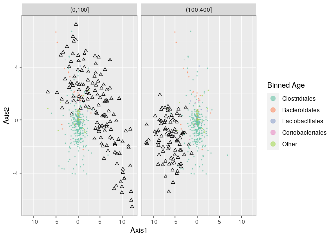<!-- -->

Le graphique en nuage de points est séparé en deux, pour les deux
tranches d’age. Avec les ronds colorés pour les ordres principaux, et
les triangles pour les scores. On remarque que les ronds de tranches
d’age forme deux groupes bien centrés. Et les triangles sont bien
groupé pour la tranche d’age entre 100 et 400, et un peu plus dispersée
pour la tranche entre 0 et 100.

Ensuite on fait le graph pour “randomForest”.

``` r
rf_prox <- cmdscale(1 - rfFit$finalModel$proximity) %>%
  data.frame(sample_data(pslog)[inTrain, ])

ggplot(rf_prox) +
  geom_point(aes(x = X1, y = X2, col = age_binned),
             size = 1, alpha = 0.7) +
  scale_color_manual(values = c("#A66EB8", "#238DB5", "#748B4F")) +
  guides(col = guide_legend(override.aes = list(size = 4))) +
  labs(col = "Binned Age", x = "Axis1", y = "Axis2")
```

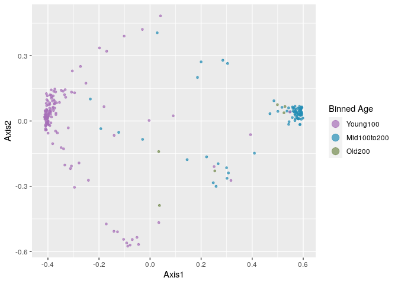<!-- -->

On remarque bien que les tranches d’age, ronds colorés, sont nettement
séparé en deux ilots pour les Young100 et les Mid100to200. Avec
quelques points dispersés entre les deux, appartenant aux trois tranches
d’age.

On peut chercher quel espèce à le plus d’influance sur la prédiction que
l’on a faite. Avec la fonction “which.max()”.

``` r
as.vector(tax_table(ps)[which.max(importance(rfFit$finalModel)), c("Family", "Genus")])
```

    ## [1] "Lachnospiraceae" "Roseburia"

Ici c’est la famille Lachnospiraceae, mais le genre n’est pas attribué.

On peut faire un graphique pour observé la distribution de
Lachnospiraceae selon les tranches d’age.

``` r
impOtu <- as.vector(otu_table(pslog)[,which.max(importance(rfFit$finalModel))])
maxImpDF <- data.frame(sample_data(pslog), abund = impOtu)
ggplot(maxImpDF) +   geom_histogram(aes(x = abund)) +
  facet_grid(age2 ~ .) +
  labs(x = "Abundance of discriminative bacteria", y = "Number of samples")
```

    ## `stat_bin()` using `bins = 30`. Pick better value with `binwidth`.

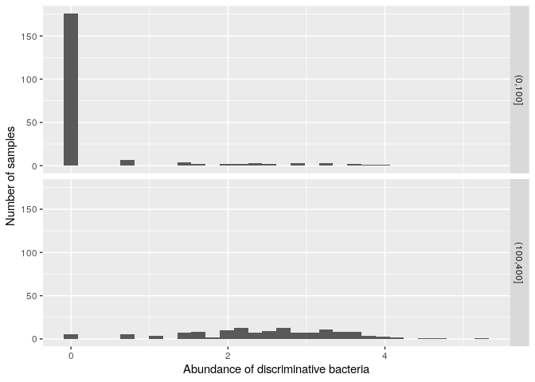<!-- -->

On observe que dans la tranche entre 0 et 100 jours, l’abondance est
très basse, avec presque tous les échantillons en dessous de 1. Au
contraire de la tranche entre 100 et 400 jours, où l’abondance des
échantillons est entre 1 et 3.

# Graphbased analysis

## Creating and ploting graphs

On créé un réseau avec la fonction “make\_network()” avec le maximum de
la distance de Jaccard à 0.35. Puis on attribut de quel souris et quelle
portée (“family\_relationship”) viennent les échantillons. Ainsi on peut
retracer les échantillons dans le réseau.

``` r
library("phyloseqGraphTest")
library("igraph")
```

    ## 
    ## Attaching package: 'igraph'

    ## The following object is masked from 'package:vegan':
    ## 
    ##     diversity

    ## The following object is masked from 'package:permute':
    ## 
    ##     permute

    ## The following objects are masked from 'package:dplyr':
    ## 
    ##     as_data_frame, groups, union

    ## The following objects are masked from 'package:stats':
    ## 
    ##     decompose, spectrum

    ## The following object is masked from 'package:base':
    ## 
    ##     union

``` r
library("ggnetwork")
net <- make_network(ps, max.dist=0.35)
sampledata <- data.frame(sample_data(ps))
V(net)$id <- sampledata[names(V(net)), "host_subject_id"]
V(net)$litter <- sampledata[names(V(net)), "family_relationship"]
```

On attribut le réseau à la variable “net\_graph”.

``` r
net_graph <- ggnetwork(net)
```

Et finalement on trace le réseau avec la fonction “ggplot()”.

``` r
ggplot(net_graph, aes(x = x, y = y, xend = xend, yend = yend), layout = "fruchtermanreingold") +
  geom_edges(color = "darkgray") +
  geom_nodes(aes(color = id, shape = litter),  size = 3 ) +
  theme(axis.text = element_blank(), axis.title = element_blank(),
        legend.key.height = unit(0.5,"line")) +
  guides(col = guide_legend(override.aes = list(size = .5)))
```

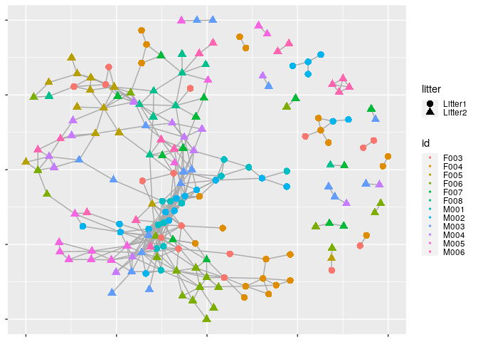<!-- -->

Dans le réseau obtenu, les portées sont des ronds (Litter1) ou des
triangle (Litter2), et en couleur sont les différentes souris. On
observe un réseau connecté de souris et de portées, et des petits
groupes périphériques connecté par la portée.

# Graph-based two-sample test

## Minimum spanning tree

On souhait connaitre si les deux lignées (“family\_relationship”)
viennent de la même distribution. Pour cela, on commence par faire un
test MST avec une distance de Jaccard en utilisant la fonction
“graph\_perm\_test()”.

``` r
gt <- graph_perm_test(ps, "family_relationship", grouping = "host_subject_id",
                      distance = "jaccard", type = "mst")
gt$pval
```

    ## [1] 0.002

On obtient une p.value de 0.004, on rejette donc l’hypothèse qu’elles
viennent de la même distribution.

Ensuite on trace l’arbre et l’histogramme de permutation, avec les
fonctions “plot\_test\_network()” et “plot\_permutations()”
respectivement.

``` r
plotNet1=plot_test_network(gt) + theme(legend.text = element_text(size = 8),
        legend.title = element_text(size = 9))
plotPerm1=plot_permutations(gt)
grid.arrange(ncol = 2,  plotNet1, plotPerm1)
```

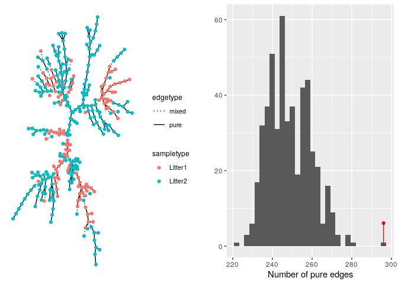<!-- -->

L’arbre de portée minimale lie les différentes portées, ronds rouge et
bleu, avec des arrêtes continues, pure, ou en pointillé, mixe. Les liens
mixtes signifient qu’il y aurait une distribution similaire pour les
deux portées. Or on observe que les portées sont principalement pure,
comme le confirme aussi l’histogramme. On a pu observé le résultat de la
p.value, les portées ne suivent pas la même distribution.

## Nearest neighbors

On continue notre étude des distances de portées avec un test du
“k-nearest neighbour”. On utilise encore la fonction
“graph\_perm\_test()” toujours avec la distance de Jaccard.

``` r
gt <- graph_perm_test(ps, "family_relationship", grouping = "host_subject_id",
                      distance = "jaccard", type = "knn", knn = 1)
```

Puis on trace le réseau et l’histogramme du nearest neighbour.

``` r
plotNet2=plot_test_network(gt) + theme(legend.text = element_text(size = 8),
        legend.title = element_text(size = 9))
plotPerm2=plot_permutations(gt)
grid.arrange(ncol = 2,  plotNet2, plotPerm2)
```

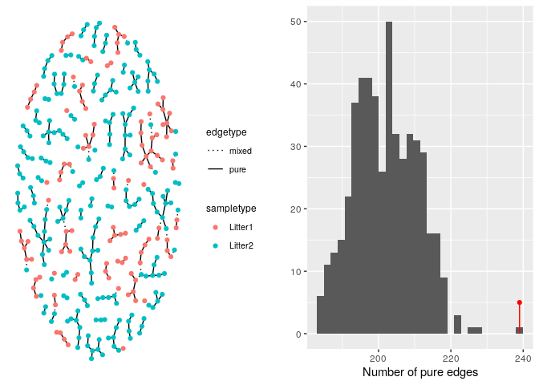<!-- -->

La légende est la même qu’au précédent graphique. On observe qu’il est
extrêment probable que les voisins les plus proches soient de la même
portée.

# Linear modeling

On va maintenant s’intéresser à la relation entre la diversité et l’age
et les portées. Pour cela, on commance par calculé l’indice de diversité
alpha de Shannon avec la fonction “estimated\_richness()”. Puis on
organise la diversité de la plus faible à la plus forte.

``` r
library("nlme")
```

    ## 
    ## Attaching package: 'nlme'

    ## The following object is masked from 'package:dplyr':
    ## 
    ##     collapse

``` r
library("reshape2")
ps_alpha_div <- estimate_richness(ps, split = TRUE, measure = "Shannon")
ps_alpha_div$SampleID <- rownames(ps_alpha_div) %>%
  as.factor()
ps_samp <- sample_data(ps) %>%
  unclass() %>%
  data.frame() %>%
  left_join(ps_alpha_div, by = "SampleID") %>%
  melt(measure.vars = "Shannon",
       variable.name = "diversity_measure",
       value.name = "alpha_diversity")

diversity_means <- ps_samp %>%
  group_by(host_subject_id) %>%
  summarise(mean_div = mean(alpha_diversity)) %>%
  arrange(mean_div)
```

    ## `summarise()` ungrouping output (override with `.groups` argument)

``` r
ps_samp$host_subject_id <- factor(ps_samp$host_subject_id)
#diversity_means$host_subject_id)
```

On utilise la fonction “lme()” pour avoir des effets fixes et aléatoires
à la fois.

``` r
alpha_div_model <- lme(fixed = alpha_diversity ~ age_binned, data = ps_samp,
                       random = ~ 1 | host_subject_id)
```

``` r
new_data <- expand.grid(host_subject_id = levels(ps_samp$host_subject_id),
                        age_binned = levels(ps_samp$age_binned))
new_data$pred <- predict(alpha_div_model, newdata = new_data)
X <- model.matrix(eval(eval(alpha_div_model$call$fixed)[-2]),
                  new_data[-ncol(new_data)])
pred_var_fixed <- diag(X %*% alpha_div_model$varFix %*% t(X))
new_data$pred_var <- pred_var_fixed + alpha_div_model$sigma ^ 2
```

Ensuite on trace les graphiques avec les barres d’erreurs.

``` r
ggplot(ps_samp %>% left_join(new_data)) +
  geom_errorbar(aes(x = age_binned, ymin = pred - 2 * sqrt(pred_var),
                    ymax = pred + 2 * sqrt(pred_var)),
                col = "#858585", size = .1) +
  geom_point(aes(x = age_binned, y = alpha_diversity,
                 col = family_relationship), size = 0.8) +
  facet_wrap(~host_subject_id) +
  scale_y_continuous(limits = c(2.4, 4.6), breaks = seq(0, 5, .5)) +
  scale_color_brewer(palette = "Set2") +
  labs(x = "Binned Age", y = "Shannon Diversity", color = "Litter") +
  guides(col = guide_legend(override.aes = list(size = 4))) +
  theme(panel.border = element_rect(color = "#787878", fill = alpha("white", 0)),
        axis.text.x = element_text(angle = -90, size = 6),
        axis.text.y = element_text(size = 6))
```

    ## Joining, by = c("host_subject_id", "age_binned")

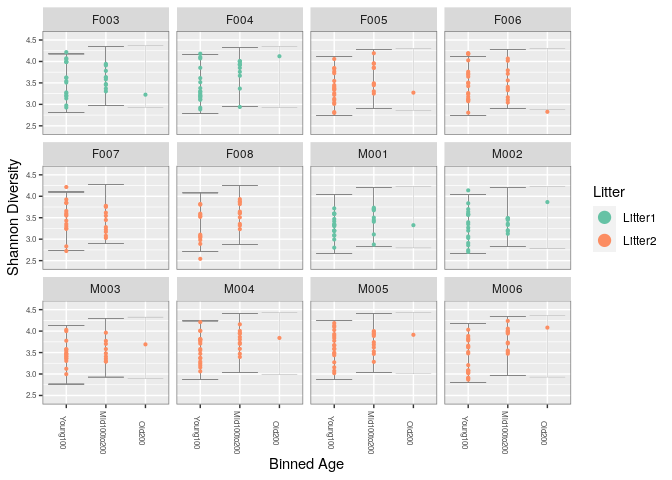<!-- -->

On observe que 4 souris font parti de la portée 1, les 8 autres de la
portée 2. On n’observe pas de flagrante différence de diversité entre
les deux portées, ni en fonction de l’age. Les barres d’erreur se
chevauchent à chaque fois.

# Hierarchical multiple testing

On souhaite maintenant étudier le lien entre l’abondance de certain
groupes taxonomiques et les tranches d’age. On commence d’abord par
normaliser afin de prendre en compte les abondances fortes, mais aussi
basses et moyennes sans écraser celles-ci. On refait les niveaux, puis
on garde les moyennes géométrique qui sont à 0.

``` r
library("reshape2")
library("DESeq2")
```

    ## Loading required package: S4Vectors

    ## Loading required package: stats4

    ## Loading required package: BiocGenerics

    ## Loading required package: parallel

    ## 
    ## Attaching package: 'BiocGenerics'

    ## The following objects are masked from 'package:parallel':
    ## 
    ##     clusterApply, clusterApplyLB, clusterCall, clusterEvalQ,
    ##     clusterExport, clusterMap, parApply, parCapply, parLapply,
    ##     parLapplyLB, parRapply, parSapply, parSapplyLB

    ## The following objects are masked from 'package:igraph':
    ## 
    ##     normalize, path, union

    ## The following object is masked from 'package:randomForest':
    ## 
    ##     combine

    ## The following object is masked from 'package:ade4':
    ## 
    ##     score

    ## The following objects are masked from 'package:dplyr':
    ## 
    ##     combine, intersect, setdiff, union

    ## The following object is masked from 'package:gridExtra':
    ## 
    ##     combine

    ## The following objects are masked from 'package:stats':
    ## 
    ##     IQR, mad, sd, var, xtabs

    ## The following objects are masked from 'package:base':
    ## 
    ##     anyDuplicated, append, as.data.frame, basename, cbind, colnames,
    ##     dirname, do.call, duplicated, eval, evalq, Filter, Find, get, grep,
    ##     grepl, intersect, is.unsorted, lapply, Map, mapply, match, mget,
    ##     order, paste, pmax, pmax.int, pmin, pmin.int, Position, rank,
    ##     rbind, Reduce, rownames, sapply, setdiff, sort, table, tapply,
    ##     union, unique, unsplit, which, which.max, which.min

    ## 
    ## Attaching package: 'S4Vectors'

    ## The following objects are masked from 'package:dplyr':
    ## 
    ##     first, rename

    ## The following object is masked from 'package:base':
    ## 
    ##     expand.grid

    ## Loading required package: IRanges

    ## 
    ## Attaching package: 'IRanges'

    ## The following object is masked from 'package:nlme':
    ## 
    ##     collapse

    ## The following objects are masked from 'package:dplyr':
    ## 
    ##     collapse, desc, slice

    ## The following object is masked from 'package:phyloseq':
    ## 
    ##     distance

    ## Loading required package: GenomicRanges

    ## Loading required package: GenomeInfoDb

    ## Loading required package: SummarizedExperiment

    ## Loading required package: Biobase

    ## Welcome to Bioconductor
    ## 
    ##     Vignettes contain introductory material; view with
    ##     'browseVignettes()'. To cite Bioconductor, see
    ##     'citation("Biobase")', and for packages 'citation("pkgname")'.

    ## 
    ## Attaching package: 'Biobase'

    ## The following object is masked from 'package:phyloseq':
    ## 
    ##     sampleNames

    ## Loading required package: DelayedArray

    ## Loading required package: matrixStats

    ## 
    ## Attaching package: 'matrixStats'

    ## The following objects are masked from 'package:Biobase':
    ## 
    ##     anyMissing, rowMedians

    ## The following object is masked from 'package:dplyr':
    ## 
    ##     count

    ## 
    ## Attaching package: 'DelayedArray'

    ## The following objects are masked from 'package:matrixStats':
    ## 
    ##     colMaxs, colMins, colRanges, rowMaxs, rowMins, rowRanges

    ## The following object is masked from 'package:igraph':
    ## 
    ##     simplify

    ## The following objects are masked from 'package:base':
    ## 
    ##     aperm, apply, rowsum

``` r
sample_data(ps)$age_binned <- cut(sample_data(ps)$age,
                          breaks = c(0, 100, 200, 400))
levels(sample_data(ps)$age_binned) <- list(Young100="(0,100]", Mid100to200="(100,200]", Old200="(200,400]")
sample_data(ps)$family_relationship = gsub(" ", "", sample_data(ps)$family_relationship)
ps_dds <- phyloseq_to_deseq2(ps, design = ~ age_binned + family_relationship)
```

    ## converting counts to integer mode

    ## Warning in DESeqDataSet(se, design = design, ignoreRank): some variables in
    ## design formula are characters, converting to factors

``` r
geo_mean_protected <- function(x) {
  if (all(x == 0)) {
    return (0)
  }
  exp(mean(log(x[x != 0])))
}

geoMeans <- apply(counts(ps_dds), 1, geo_mean_protected)
ps_dds <- estimateSizeFactors(ps_dds, geoMeans = geoMeans)
ps_dds <- estimateDispersions(ps_dds)
```

    ## gene-wise dispersion estimates

    ## mean-dispersion relationship

    ## final dispersion estimates

``` r
abund <- getVarianceStabilizedData(ps_dds)
```

On raccourci les noms des taxons.

``` r
short_names <- substr(rownames(abund), 1, 5)%>%
  make.names(unique = TRUE)
rownames(abund) <- short_names
```

Puis on trace l’histogramme.

``` r
abund_sums <- rbind(data.frame(sum = colSums(abund),
                               sample = colnames(abund),
                               type = "DESeq2"),
                    data.frame(sum = rowSums(otu_table(pslog)),
                               sample = rownames(otu_table(pslog)),
                               type = "log(1 + x)"))

ggplot(abund_sums) +
  geom_histogram(aes(x = sum), binwidth = 20) +
  facet_grid(type ~ .) +
  xlab("Total abundance within sample")
```

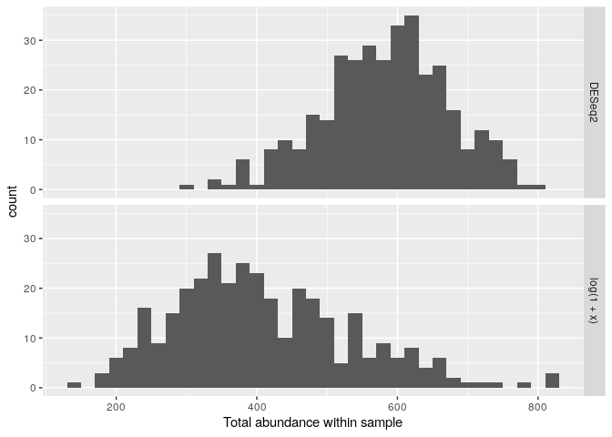<!-- -->

L’histogramme du haut est celui avec les modifications que l’on vient
d’apporter, et celui du bas est celui avec les données non-modifiées.
On observe que l’abondance totale des échantillon a augmenté.

On utilise la fonction “treePValues()” pour faire un arbre avec les
p.values des espèces abondantes.

``` r
library("structSSI")
el <- phy_tree(pslog)$edge
el0 <- el
el0 <- el0[nrow(el):1, ]
el_names <- c(short_names, seq_len(phy_tree(pslog)$Nnode))
el[, 1] <- el_names[el0[, 1]]
el[, 2] <- el_names[as.numeric(el0[, 2])]
unadj_p <- treePValues(el, abund, sample_data(pslog)$age_binned)
```

La fonction “hFDR.adjust()” sert à contrôler les hypothèses de structure
hiérarchique.

``` r
hfdr_res <- hFDR.adjust(unadj_p, el, .75)
summary(hfdr_res)
```

    ## Number of hypotheses: 764 
    ## Number of tree discoveries: 579 
    ## Estimated tree FDR: 1 
    ## Number of tip discoveries: 280 
    ## Estimated tips FDR: 1 
    ## 
    ##  hFDR adjusted p-values: 
    ##                 unadjp         adjp adj.significance
    ## GCAAG.95  1.861873e-82 3.723745e-82              ***
    ## GCAAG.70  1.131975e-75 2.263950e-75              ***
    ## GCAAG.187 5.148758e-59 1.029752e-58              ***
    ## GCAAG.251 3.519276e-50 7.038553e-50              ***
    ## GCAAG.148 1.274481e-49 2.548962e-49              ***
    ## GCAAG.30  9.925218e-49 1.985044e-48              ***
    ## GCGAG.76  1.722591e-46 3.445183e-46              ***
    ## GCAAG.167 6.249050e-43 1.249810e-42              ***
    ## 255       8.785479e-40 1.757096e-39              ***
    ## GCAAG.64  2.727610e-36 5.455219e-36              ***
    ## [only 10 most significant hypotheses shown] 
    ## --- 
    ## Signif. codes:  0 '***' 0.015 '**' 0.15 '*' 0.75 '.' 1.5 '-' 1

Ensuite on trace l’arbre, qui s’ouvrira dans une page web annexe.

``` r
#interactive part: not run
plot(hfdr_res, height = 5000) # opens in a browser
```

Malheureusement, la page web s’ouvre mais l’arbre n’apparait pas.

On continue quand bien même. L’’hypothèse est censée n’être
valide’association entre tranche d’age et diversité et abondance n’est
valable que pour certains groupes taxonomiques, on va donc retrouver ces
groupes.

``` r
tax <- tax_table(pslog)[, c("Family", "Genus")] %>%
  data.frame()
tax$seq <- short_names
```

``` r
options(digits=3)
hfdr_res@p.vals$seq <- rownames(hfdr_res@p.vals)
tax %>%
  left_join(hfdr_res@p.vals) %>%
  arrange(adjp) %>% head(10)
```

    ## Joining, by = "seq"

    ##             Family            Genus       seq   unadjp     adjp
    ## 1  Lachnospiraceae             <NA>  GCAAG.95 1.86e-82 3.72e-82
    ## 2  Lachnospiraceae        Roseburia  GCAAG.70 1.13e-75 2.26e-75
    ## 3  Lachnospiraceae Clostridium_XlVa GCAAG.187 5.15e-59 1.03e-58
    ## 4  Lachnospiraceae             <NA> GCAAG.251 3.52e-50 7.04e-50
    ## 5  Lachnospiraceae Clostridium_XlVa GCAAG.148 1.27e-49 2.55e-49
    ## 6  Lachnospiraceae             <NA>  GCAAG.30 9.93e-49 1.99e-48
    ## 7  Ruminococcaceae     Ruminococcus  GCGAG.76 1.72e-46 3.45e-46
    ## 8  Lachnospiraceae Clostridium_XlVa GCAAG.167 6.25e-43 1.25e-42
    ## 9  Lachnospiraceae        Roseburia  GCAAG.64 2.73e-36 5.46e-36
    ## 10            <NA>             <NA>   GCAAG.1 5.22e-35 1.04e-34
    ##    adj.significance
    ## 1               ***
    ## 2               ***
    ## 3               ***
    ## 4               ***
    ## 5               ***
    ## 6               ***
    ## 7               ***
    ## 8               ***
    ## 9               ***
    ## 10              ***

On remarque que c’est presque exclusivement la famille Lachnospiraceae
qui a une association entre age et abondance.

# Multitable techniques

Pour comparer les variations de certains parametres et les échantillons,
on utilise “sparse CCA”. D’abord on charge un nouveau dataset, contenant
deux tableaux, un pour les microbes et un pour les métabolites.

``` r
metab <- read.csv("https://raw.githubusercontent.com/spholmes/F1000_workflow/master/data/metabolites.csv",row.names = 1)
microbe_connect <-url("https://raw.githubusercontent.com/spholmes/F1000_workflow/master/data/microbe.rda")
load(microbe_connect)
microbe
```

    ## phyloseq-class experiment-level object
    ## otu_table()   OTU Table:         [ 20609 taxa and 12 samples ]
    ## tax_table()   Taxonomy Table:    [ 20609 taxa by 6 taxonomic ranks ]
    ## phy_tree()    Phylogenetic Tree: [ 20609 tips and 20607 internal nodes ]

On filtre les microbes et les métabolites. On enlève ceux qui sont 0 sur
plusieurs échantillons, et on normalise les métabolites au log(1+metab).

``` r
library("genefilter")
```

    ## 
    ## Attaching package: 'genefilter'

    ## The following objects are masked from 'package:matrixStats':
    ## 
    ##     rowSds, rowVars

``` r
keep_ix <- rowSums(metab == 0) <= 3
metab <- metab[keep_ix, ]
microbe <- prune_taxa(taxa_sums(microbe) > 4, microbe)
microbe <- filter_taxa(microbe, filterfun(kOverA(3, 2)), TRUE)
metab <- log(1 + metab, base = 10)
X <- otu_table(microbe)
X[X > 50] <- 50
dim(X)
```

    ## [1] 174  12

La fonction “dim()” donne la dimension de l’objet “metab”.

``` r
dim(metab)
```

    ## [1] 405  12

On applique “CCA()”.

``` r
library(PMA)
cca_res <- CCA(t(X),  t(metab), penaltyx = .15, penaltyz = .15)
```

    ## 123456789101112131415

``` r
cca_res
```

    ## Call: CCA(x = t(X), z = t(metab), penaltyx = 0.15, penaltyz = 0.15)
    ## 
    ## 
    ## Num non-zeros u's:  5 
    ## Num non-zeros v's:  15 
    ## Type of x:  standard 
    ## Type of z:  standard 
    ## Penalty for x: L1 bound is  0.15 
    ## Penalty for z: L1 bound is  0.15 
    ## Cor(Xu,Zv):  0.974

On a donc 6 microbes et 11 metabolites, avec une correlation de 0.977.
Il doit donc y avoir des signaux communs.

On utilise donc les 17 caractéristiques. On applique une PCA pour
trouver les paramètres d’échantillons.

``` r
combined <- cbind(t(X[cca_res$u != 0, ]),
                  t(metab[cca_res$v != 0, ]))
pca_res <- dudi.pca(combined, scannf = F, nf = 3)
```

``` r
genotype <- substr(rownames(pca_res$li), 1, 2)
sample_type <- substr(rownames(pca_res$l1), 3, 4)
feature_type <- grepl("\\.", colnames(combined))
feature_type <- ifelse(feature_type, "Metabolite", "OTU")
sample_info <- data.frame(pca_res$li, genotype, sample_type)
feature_info <- data.frame(pca_res$c1,
                           feature = substr(colnames(combined), 1, 6))
```

On trace la PCA.

``` r
ggplot() +  geom_point(data = sample_info,
            aes(x = Axis1, y = Axis2, col = sample_type, shape = genotype), size = 3) + 
  geom_label_repel(data = feature_info,
                   aes(x = 5.5 * CS1, y = 5.5 * CS2, label = feature, fill = feature_type),
                   size = 2, segment.size = 0.3,
                   label.padding = unit(0.1, "lines"), label.size = 0) +
  geom_point(data = feature_info,
             aes(x = 5.5 * CS1, y = 5.5 * CS2, fill = feature_type),
             size = 1, shape = 23, col = "#383838") +
  scale_color_brewer(palette = "Set2") +
  scale_fill_manual(values = c("#a6d854", "#e78ac3")) +
  guides(fill = guide_legend(override.aes = list(shape = 32, size = 0))) +
  coord_fixed(sqrt(pca_res$eig[2] / pca_res$eig[2])) +
  labs(x = sprintf("Axis1 [%s%% Variance]",
                   100 * round(pca_res$eig[1] / sum(pca_res$eig), 2)),
       y = sprintf("Axis2 [%s%% Variance]",
                   100 * round(pca_res$eig[2] / sum(pca_res$eig), 2)),
       fill = "Feature Type", col = "Sample Type")
```

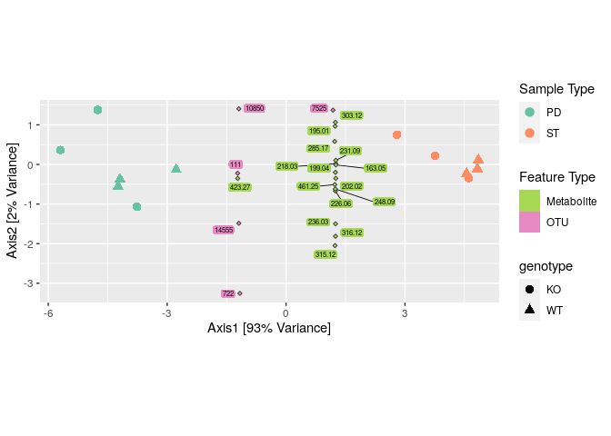<!-- -->

On obtient une PCA triplot, avec le type d’échantillon, si c’est un
microbe ou un métabolite, et le génotype. On note que l’axe 2 correspond
à 92% de la variance. la variation la plus importante dépend du type
d’échantillon, ST ou PD. Il semble aussi y avoir une différence de
variance entre les métabollites et les microbes.

# Conclusion

On a donc utilisé Phyloseq pour débruiter, identifier, et normaliser des
reads avec des models probabilistiques adaptés.
